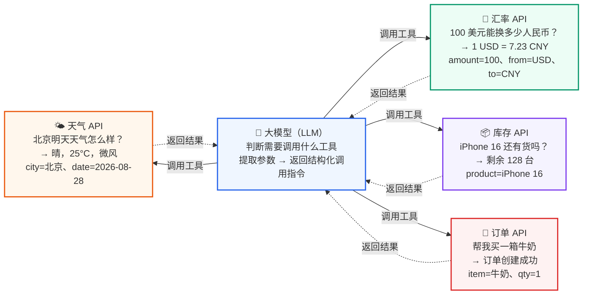
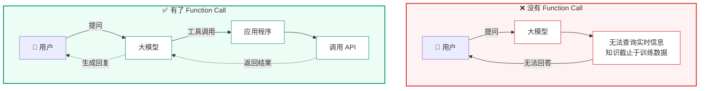
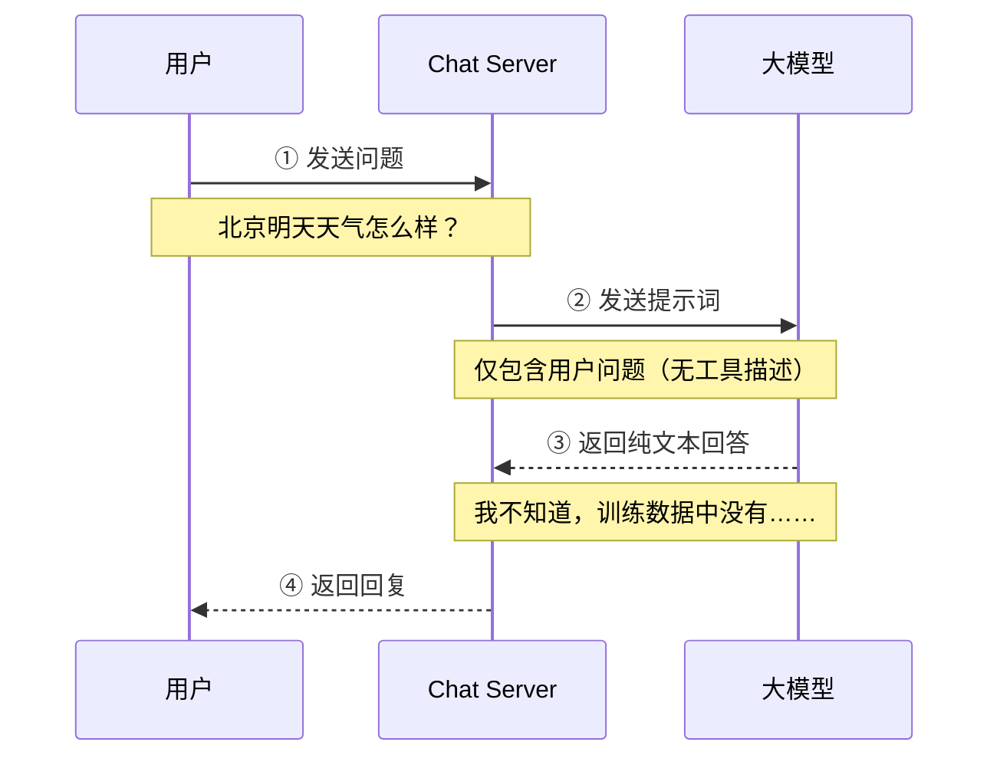
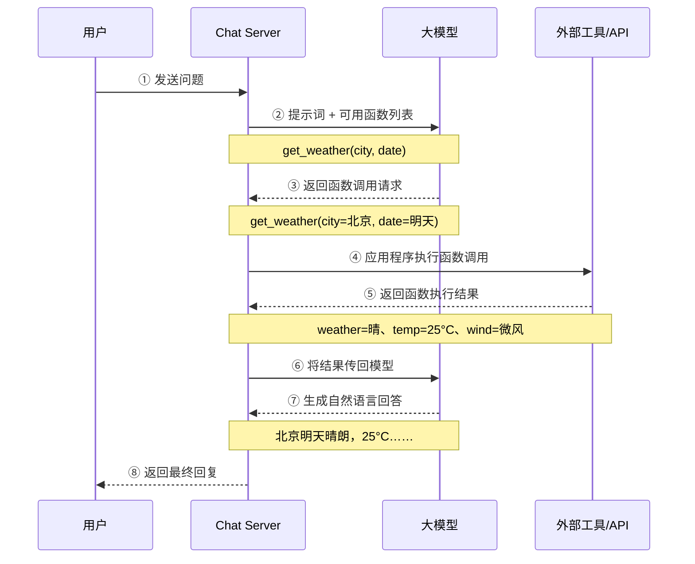
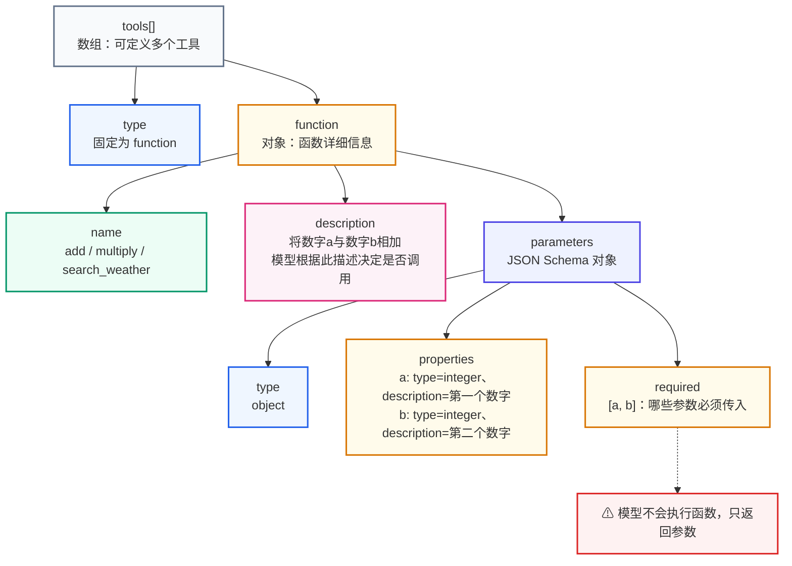
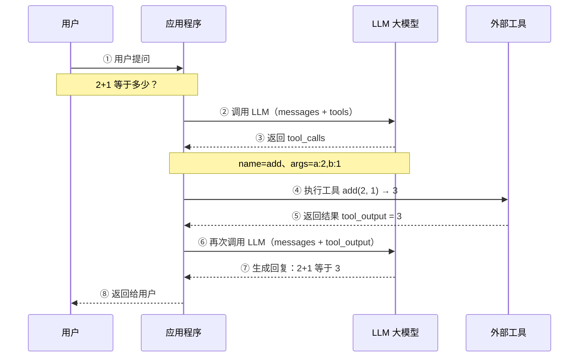
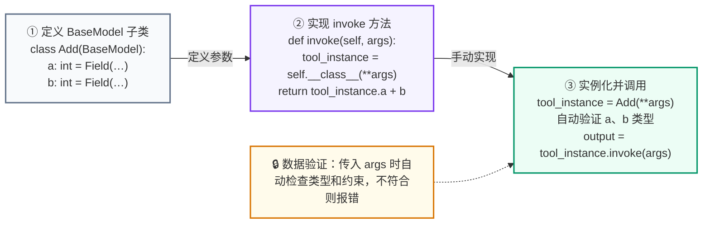
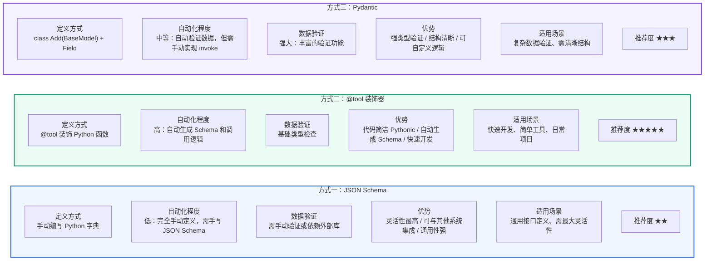

> 一句话总结：Function Call 让大模型从「只会聊天」变成「懂得求助」——模型自己不执行任何函数，只输出调用所需的参数，由应用程序去调用真实的 API，再把结果交回模型组织成自然语言回复。

## 一、什么是 Function Call

### 1 从一个生活场景说起

想象你是一位旅行顾问，客户问你："北京明天天气怎么样？适合户外游玩吗？"

你会怎么做？你不会凭空编造一个天气——你会打开天气 App 查一下，看到"晴，25°C，微风"，然后告诉客户："明天北京天气晴朗，气温 25 度，非常适合户外活动。"

**大模型也面临同样的处境**。用户问它"北京明天天气怎么样"，但大模型的知识截止于训练数据的时间点，它根本不知道"明天"是几月几号，更不知道那天的真实天气。如果硬让它回答，它要么瞎猜（产生"幻觉"），要么无奈地说"我不知道"。

**Function Call 就是让大模型学会"查 App"的能力**——模型自己不执行查询，但它能判断"这个问题需要调用天气工具"，然后告诉你："请帮我查一下城市=北京、日期=明天的天气"。应用程序拿到这些参数后，去调用真实的天气 API，把结果交回给模型，模型再把这些数据组织成一句通顺的回复。

```mermaid
flowchart LR
    A["① 用户提问<br/>北京明天天气怎么样？"] --> B["② 大模型思考<br/>需要调用天气工具"]
    B --> C["③ 模型输出参数<br/>city=北京、date=明天"]
    C --> D["④ 应用程序调用 API<br/>天气 API → 晴，25°C，微风"]
    D --> E["⑤ 返回真实数据<br/>晴，25°C，微风"]
    E --> F["⑥ 模型组织语言<br/>北京明天晴朗，25°C"]
    F --> G["⑦ 用户收到回答<br/>明天晴朗 25°C，非常适合户外活动"]

    style A fill:#F8FAFC,stroke:#64748B,stroke-width:2px
    style B fill:#ECFDF5,stroke:#10B981,stroke-width:2px
    style C fill:#EFF6FF,stroke:#2563EB,stroke-width:2px
    style D fill:#FFF7ED,stroke:#EA580C,stroke-width:2px
    style E fill:#ECFDF5,stroke:#10B981,stroke-width:2px
    style F fill:#EFF6FF,stroke:#2563EB,stroke-width:2px
    style G fill:#F8FAFC,stroke:#64748B,stroke-width:2px
```



> **图示解读：** 一次完整的 Function Call 共七步——用户提问 → 大模型判断需要调用天气工具 → 模型只输出结构化参数（不是答案）→ 应用程序拿参数调用真实天气 API → 拿到真实数据 → 交回模型组织语言 → 用户收到自然语言回答。注意第 ③ 步与第 ④ 步的分工：模型负责"想清楚要什么参数"，应用程序负责"真正把事办了"。

### 2 更多生活中的 Function Call

Function Call 的思路其实很朴素——**让"聪明但不联网"的大脑，学会"调用外部工具获取实时信息"**。类似的场景在生活中随处可见：

| 场景 | 大脑（大模型） | 工具（外部 API） | 用户提问 |
| --- | --- | --- | --- |
| 问天气 | 知道"晴天适合出行"，但不知道明天天气 | 天气 API → 返回"晴，25°C" | "北京明天天气怎么样？" |
| 查汇率 | 知道"1 美元 ≈ 7 元人民币"的大概概念，但不知道实时汇率 | 汇率 API → 返回"1 USD = 7.23 CNY" | "100 美元能换多少人民币？" |
| 查库存 | 知道某款手机的参数，但不知道仓库还剩多少 | 库存 API → 返回"剩余 128 台" | "iPhone 16 还有货吗？" |
| 下订单 | 理解"帮我下单"的意思，但没有权限操作电商系统 | 订单 API → 返回"订单创建成功，单号 20260828001" | "帮我买一箱牛奶" |



> **图示解读：** 四个场景都以大模型为调度中枢：模型判断"该调哪个工具"→ 提取参数 → 应用执行 → 结果回传 → 组织自然语言回复。差别只在于挂载的工具不同，主流程完全一致——这正是 Function Call 能被抽象成一套标准协议的前提。

可以看到，每个场景都遵循相同的模式：**大模型判断"我需要调用某个工具"→ 提取工具所需的参数 → 应用程序替它执行 → 把结果交回大模型 → 大模型组织成自然语言回复用户**。这就是 Function Call 的核心流程。

### 3 Function Call 解决了什么问题

在 Function Call 出现之前，要让大模型调用外部工具是一件非常困难的事——开发者需要自己写复杂的正则表达式或提示词工程，从用户输入中硬提取参数，再手动调用 API。这种方式不仅脆弱（用户换个说法就可能失效），而且无法处理多工具选择。

Function Call 的出现在三个层面解决了大模型的瓶颈：

| 问题维度 | 没有 Function Call | 有了 Function Call |
| --- | --- | --- |
| **信息实时性** | 只能用训练截止日期前的知识，问实时问题只能回答"我不知道" | 模型自主判断何时需要调用天气、股价、新闻等实时 API，获取最新数据 |
| **数据局限性** | 无法覆盖医学、法律、企业内部数据等专业领域 | 模型可调用外部数据库或 API，获取任意领域的详细信息 |
| **功能扩展性** | 复杂计算、数据分析等能力需要全部内建 | 只需注册新的工具函数，模型即可按需调用，能力无限扩展 |

**一个直观的对比**：假设用户问"帮我查一下上海到北京的火车票，然后看看北京明天天气如何"。

- 没有 Function Call：大模型只能输出一段文字——"我无法查询实时火车票和天气信息，建议您使用 12306 和天气 App。"
- 有了 Function Call：大模型先输出 `{"name": "query_train", "args": {"from": "上海", "to": "北京"}}`，应用程序调用火车票 API 拿到结果；再把结果和天气查询一起返回给模型，模型整合成一段通顺的回复："查到 3 趟高铁可选……北京明天晴，25°C，适合出行。"



> **图示解读：** 左边是"死路"：模型只能基于训练数据作答，遇到实时问题就退回"我无法查询"。右边多了「应用程序」与「调用 API」两个环节，模型把执行权外包出去，自己只负责决策与表达——链路变长了，但答案从"编造"变成了"有据可查"。

| | 没有 Function Call | 有了 Function Call |
| --- | --- | --- |
| 三大问题 / 优势 | 信息不实时：只能用训练截止日期的知识 | 信息实时：自主调用天气/股价/新闻等 API |
| | 数据有局限：无法覆盖医学/法律/企业等专业领域 | 数据无限：可接入任意领域的数据库/API |
| | 功能难扩展：复杂能力需要全部内建到模型中 | 功能可扩展：只需注册新工具函数即可 |
| 示例回复 | 无法查询火车票和天气信息，建议您使用 12306 和天气 App。 | 查到 3 趟高铁可选，最快 4h18m……北京明天晴，25°C，非常适合出行。 |

### 4 Function Call 的正式定义

2023 年 6 月 13 日 OpenAI 公布了 Function Call（函数调用）功能：它允许开发者向 GPT-4 和 GPT-3.5-turbo 模型描述函数，模型会智能地选择输出一个包含调用这些函数参数的 JSON 对象。这是一种更可靠地将 GPT 的能力与外部工具和 API 相连接的新方法。

GPT-4 及 GPT-3.5-turbo 之所以能使用 Function Call，是因为这些模型经过训练，不仅可以检测到何时需要调用函数（根据用户的输入），还可以回复符合函数参数的 JSON 对象，而不是直接返回常规的文本。

目前支持 Function Call 功能的模型除了 GPT 系列外，国内的模型也支持，如：百度文心一言、ChatGLM3-6B、讯飞星火 3.0 等。

## 二、Function Call 工作原理

接下来，我们对比有无 Function Call 功能时 GPT 模型工作流程的差异。

当**没有**函数调用（Function Call）时，我们调用 GPT 构建 AI 应用的模式非常简单：

1. 用户（client）发请求给我们的服务（chat server）
2. 我们的服务（chat server）给 GPT 提示词
3. 重复执行

当**有**函数调用（Function Call）时，模式比之前要复杂一些：

1. 用户发请求提示词，chat server 将提示词和可以调用的函数发送给大模型
2. GPT 模型根据用户的提示词，判断是用普通文本还是函数调用的格式响应我们的服务
3. 如果是函数调用格式，那么 chat server 就会执行这个函数，并将结果返回给 GPT
4. 然后模型使用提供的数据，用连贯的文本回答

**无 Function Call 时的工作流程：**



> **图示解读：** 整条链路只有一次模型交互：Chat Server 把用户问题原样转给大模型，模型只能"掏记忆"。由于提示词里没有任何工具描述，模型连"可以调用天气 API"这件事都不知道，最终只能返回一段纯文本。

> **局限：** 大模型只能基于训练数据回答，无法获取实时信息，遇到知识截止后的问题只能猜测或拒绝回答。

**有 Function Call 时的工作流程：**



> **图示解读：** 相比左图，这里多了三条关键信息流：② 提示词里携带了**可用函数列表**（让模型知道有哪些工具），③ 模型返回的是**函数调用请求**而非答案，⑤ 外部工具返回**真实执行结果**。模型在第 ④ 步之后再次被调用（第 ⑥ 步），才把结构化数据翻译成人话。

> **核心：** 模型不执行函数，只输出参数 → 应用程序执行 → 结果返回模型 → 模型组织回答。

需要注意的是，大模型的 Function Call **不会执行任何函数调用，仅返回调用函数所需要的参数**。开发者可以利用模型输出的参数在应用中执行函数调用。

## 三、Function Call 使用方式

> **为什么用加减法示例？** Function Call 最典型的应用是查询实时数据（如天气、股价）——模型只返回函数参数，由应用调用外部 API 获取结果。但为了聚焦"函数调用"本身、降低学习门槛，本节用最熟悉的**加减法**（`add` / `multiply`）作为示例：它足够简单，能让你看清"定义函数 → 描述函数 → 模型返回参数 → 应用执行"的完整链路。学会后，把加减法换成真实业务函数（如查询天气）即可，逻辑完全一致。

### 1 自定义 tool 结构

以下代码通过自定义 JSON 格式的工具 schema 来定义工具。

#### 1.1 导包

> 代码位置：`agent_learn/function_call/C01_define_tool.py`

```python
from langchain_openai import ChatOpenAI
from langchain_core.messages import HumanMessage, ToolMessage

from agent_learn.config import Config

conf = Config()
```

#### 1.2 定义外部函数

```python
# todo: 第一步：定义工具函数
def add(a: int, b: int) -> int:
    """
    将数字a与数字b相加
    Args:
        a: 第一个数字
        b: 第二个数字
    """
    return a + b

def multiply(a: int, b: int) -> int:
    """
    将数字a与数字b相乘
    Args:
        a: 第一个数字
        b: 第二个数字
    """
    return a * b
```

#### 1.3 描述函数功能

光有函数还不够，模型并不知道它存在。我们要用一份 JSON Schema 把工具的"名字、用途、参数"描述给模型：



> **图示解读：** 一份工具定义分三层：最外层 `tools[]` 是数组，可以一次注册多个工具；第二层 `type` 固定为 `function`（用于区分未来的其他工具类型），`function` 对象里装真正的元信息；第三层是 `name`（模型靠它选择工具）、`description`（模型靠它判断"该不该调用"）和 `parameters`（用 JSON Schema 描述每个参数的类型与含义，`required` 声明哪些必填）。**`description` 是模型决策的唯一依据，写得含糊模型就选错工具。**

为了向模型描述外部函数库，需要向 `tools` 字段传入可以调用的函数列表。参数如下表：

| 参数名称 | 类型 | 是否必填 | 参数说明 |
| --- | --- | --- | --- |
| type | String | 是 | 设置为 function |
| function | Object | 是 | 函数详细信息对象 |
| name | String | 是 | 函数名称 |
| description | String | 是 | 用于描述函数功能，模型会根据这段描述决定函数调用方式。 |
| parameters | Object | 是 | 需要传入一个 JSON Schema 对象，以准确地定义函数所接受的参数。若调用函数时不需要传入参数，省略该参数即可。 |
| required |  | 否 | 指定哪些属性在数据中必须被包含。 |

说明如下：

```json
// 定义 JSON 格式的工具 schema
tools = [
    {
        "type": "function",
        "function": {
            "name": "add",
            "description": "将数字a与数字b相加",
            "parameters": {
                "type": "object",
                "properties": {
                    "a": {
                        "type": "integer",
                        "description": "第一个数字"
                    },
                    "b": {
                        "type": "integer",
                        "description": "第二个数字"
                    }
                },
                "required": ["a", "b"]
            }
        }
    },
    {
        "type": "function",
        "function": {
            "name": "multiply",
            "description": "将数字a与数字b相乘",
            "parameters": {
                "type": "object",
                "properties": {
                    "a": {
                        "type": "integer",
                        "description": "第一个数字"
                    },
                    "b": {
                        "type": "integer",
                        "description": "第二个数字"
                    }
                },
                "required": ["a", "b"]
            }
        }
    }
]
```

#### 1.4 模型实例化

为方便使用配置，需要创建 `Config` 类。

> 代码位置：`agent_learn/config.py`

```python
class Config:
    def __init__(self):
        self.base_url = 'https://dashscope.aliyuncs.com/compatible-mode/v1'
        self.api_key = 'sk-xxxxxxxxxxxxxxxxxxxxxxxxxxxx'
        self.model_name = 'qwen-plus'
```

在 `C01_define_tool.py` 中实例化模型的代码如下：

```python
# todo: 第二步：初始化模型
llm = ChatOpenAI(base_url=conf.base_url,
                 api_key=conf.api_key,
                 model=conf.model_name,
                 temperature=0.1)
# 绑定工具，允许模型自动选择工具
llm_with_tools = llm.bind_tools(tools, tool_choice="auto")
```

#### 1.5 模型调用

绑定完工具后，一次完整的问答要走两轮模型调用：



> **图示解读：** 关键在第 ② 与第 ⑥ 步——**同一个模型被调用了两次**。第一次带上 `tools`，模型只决定"调哪个工具、传什么参数"；第 ④ 步由应用程序真正执行本地函数；第 ⑥ 步把执行结果作为 `ToolMessage` 追加进消息列表再问一次，模型才产出面向用户的自然语言答案。少了任何一轮，用户都拿不到最终回复。

```python
# todo: 第三步：调用回复
query = "2+1等于多少？"
messages = [HumanMessage(query)]

try:
    # todo: 第一次调用
    ai_msg = llm_with_tools.invoke(messages)
    messages.append(ai_msg)
    print(f"\n第一轮调用后结果：\n{messages}")

    # 处理工具调用
    # 判断消息中是否有tool_calls，以判断工具是否被调用
    if hasattr(ai_msg, 'tool_calls') and ai_msg.tool_calls:
        for tool_call in ai_msg.tool_calls:
            # todo: 处理工具调用
            selected_tool = {"add": add, "multiply": multiply}[tool_call["name"].lower()]
            tool_output = selected_tool(**tool_call["args"])
            messages.append(ToolMessage(content=tool_output, tool_call_id=tool_call["id"]))
        print(f"\n第二轮  message中增加tool_output 之后：\n{messages}")

        # todo: 第二次调用，将工具结果传回模型以生成最终回答
        final_response = llm_with_tools.invoke(messages)
        print(f"\n最终模型响应：\n{final_response.content}")
    else:
        print("模型未生成工具调用，直接返回文本:")
        print(ai_msg.content)
except Exception as e:
    print(f"模型调用失败: {str(e)}")
```

#### 1.6 完整代码

```python
from langchain_openai import ChatOpenAI
from langchain_core.messages import HumanMessage, ToolMessage

from agent_learn.config import Config

conf = Config()

# todo: 第一步：定义工具函数
def add(a: int, b: int) -> int:
    """
    将数字a与数字b相加
    Args:
        a: 第一个数字
        b: 第二个数字
    """
    return a + b

def multiply(a: int, b: int) -> int:
    """
    将数字a与数字b相乘
    Args:
        a: 第一个数字
        b: 第二个数字
    """
    return a * b

# 定义 JSON 格式的工具 schema
tools = [
    {
        "type": "function",
        "function": {
            "name": "add",
            "description": "将数字a与数字b相加",
            "parameters": {
                "type": "object",
                "properties": {
                    "a": {"type": "integer", "description": "第一个数字"},
                    "b": {"type": "integer", "description": "第二个数字"}
                },
                "required": ["a", "b"]
            }
        }
    },
    {
        "type": "function",
        "function": {
            "name": "multiply",
            "description": "将数字a与数字b相乘",
            "parameters": {
                "type": "object",
                "properties": {
                    "a": {"type": "integer", "description": "第一个数字"},
                    "b": {"type": "integer", "description": "第二个数字"}
                },
                "required": ["a", "b"]
            }
        }
    }
]

# todo: 第二步：初始化模型
llm = ChatOpenAI(base_url=conf.base_url,
                 api_key=conf.api_key,
                 model=conf.model_name,
                 temperature=0.1)
# 绑定工具，允许模型自动选择工具
llm_with_tools = llm.bind_tools(tools, tool_choice="auto")

# todo: 第三步：调用回复
query = "2+1等于多少？"
messages = [HumanMessage(query)]

try:
    # todo: 第一次调用
    ai_msg = llm_with_tools.invoke(messages)
    messages.append(ai_msg)
    print(f"\n第一轮调用后结果：\n{messages}")

    # 处理工具调用
    # 判断消息中是否有tool_calls，以判断工具是否被调用
    if hasattr(ai_msg, 'tool_calls') and ai_msg.tool_calls:
        for tool_call in ai_msg.tool_calls:
            # todo: 处理工具调用
            selected_tool = {"add": add, "multiply": multiply}[tool_call["name"].lower()]
            tool_output = selected_tool(**tool_call["args"])
            messages.append(ToolMessage(content=tool_output, tool_call_id=tool_call["id"]))
        print(f"\n第二轮  message中增加tool_output 之后：\n{messages}")

        # todo: 第二次调用，将工具结果传回模型以生成最终回答
        final_response = llm_with_tools.invoke(messages)
        print(f"\n最终模型响应：\n{final_response.content}")
    else:
        print("模型未生成工具调用，直接返回文本:")
        print(ai_msg.content)
except Exception as e:
    print(f"模型调用失败: {str(e)}")
```

注意 `bind_tools` 与临时传参的区别：

```text
llm.invoke(messages, tools=tools, ...):
绑定方式: 直接在 .invoke() 调用中传入 tools 参数。这是一种临时、一次性的绑定方式，仅对本次调用有效。
调用方式: 如果你想再次调用模型并使用工具，必须在下一次 .invoke() 调用中再次传递 tools 参数。
适用场景: 适用于简单、单次的工具调用需求。
```

### 2 装饰器 tool 方式

**定义方式**：通过 `@tool` 装饰器直接装饰一个普通的 Python 函数，比如 `add` 和 `multiply`。

**工作原理**：`@tool` 装饰器会自动根据函数签名（如 `a: int, b: int`）和文档字符串生成一个完整的工具定义（schema），包括工具名称、描述和参数结构。

**优势**：

- **简洁高效**：这是最简单、最 Pythonic 的方式，几乎不需要额外的样板代码。你只需编写核心函数逻辑，工具定义部分由框架自动处理。
- **自动化**：LangChain 的工具系统会自动处理工具的封装和调用，包括基本的参数类型验证。

```mermaid
flowchart LR
    A["① 普通 Python 函数<br/>def add(a: int, b: int) -> int:<br/>将 a 与 b 相加<br/>return a + b"]
    B["② 装饰器自动处理<br/>读取函数签名 → 提取参数类型<br/>读取 docstring → 生成描述<br/>自动生成 JSON Schema"]
    C["③ 工具对象<br/>StructuredTool<br/>name=add<br/>args_schema=…"]
    D["注册到工具列表"]

    A -->|@tool 装饰| B
    B -->|生成 Schema| C
    C --> D

    style A fill:#F8FAFC,stroke:#64748B,stroke-width:2px
    style B fill:#EFF6FF,stroke:#2563EB,stroke-width:2px
    style C fill:#ECFDF5,stroke:#059669,stroke-width:2px
    style D fill:#ECFDF5,stroke:#059669,stroke-width:2px
```

> **图示解读：** `@tool` 做的是"翻译"工作：把函数签名翻译成参数类型、把 docstring 翻译成 description，最终产出标准 `StructuredTool` 对象。**所以 docstring 必须写清楚**——它直接决定了模型看到的工具描述。

> 类比：给函数"穿上工具外套"。普通函数就像"便装"，只能自己调用 `add(1, 2)`；`@tool` 装饰器就像"工具外套"，穿上后函数变成了标准工具，LLM 可以识别和调用；外套自动适配尺寸（生成 Schema），你只需关注函数本身的业务逻辑。优势是代码简洁、自动化程度高、适合快速开发和简单工具。

代码如下：

> 代码位置：`agent_learn/function_call/C02_by_annotation.py`

```python
from langchain_openai import ChatOpenAI
from langchain_core.messages import HumanMessage, ToolMessage
from langchain_core.tools import tool

from agent_learn.config import Config

conf = Config()

# todo: 第一步：定义工具函数
@tool
def add(a: int, b: int) -> int:
    """
    将数字a与数字b相加
    Args:
        a: 第一个数字
        b: 第二个数字
    """
    return a + b

@tool
def multiply(a: int, b: int) -> int:
    """
    将数字a与数字b相乘
    Args:
        a: 第一个数字
        b: 第二个数字
    """
    return a * b

# 定义 JSON 格式的工具 schema
tools = [add, multiply]

# todo: 第二步：初始化模型
llm = ChatOpenAI(base_url=conf.base_url,
                 api_key=conf.api_key,
                 model=conf.model_name,
                 temperature=0.1)
# 绑定工具，允许模型自动选择工具
llm_with_tools = llm.bind_tools(tools, tool_choice="auto")

# todo: 第三步：调用回复
query = "2+1等于多少？"
messages = [HumanMessage(query)]

try:
    # todo: 第一次调用
    ai_msg = llm_with_tools.invoke(messages)
    messages.append(ai_msg)
    print(f"\n第一轮调用后结果：\n{messages}")

    # 处理工具调用
    # 判断消息中是否有tool_calls，以判断工具是否被调用
    if hasattr(ai_msg, 'tool_calls') and ai_msg.tool_calls:
        for tool_call in ai_msg.tool_calls:
            # todo: 处理工具调用
            selected_tool = {"add": add, "multiply": multiply}[tool_call["name"].lower()]
            tool_output = selected_tool.invoke(tool_call["args"])  # 需要使用invoke进行调用
            messages.append(ToolMessage(content=tool_output, tool_call_id=tool_call["id"]))
        print(f"\n第二轮  message中增加tool_output 之后：\n{messages}")

        # todo: 第二次调用，将工具结果传回模型以生成最终回答
        final_response = llm_with_tools.invoke(messages)
        print(f"\n最终模型响应：\n{final_response.content}")
    else:
        print("模型未生成工具调用，直接返回文本:")
        print(ai_msg.content)
except Exception as e:
    print(f"模型调用失败: {str(e)}")
```

> 与 JSON Schema 方式的两点差异：`tools` 里直接放**函数对象**而不是字典；执行时要用 `selected_tool.invoke(...)`，而不是 `selected_tool(...)`。

### 3 pydantic 的 tool 方式

通过严格数据校验 Pydantic 进行工具定义：

**定义方式**：创建一个继承自 `BaseModel` 的类，用类型注解和 `Field` 定义工具参数，并在类中手动实现 `invoke` 方法包含执行逻辑。

**与 `@tool` 的区别**：`@tool` 自动生成 Schema 和调用逻辑；Pydantic 方式则需手动实现 `invoke`，但换来更强的数据验证（自动校验参数类型与约束）和更清晰的结构。

> **说明**：Pydantic 方式在实际项目中用得相对较少，多数场景用 `@tool` 更省事。这里介绍它，是为了让你了解三种定义方式的差异（见下方对比表）。



> **图示解读：** 三步里框架只帮你做了第一步的"参数声明"，第二步的 `invoke` 要自己写。代价是多写几行代码，收益是每次实例化 `Add(**args)` 时 Pydantic 都会强制校验类型——传 `a="abc"` 会立刻报错，而不是等到运行时才算错。

> 类比：Pydantic 就像"带质检的生产线"，每个参数都要经过严格检查；如果传入 `a="abc"`（应该是 int），Pydantic 会立即报错，而不是等到运行时才发现问题；就像工厂质检员，不合格的产品（参数）直接拦截，保证进入生产线的都是合格品。适用场景是需要复杂数据验证、清晰结构和自定义逻辑的场景。

代码如下：

> 代码位置：`agent_learn/function_call/C03_by_pydantic.py`

```python
from langchain_openai import ChatOpenAI
from langchain_core.messages import HumanMessage, ToolMessage
from pydantic.v1 import BaseModel, Field

from agent_learn.config import Config

conf = Config()

# todo: 第一步：定义工具类
class Add(BaseModel):
    """将两个数字相加"""
    a: int = Field(..., description="第一个数字")
    b: int = Field(..., description="第二个数字")

    def invoke(self, args):
        # 验证参数
        tool_instance = self.__class__(**args)  # 自动验证 a 和 b
        return tool_instance.a + tool_instance.b

class Multiply(BaseModel):
    """将两个数字相乘"""
    a: int = Field(..., description="第一个数字")
    b: int = Field(..., description="第二个数字")

    def invoke(self, args):
        # 验证参数
        tool_instance = self.__class__(**args)  # 自动验证 a 和 b
        return tool_instance.a * tool_instance.b

# 使用类名作为工具
tools = [Add, Multiply]

# todo: 第二步：初始化模型
llm = ChatOpenAI(base_url=conf.base_url,
                 api_key=conf.api_key,
                 model=conf.model_name,
                 temperature=0.1)
# 绑定工具，允许模型自动选择工具
llm_with_tools = llm.bind_tools(tools, tool_choice="auto")

# todo: 第三步：调用回复
query = "2+1等于多少？"
messages = [HumanMessage(query)]

try:
    # todo: 第一次调用
    ai_msg = llm_with_tools.invoke(messages)
    messages.append(ai_msg)
    print(f"\n第一轮调用后结果：\n{messages}")

    # 处理工具调用
    # 判断消息中是否有tool_calls，以判断工具是否被调用
    if hasattr(ai_msg, 'tool_calls') and ai_msg.tool_calls:
        for tool_call in ai_msg.tool_calls:
            # todo: 处理工具调用
            selected_tool = {"add": Add, "multiply": Multiply}[tool_call["name"].lower()]
            # 实例化工具类并调用 invoke
            tool_instance = selected_tool(**tool_call["args"])
            tool_output = tool_instance.invoke(tool_call["args"])
            messages.append(ToolMessage(content=tool_output, tool_call_id=tool_call["id"]))
        print(f"\n第二轮  message中增加tool_output 之后：\n{messages}")

        # todo: 第二次调用，将工具结果传回模型以生成最终回答
        final_response = llm_with_tools.invoke(messages)
        print(f"\n最终模型响应：\n{final_response.content}")
    else:
        print("模型未生成工具调用，直接返回文本:")
        print(ai_msg.content)
except Exception as e:
    print(f"模型调用失败: {str(e)}")
```

### 4 三种定义方式对比



> **图示解读：** 三种方式的差异集中在"自动化程度"与"数据验证强度"两个维度上，并且是反向的——`@tool` 自动化最高但只做基础类型检查；Pydantic 要手写 `invoke`，却换来最强的校验能力。**日常开发首选 `@tool`，需要严格验证或复杂参数结构时再用 Pydantic，需要与其他系统做通用集成时才回到手写 JSON Schema。**

**推荐：日常开发使用 `@tool` 装饰器，需要严格验证时使用 Pydantic。**

| 特性 | JSON Schema | @tool 装饰器 | Pydantic |
| --- | --- | --- | --- |
| 定义方式 | 手动编写 Python 字典（JSON Schema） | 装饰 Python 函数 | 继承 Pydantic BaseModel |
| 自动化程度 | 低：完全手动定义和分发 | 高：自动生成 Schema 和调用逻辑 | 中等：自动验证数据，但需手动实现 invoke |
| 数据验证 | 需要手动验证或依赖外部库 | 基础类型检查 | 强大：提供丰富的验证功能 |
| 适用场景 | 需要与其他系统集成、通用性和最大灵活性的场景 | 快速开发、简单工具、原型验证 | 需要复杂数据验证、清晰结构和自定义逻辑的场景 |

## 四、Agent 调用 tool

Agent（智能体）是一种能够感知环境、进行决策和执行动作的智能实体。从大模型的角度来看，**Agent 其实就是基于大模型的语义理解和推理能力，让大模型拥有解决复杂问题时的任务规划能力，并调用外部工具来执行各种任务，并且能够保留"记忆"的一个智能体**。

> Agent = 大模型 + 任务规划（Planning） + 使用外部工具执行任务（Tools & Action） + 记忆（Memory）

Agent 的核心就是大模型，它调用工具的方式通常通过 Function Call 实现，不过很多 Agent 框架对内部的调用过程进行了封装，所以更易使用。

```mermaid
flowchart LR
    A["👤 用户输入<br/>2+1 等于多少？"]
    B["🤖 Agent（智能体）<br/>分析意图 → 选择工具 → 执行 → 返回<br/>封装了 Function Call 的完整流程"]
    C["🧰 工具列表<br/>add、multiply<br/>自动选择 add"]
    D["📤 返回结果<br/>result: 3"]
    E["📥 最终输出<br/>2+1 等于 3"]

    A --> B
    B -->|调用工具| C
    C -->|执行 add(2, 1)| D
    D -->|结果返回| B
    B --> E

    style A fill:#EFF6FF,stroke:#2563EB,stroke-width:2px
    style B fill:#FFFBEB,stroke:#D97706,stroke-width:2px
    style C fill:#ECFDF5,stroke:#059669,stroke-width:2px
    style D fill:#F8FAFC,stroke:#64748B,stroke-width:2px
    style E fill:#EFF6FF,stroke:#2563EB,stroke-width:2px
```

> **图示解读：** 与第三节的"手动版"相比，Agent 把「分析意图 → 选工具 → 执行 → 把结果喂回模型 → 再要一次回答」这一整套循环收进了自己内部。外部只需要一次 `agent.invoke("2+1等于多少？")`，中间的两轮模型调用、`tool_calls` 解析、`ToolMessage` 拼装都由框架完成。

> 类比：手动 Function Call 像"自己做饭"——你要自己判断用什么工具、怎么调用、怎么处理结果；Agent 像"智能管家"——你只需说"2+1 等于多少"，管家自动判断用计算器、执行计算、告诉你结果。Agent = 大模型 + 任务规划 + 工具调用 + 记忆，是更高级的 Function Call 封装。适用场景是复杂任务、多步骤推理、需要自动选择工具的场景。

代码如下：

> 代码位置：`agent_learn/function_call/C04_by_agent.py`

```python
from langchain.agents import initialize_agent, AgentType
from langchain_openai import ChatOpenAI
from langchain_core.tools import tool

from agent_learn.config import Config

conf = Config()

# todo: 第一步：定义工具函数
@tool
def add(a: int, b: int) -> int:
    """
    将数字a与数字b相加
    Args:
        a: 第一个数字
        b: 第二个数字
    """
    return a + b

@tool
def multiply(a: int, b: int) -> int:
    """
    将数字a与数字b相乘
    Args:
        a: 第一个数字
        b: 第二个数字
    """
    return a * b

# 加载工具
tools = [add, multiply]

# todo: 第二步：初始化模型
llm = ChatOpenAI(base_url=conf.base_url,
                 api_key=conf.api_key,
                 model=conf.model_name,
                 temperature=0.1)

# todo: 第三步：创建Agent
agent = initialize_agent(tools, llm, AgentType.STRUCTURED_CHAT_ZERO_SHOT_REACT_DESCRIPTION, verbose=True)

# todo: 第四步：调用Agent
query = "2+1等于多少？"
result = agent.invoke(query)
print(f'result: {result["output"]}')
```

核心代码只有 4 行（创建 Agent + 调用），对比手动 Function Call 需要自己处理 `tool_calls`、`invoke`、`ToolMessage`，Agent 一行 `invoke()` 搞定，框架自动处理所有细节。

## 本节小结

- Function Call 的本质是**模型只输出参数、不执行函数**，执行权留在应用程序手里
- 一次完整调用需要**两轮模型交互**：第一轮拿到 `tool_calls`，第二轮拿到自然语言答案
- 工具定义的三种方式中，`@tool` 装饰器日常最省事，Pydantic 适合需要严格校验的场景
- Agent 是对 Function Call 流程的封装，把"多轮调用 + 工具执行"隐藏起来，让调用方只写一行