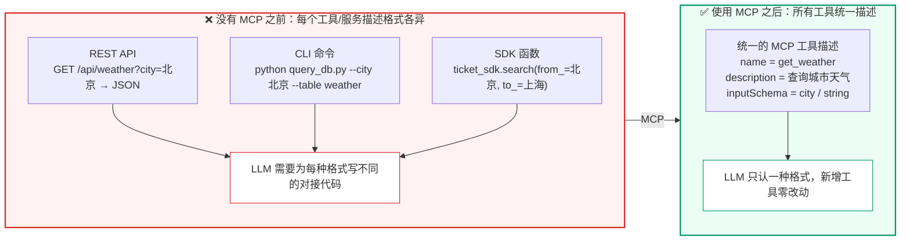
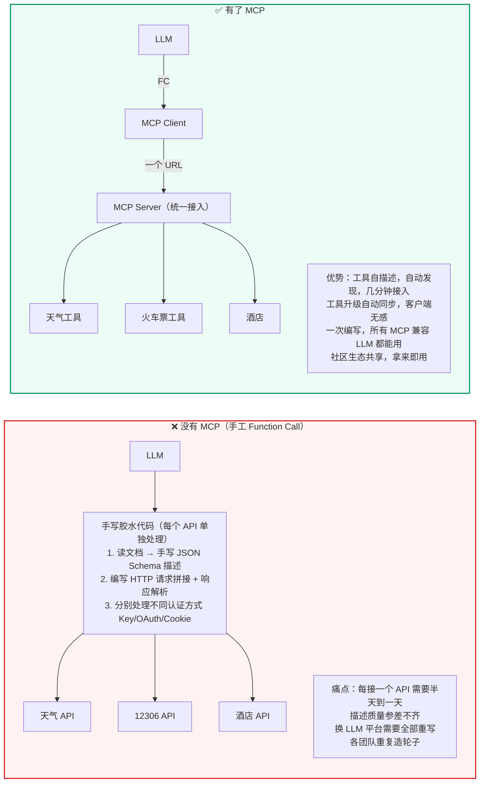
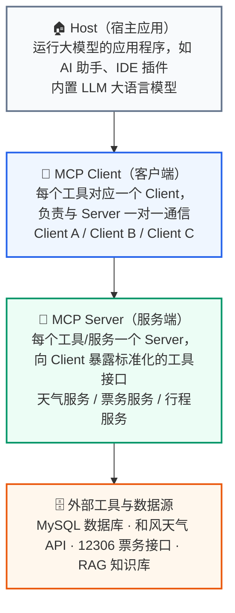
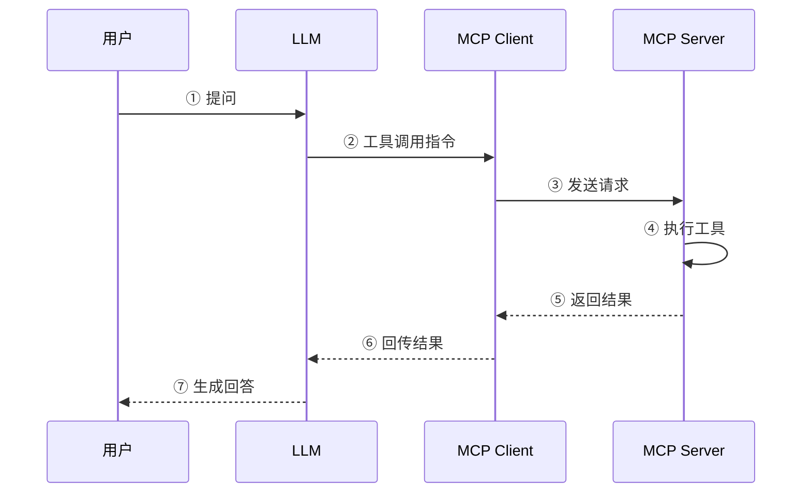
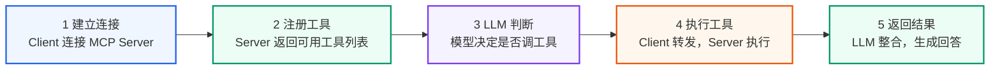

> 一句话总结：Function Call 解决的是"模型怎么表达要调用工具"，MCP 解决的是"工具怎么被统一暴露和调用"——前者是模型层的能力，后者是工具层的协议。MCP 想做的，是 AI 世界的 Type-C。

## 一、背景

### 1 从一个生活场景说起

你的手机、耳机、平板、笔记本……每台设备都需要充电，但你家里的充电线可能只有一两种——Type-C 解决了这个问题。在 Type-C 出现之前，每家厂商都有自己的充电口：Micro-USB、Lightning、Mini-USB……出门得带一堆线，借充电宝还得看接口匹不匹配。

**大模型调用工具也经历了类似的"接口混乱"阶段**。

在前面的 Function Call 例子中，工具的描述（函数名、参数格式、说明文字）都是由应用开发者手写的。这就带来两个现实问题：

- **描述质量参差不齐**：每个开发者对同一个工具的描述方式不同，有的写"查询天气"，有的写"获取气象信息"，参数有的用 `city`、有的用 `location`。模型调用的稳定性自然无法保证。
- **重复劳动严重**：你写了一个天气查询工具，隔壁团队也想用——但他们得重新写一遍描述、重新调试参数格式。工具越多，重复工作越多。



> **图示解读：** 左边是三种形态各异的工具接入方式——HTTP 接口、命令行脚本、SDK 函数，每一种都要 LLM 侧单独写对接代码；MCP 把这三种形态统一收敛成一份"名字 + 描述 + 参数 Schema"的声明，模型只认这一种格式。这就是 MCP 被称为"工具世界 USB 接口"的原因。

**核心矛盾在于**：工具的描述应该由**最了解工具的人**（工具开发者）来完成，而不是由调用者（应用开发者）去猜。如果工具能"自我介绍"——清晰地描述自己有什么能力、需要什么参数——就能实现"一次编写，到处调用"。

这就是 MCP 要解决的问题。
### 2 有了 MCP 之前 vs 有了 MCP 之后

为了更直观地理解 MCP 的价值，先看一个**真实开发场景的对比**：假设你的团队要开发一个旅行助手，需要接入天气查询、火车票查询、酒店查询三个外部工具。

**有了 MCP 之前（Function Call 手工集成）：**

```text
应用开发者视角：
1. 打开天气 API 文档 → 手写 JSON Schema 描述（函数名、参数、返回值）
2. 打开 12306 API 文档 → 手写 JSON Schema 描述
3. 打开酒店 API 文档 → 手写 JSON Schema 描述
4. 编写胶水代码：拼接 HTTP 请求 → 解析响应 → 转换格式
5. 每个 API 的认证方式不同（API Key / OAuth / Cookie），分别处理
6. 如果换一个 LLM 平台，以上全部重写一遍
```

**有了 MCP 之后：**

```text
应用开发者视角：
1. 连接 MCP Server（一个 URL 搞定）
2. 自动获取工具列表（Server 自己描述自己）
3. 直接用，认证/格式/错误处理全由 MCP Server 负责
```



> **图示解读：** 左图是"星型直连"——LLM 通过一堆手写胶水代码分别对接 N 个 API，每加一个工具就多一份维护成本。右图把胶水代码换成了 **MCP Server（统一接入）**：LLM 只经 Function Call 与 MCP Client 打交道，Client 再通过一个 URL 连上 Server，由 Server 内部去适配底下的三类工具。接入成本从"每个 API 半天"变成"一次配置"。

下面用一张对比表把差异说清楚：

| 对比维度 | 没有 MCP（手工 Function Call） | 有了 MCP |
| --- | --- | --- |
| **工具描述谁写** | 应用开发者手写（经常不准确） | 工具开发者自己写（最准确） |
| **接入一个新工具** | 读文档 → 写 Schema → 写胶水代码 → 测试，通常半天到一天 | 配置 MCP Server 地址 → 自动发现工具，几分钟 |
| **工具升级** | 应用侧也要同步改 Schema 和胶水代码 | Server 侧更新即可，客户端自动获取最新描述 |
| **跨 LLM 复用** | 每个 LLM 平台的 Schema 格式不同，需要分别适配 | MCP 是统一协议，一次编写，所有支持 MCP 的 LLM 都能用 |
| **生态共享** | 各团队各自造轮子，同一个 API 被不同团队重复集成 | MCP 社区提供标准化工具服务，拿来即用 |

**一句话总结**：MCP 之前，每个应用开发者都在"手工接线"；MCP 之后，工具自己"插上就能用"——就像 Type-C 统一了充电口一样。

### 3 更多场景：MCP 在真实业务中的价值

| 场景 | 没有 MCP 的痛点 | 有了 MCP 的解法 |
| --- | --- | --- |
| **企业内部知识库** | 每个 AI 应用都要单独写一套 RAG 接入代码，不同团队各搞一套 | 知识库团队发布一个 MCP Server，所有 AI 应用统一接入，查询/权限/缓存全由 Server 管理 |
| **数据库查询** | 开发者在提示词里拼 SQL，既不安全也不可控 | DBA 发布 MCP Server，只暴露安全的查询工具，参数化查询防止注入，权限由 Server 统一管控 |
| **第三方 SaaS 集成** | 每接一个 SaaS（如 Slack、Jira、GitHub）都要写一套集成代码 | 社区已有大量现成的 MCP Server，配置 URL 即可使用 |
| **多模型切换** | 从 GPT 切到 Claude 切到通义千问，工具集成代码要重写三遍 | MCP 工具定义与模型无关，切换模型不影响工具层 |

```mermaid
flowchart TB
    subgraph S1["场景一：企业内部知识库"]
        S1A["❌ 没有 MCP：每个 AI 应用单独写 RAG 接入代码<br/>不同团队各搞一套，重复劳动<br/>App A / App B / App C 各写一套"]
        S1B["✅ 有了 MCP：知识库团队发布 1 个 MCP Server<br/>所有 AI 应用统一接入<br/>App A/B/C → 同一个 MCP Server"]
        S1C["收益：一次构建，全公司复用；权限/缓存由 Server 统一管理"]
        S1A --> S1B --> S1C
    end

    subgraph S2["场景二：数据库查询"]
        S2A["❌ 没有 MCP：开发者在提示词里拼 SQL<br/>不安全、不可控、有注入风险<br/>LLM → SELECT * FROM ..."]
        S2B["✅ 有了 MCP：DBA 发布 MCP Server<br/>参数化查询，权限由 Server 管控<br/>LLM → MCP → 安全的参数化 SQL"]
        S2C["收益：参数化查询防注入，DBA 统一管控权限"]
        S2A --> S2B --> S2C
    end

    subgraph S3["场景三：第三方 SaaS 集成"]
        S3A["❌ 没有 MCP：每接一个 SaaS 写一套集成代码<br/>Slack/Jira/GitHub 各搞各的<br/>API Key/OAuth/REST 各不相同"]
        S3B["✅ 有了 MCP：社区已有大量现成 MCP Server<br/>配置 URL 即可使用<br/>Slack MCP / Jira MCP / GitHub MCP"]
        S3C["收益：社区生态即插即用，零集成成本"]
        S3A --> S3B --> S3C
    end

    subgraph S4["场景四：多模型切换"]
        S4A["❌ 没有 MCP：从 GPT 切到 Claude 切到通义<br/>工具集成代码要重写三遍<br/>每个 LLM 平台 Schema 格式不同"]
        S4B["✅ 有了 MCP：工具定义与模型无关<br/>切换模型不影响工具层<br/>MCP Server = 统一标准接口"]
        S4C["收益：工具层与模型解耦，切换零成本"]
        S4A --> S4B --> S4C
    end

    style S1 fill:#ECFDF5,stroke:#059669,stroke-width:2px
    style S2 fill:#EFF6FF,stroke:#2563EB,stroke-width:2px
    style S3 fill:#F5F3FF,stroke:#7C3AED,stroke-width:2px
    style S4 fill:#FFF7ED,stroke:#EA580C,stroke-width:2px
```


> **图示解读：** 四个场景的共性都是"从 N 份重复实现收敛到 1 个统一出口"：知识库把接入代码收敛到一个 Server、数据库把 SQL 拼接收敛到参数化查询、SaaS 把集成代码收敛到社区现成的 Server、多模型把平台适配收敛到与模型无关的工具层。**MCP 的核心价值就是工具自描述 + 统一标准 + 生态共享，最终落到"一次编写，到处调用"。**

## 二、什么是 MCP 协议

**一个生活类比**：把 LLM 想象成餐厅里的顾客，MCP 就是服务员。顾客（LLM）知道自己想吃什么（意图），但不会做菜（没有数据访问能力）。服务员（MCP Server）知道菜单上有什么（工具列表），能帮顾客下单到厨房（执行工具），再把菜端回来（返回结果）。顾客不需要知道厨房在哪、怎么做菜——只要说"我要宫保鸡丁"，服务员就搞定一切。

在这个类比中：

- **MCP 服务端（Server）** = 服务员 + 厨房接口：把本地函数包装成标准接口暴露出去
- **MCP 客户端（Client）** = 服务员点单系统：连接服务端、查询菜单（工具列表）并按需下单（调用工具）
- **MCP 主机（Host）** = 餐厅本身：发起请求的 LLM 应用，MCP 客户端是主机程序内部的一个对象

MCP（Model Context Protocol，模型上下文协议）是由 Anthropic 提出的一套开放协议，旨在实现大型语言模型（LLM）与外部数据源和工具的无缝集成，用来在大模型和数据源之间建立安全双向的链接。

Anthropic 的愿景，是希望把 MCP 协议打造成 AI 世界的"Type-C"接口，可以通过 MCP 协议把工具、数据链接起来，达到类似 HTTP 协议的那种通用程度。

> 协议（Protocol）是一种约定或标准，用于定义不同系统、设备或软件之间如何通信和交换数据。它确保各方使用相同的"语言"和规则，避免混乱。例如，HTTP 协议定义了浏览器与服务器的交互方式，USB 协议标准化了设备连接。

### 1 MCP 核心架构



> **图示解读：** 自上而下四层，职责逐层收敛——Host 是**跑着大模型的应用进程**（只有它知道用户意图）；MCP Client 是 Host 内部的对象，**一个 Server 配一个 Client**，负责把模型的意图翻译成协议请求；MCP Server 是**工具的封装层**，对外只暴露标准化接口，对内实现业务逻辑；最底层才是真正干活的数据库与第三方 API。分层的收益是：换数据源不用动模型，换模型也不用动数据源。

MCP 协议有两个核心角色：客户端与服务端。

**MCP 服务端（Tool Provider）：**

- **角色**：工具的提供者。
- **职责**：将一个或多个本地函数（例如 Python 函数）包装起来，通过一个标准的 MCP 接口暴露出去。它监听来自客户端的请求，执行对应的函数，并返回结果。
- **例子**：一个天气查询服务、一个数学计算服务、一个数据库访问服务。

**MCP 客户端（Tool Consumer）：**

- **角色**：工具的调用者或消费者。
- **职责**：连接到 MCP 服务端，查询可用的工具列表（自发现），并根据需要调用这些工具。
- **例子**：大模型 Agent、自动化脚本、任何需要远程执行功能的应用程序。
### 2 MCP 工具调用流程



> **图示解读：** 注意第 ④ 步是**自循环**——真正执行工具逻辑的动作发生在 MCP Server 内部，模型侧完全看不到实现细节。整条链路的分工是：LLM 只负责判断"调哪个工具"，MCP Client 负责通信与转发，MCP Server 负责执行。这也是 MCP 与 Function Call 的分界线所在。

> MCP 主机（MCP Hosts）指的是发起请求的 LLM 应用程序。MCP 客户端（MCP Clients）指的是在主机程序内部的一个对象。
>
> 核心要点：**MCP Client 负责与 Server 通信并调用工具；LLM 只负责判断"该调哪个工具"，并不直接执行工具**。

无论使用哪种传输方式（stdio / SSE / Streamable HTTP），Client 与 Server 的交互模式完全一致：



> **图示解读：** 五个步骤里，第 1、2 步只在连接建立时发生一次（Host 为每个 MCP Server 创建一个对应的 Client，Server 回吐工具清单）；第 3、4、5 步则是每轮问答都会走一遍的循环。**关键：MCP Client 对 LLM 是透明的**——LLM 只输出"调哪个工具 + 什么参数"，通信、转发、执行全部由 Client 和 Server 自动完成，开发者不用手写对接代码。

**步骤 1：客户端注册并连接 MCP Server**

- MCP Client 启动后，根据配置文件或命令参数连接多个 MCP Server。
- 每个 Server 都会返回一份工具描述列表（Tool Manifest），包括：

```json
[
  {
    "name": "query_mysql",
    "description": "执行 SQL 查询",
    "input_schema": {},
    "output_schema": {}
  }
]
```

- Client 将这些工具的元信息缓存并上报给 LLM，使大模型"知道"有哪些可用工具。

**步骤 2：LLM 接收用户输入并决定调用工具**

- 用户输入请求（如："帮我查一下 users 表中有多少行数据"）。
- LLM 分析语义后，判断需要使用 `query_mysql` 工具。
- LLM 生成 function calling 格式的调用指令：

```json
{
  "name": "query_mysql",
  "arguments": {
    "sql": "SELECT COUNT(*) FROM users;"
  }
}
```

**步骤 3：MCP Client 执行工具调用**

- MCP Client 收到该调用后，匹配到对应的 Server。
- 按协议通过 stdio 或 WebSocket 将请求发送给 MCP Server，例如：

```json
{
  "type": "tool_call",
  "tool": "query_mysql",
  "args": {"sql": "SELECT COUNT(*) FROM users;"}
}
```

**步骤 4：MCP Server 执行工具逻辑**

- MCP Server 内部执行工具逻辑（例如运行 SQL 查询）。
- 生成结果：

```json
{
  "result": [{"count": 520}]
}
```

- 将结果通过相同的通信通道返回给 MCP Client。

**步骤 5：结果回传给 LLM**

- MCP Client 接收结果，并包装为 ToolMessage 发送回 LLM。
- LLM 读取结果上下文，再生成最终自然语言回答："数据库中共有 520 条用户记录。"