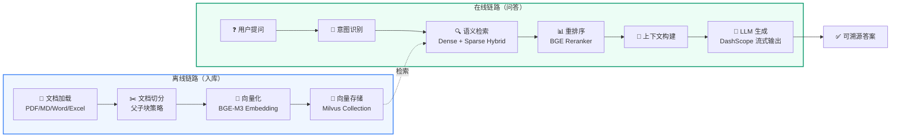
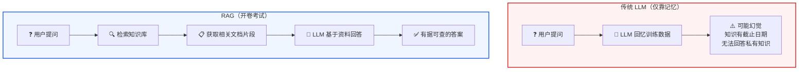

---
## 1. 什么是 RAG（检索增强生成）

**RAG = Retrieval-Augmented Generation**，即"检索增强生成"。

**核心思想**：
- 在让大模型回答问题之前，先让它去一个外部知识库里“查资料”，然后把查到的资料和问题一起交给模型，让它基于这些资料来生成答案。

在没有 RAG 之前，大语言模型（LLM）存在几个核心问题：

1. 知识截止日期：模型训练完成后，无法获取训练数据之后的新信息。例如早期 GPT-4 的知识截止到 2023 年某月，之后发生的事情它不知道。不同模型、不同版本的截止时间并不相同。
2. 幻觉问题：当模型不确定某个答案时，它可能会"编造"一个看起来很合理但实际上是错误的内容。这在企业场景中是不可接受的。
3. 私有知识无法覆盖：企业内部的制度、流程、业务文档是私有数据，从未进入过公开训练集，模型自然无法回答。

**RAG 的解决思路**非常简单：

```text
用户提问 → 先从知识库中检索相关文档 → 把检索到的文档和问题一起发给 LLM → LLM 基于文档生成答案
```

可以把 RAG 理解成"开卷考试"：LLM 不再只靠记忆回答，而是可以查阅我们提供的资料后再作答。

**RAG 的核心价值**：
- 答案是**可溯源**的（每个回答都能追溯到具体的文档片段）
- 知识可以**实时更新**（更新知识库不需要重新训练模型）
- 幻觉大幅**减少**（模型被约束在提供的文档范围内回答）

## 2. RAG 系统的基本组成

一个完整的 RAG 系统包含两条核心链路：



> **图示解读：** RAG 平台由两条核心链路组成——离线链路负责入库：文档加载 → 文档切分（父子块策略）→ 向量化（BGE-M3 Embedding）→ 存入 Milvus Collection；在线链路负责问答：用户提问 → 意图识别 → 语义检索（Dense + Sparse Hybrid）→ 重排序（BGE Reranker）→ 上下文构建 → LLM 生成（DashScope 流式输出）。在线检索时反向读取索引，最终输出可溯源答案。

**对比：传统 LLM vs RAG**



> **图示解读：** 传统 LLM 仅靠记忆回答，存在可能幻觉、知识有截止日期、无法回答私有知识等问题；RAG 如同“开卷考试”，先检索知识库、拿到相关文档片段，再基于资料回答，答案有据可查。

**离线链路（入库）**：
1. **文档加载**：读取 PDF、Markdown、Word 等各种格式的文档
2. **文档切分**：把长文档按语义边界切成小块（chunk），每块通常是几百到一千字
3. **向量化**：用 Embedding 模型把每个 chunk 转成一串数字（向量），表达其语义
4. **存储**：把向量和原文一起存入向量数据库

**在线链路（问答）**：
1. **意图识别**：判断用户问的是什么类型的问题
2. **查询向量化**：把用户问题转成向量
3. **语义检索**：在向量数据库中找最相似的文档片段
4. **上下文构建**：把检索到的片段整理成 LLM 的参考资料
5. **答案生成**：LLM 基于资料生成回答

> 说明：简单的知识库问答可以省略“意图识别”这一步；当系统里同时存在 FAQ、制度文档、业务报表等多种数据源时，再用意图识别做路由。

## 3. 向量和向量检索是什么

这是理解 RAG 最关键的概念。我们通过一个类比来理解：

**类比：图书馆找书**

传统关键词搜索（比如 MySQL LIKE 查询）就像你告诉图书管理员"我要找书名里有'Python'的书"。问题在于：
- 一本叫《Python 机器学习实战》的书会被找到
- 但一本叫《用编程语言做数据分析》的书不会被找到，虽然它也讲 Python

向量检索就像你告诉图书管理员"我要找一本关于'用代码分析数据'的书"。图书管理员理解了这个概念的"语义"，然后去书架上找到《Python 机器学习实战》、《R 语言统计分析》、《数据科学入门》等语义相近的书。

**技术层面**：
- Embedding 模型把一段文本（比如一句话、一个段落）转换成一个固定长度的浮点数数组，例如 1024 维的向量
- 语义相近的文本，它们的向量在数学空间中的"距离"也近
- 向量数据库就是专门存储和检索这些向量的系统

```python
# 伪代码示例
文本1 = "Python 是一门编程语言"
文本2 = "Java 也是一门编程语言"
文本3 = "今天天气很好"

向量1 = embedding(文本1)  # [0.12, 0.34, -0.56, ...] (1024个数字)
向量2 = embedding(文本2)  # [0.11, 0.33, -0.54, ...] (与向量1很接近)
向量3 = embedding(文本3)  # [0.89, -0.21, 0.67, ...] (与向量1差异很大)

# 向量1和向量2的余弦相似度 ≈ 0.95（很高）
# 向量1和向量3的余弦相似度 ≈ 0.12（很低）
```

**Dense、Sparse 与 Hybrid 检索**

BGE-M3 是当前最常用的多语种 Embedding 模型之一，它同时支持三种检索能力：

| 方式 | 原理 | 优点 | 弱点 |
| --- | --- | --- | --- |
| Dense（稠密检索） | 把整段文本编码成一个语义向量，用余弦相似度或内积计算相关度 | 理解同义词、改写、上下文语义 | 对精确术语、编号、英文缩写不敏感 |
| Sparse（稀疏检索） | 给文本里的词计算权重，类似 BM25，只保留少数高权重词 | 精确匹配关键词、型号、编号、专业名词 | 不理解语义，容易漏掉“换一种说法”的查询 |
| Hybrid（混合检索） | 同时跑 Dense 和 Sparse，再把两路结果融合 | 兼顾语义和关键词，召回更稳 | 需要额外融合排序，成本略高 |

BGE-M3 的特点：

- 多语言：支持 100+ 语言，中文和英文效果都很好
- 多粒度：最长可处理 8192 token 的长文本
- 多功能：一次推理可以同时输出稠密向量、稀疏词权重和用于精排的多向量

**检索之后还要重排序**

向量检索得到的是“粗排候选”，一般召回 20 到 50 个片段；随后用 BGE Reranker 这类交叉编码器对“问题 + 片段”逐对打分，挑出最相关的 3 到 5 个片段。Reranker 精度更高但速度更慢，所以只对少量候选做精排。
