> 一句话总结：Function Call 解决的是“模型怎么表达要调用工具”，MCP 解决的是“工具怎么被统一暴露和调用”——前者是模型层的能力，后者是工具层的协议。MCP 想做的，是 AI 世界的 Type-C。

## 1. 背景

### 1.1 从一个生活场景说起

出差住酒店，你把手机、手表、耳机往床头一放，桌上却只有一种接口可用——Type-C 解决了"接口不统一"这件事。在它出现之前，每家厂商都有自己的方案：Micro-USB、Lightning、Mini-USB……出门得带三根线再加一个转接头，借个充电宝还得先看口子对不对得上。

**大模型调用工具也经历了类似的"接口混乱"阶段**。

在前面的 Function Call 例子中，工具的描述（函数名、参数格式、说明文字）都是由应用开发者手写的。这就带来两个现实问题：

- **描述质量参差不齐**：同一个能力，不同开发者写法不同——有的叫"查询排队人数"，有的叫"获取门店等候时长"；参数有的用 `store`，有的用 `shop_id`。模型该按哪一份来调？调用稳定性自然无法保证。
- **重复劳动严重**：你封装好了一个门店排队查询工具，隔壁团队也想用——但他们得照文档重写一遍描述、重新调试参数格式。工具越多，这种重复越夸张。

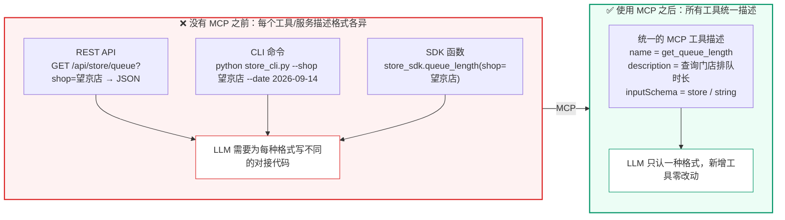

> **图示解读：** 左边是三种形态各异的工具接入方式——HTTP 接口、命令行脚本、SDK 函数，每一种都要 LLM 侧单独写对接代码；MCP 把这三种形态统一收敛成一份"名字 + 描述 + 参数 Schema"的声明，模型只认这一种格式。这就是 MCP 被称为"工具世界 USB 接口"的原因。

**核心矛盾在于**：工具的描述应该由**最了解工具的人**（工具开发者）来完成，而不是由调用者（应用开发者）去猜。如果工具能"自我介绍"——清晰地描述自己有什么能力、需要什么参数——就能实现"一次编写，到处调用"。

这就是 MCP 要解决的问题。
### 1.2 有了 MCP 之前 vs 有了 MCP 之后

为了更直观地理解 MCP 的价值，先看一个**真实开发场景的对比**：假设你的团队要开发一个门店经营助手，需要接入排队时长查询、原料库存查询、员工排班查询三个外部工具。

**有了 MCP 之前（Function Call 手工集成）：**

```text
应用开发者视角：
1. 打开排队系统 API 文档 → 手写 JSON Schema 描述（函数名、参数、返回值）
2. 打开库存系统 API 文档 → 手写 JSON Schema 描述
3. 打开排班系统 API 文档 → 手写 JSON Schema 描述
4. 编写胶水代码：拼接 HTTP 请求 → 解析响应 → 转换格式
5. 每个 API 的认证方式不同（API Key / OAuth / Cookie），分别处理
6. 如果换一个 LLM 平台，以上全部重写一遍
```

**有了 MCP 之后：**

```text
应用开发者视角：
1. 连接 MCP Server（一个 URL 搞定）
2. 自动获取工具列表（Server 自己描述自己）
3. 直接用，认证/格式/错误处理全由 MCP Server 负责
```

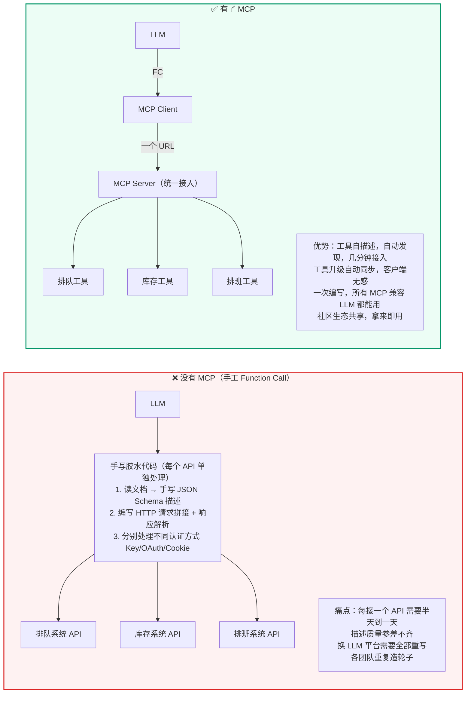

> **图示解读：** 左图是"星型直连"——LLM 通过一堆手写胶水代码分别对接 N 个 API，每加一个工具就多一份维护成本。右图把胶水代码换成了 **MCP Server（统一接入）**：LLM 只经 Function Call 与 MCP Client 打交道，Client 再通过一个 URL 连上 Server，由 Server 内部去适配底下的三类工具。接入成本从"每个 API 半天"变成"一次配置"。

下面用一张对比表把差异说清楚：

| 对比维度 | 没有 MCP（手工 Function Call） | 有了 MCP |
| --- | --- | --- |
| **工具描述谁写** | 应用开发者手写（经常不准确） | 工具开发者自己写（最准确） |
| **接入一个新工具** | 读文档 → 写 Schema → 写胶水代码 → 测试，通常半天到一天 | 配置 MCP Server 地址 → 自动发现工具，几分钟 |
| **工具升级** | 应用侧也要同步改 Schema 和胶水代码 | Server 侧更新即可，客户端自动获取最新描述 |
| **跨 LLM 复用** | 每个 LLM 平台的 Schema 格式不同，需要分别适配 | MCP 是统一协议，一次编写，所有支持 MCP 的 LLM 都能用 |
| **生态共享** | 各团队各自造轮子，同一个 API 被不同团队重复集成 | MCP 社区提供标准化工具服务，拿来即用 |

**一句话总结**：MCP 之前，每个应用开发者都在"手工接线"；MCP 之后，工具自己"插上就能用"——就像 Type-C 统一了充电口一样。

### 1.3 更多场景：MCP 在真实业务中的价值

| 场景 | 没有 MCP 的痛点 | 有了 MCP 的解法 |
| --- | --- | --- |
| **企业内部知识库** | 每个 AI 应用都要单独写一套 RAG 接入代码，不同团队各搞一套 | 知识库团队发布一个 MCP Server，所有 AI 应用统一接入，查询/权限/缓存全由 Server 管理 |
| **数据库查询** | 开发者在提示词里拼 SQL，既不安全也不可控 | DBA 发布 MCP Server，只暴露安全的查询工具，参数化查询防止注入，权限由 Server 统一管控 |
| **第三方 SaaS 集成** | 每接一个 SaaS（如飞书、钉钉、企业微信）都要写一套集成代码 | 社区已有大量现成的 MCP Server，配置 URL 即可使用 |
| **多模型切换** | 从 GPT 切到 Claude 切到通义千问，工具集成代码要重写三遍 | MCP 工具定义与模型无关，切换模型不影响工具层 |
```mermaid
flowchart TB
    subgraph S1["场景一：企业内部知识库"]
        S1A["❌ 没有 MCP：每个 AI 应用单独写 RAG 接入代码<br/>不同团队各搞一套，重复劳动<br/>App A / App B / App C 各写一套"]
        S1B["✅ 有了 MCP：知识库团队发布 1 个 MCP Server<br/>所有 AI 应用统一接入<br/>App A/B/C → 同一个 MCP Server"]
        S1C["收益：一次构建，全公司复用；权限/缓存由 Server 统一管理"]
        S1A --> S1B --> S1C
    end

    subgraph S2["场景二：数据库查询"]
        S2A["❌ 没有 MCP：开发者在提示词里拼 SQL<br/>不安全、不可控、有注入风险<br/>LLM → SELECT * FROM ..."]
        S2B["✅ 有了 MCP：DBA 发布 MCP Server<br/>参数化查询，权限由 Server 管控<br/>LLM → MCP → 安全的参数化 SQL"]
        S2C["收益：参数化查询防注入，DBA 统一管控权限"]
        S2A --> S2B --> S2C
    end

    subgraph S3["场景三：第三方 SaaS 集成"]
        S3A["❌ 没有 MCP：每接一个 SaaS 写一套集成代码<br/>飞书/钉钉/企业微信各搞各的<br/>API Key/OAuth/REST 各不相同"]
        S3B["✅ 有了 MCP：社区已有大量现成 MCP Server<br/>配置 URL 即可使用<br/>飞书 MCP / 钉钉 MCP / 企业微信 MCP"]
        S3C["收益：社区生态即插即用，零集成成本"]
        S3A --> S3B --> S3C
    end

    subgraph S4["场景四：多模型切换"]
        S4A["❌ 没有 MCP：从 GPT 切到 Claude 切到通义<br/>工具集成代码要重写三遍<br/>每个 LLM 平台 Schema 格式不同"]
        S4B["✅ 有了 MCP：工具定义与模型无关<br/>切换模型不影响工具层<br/>MCP Server = 统一标准接口"]
        S4C["收益：工具层与模型解耦，切换零成本"]
        S4A --> S4B --> S4C
    end

    style S1 fill:#ECFDF5,stroke:#059669,stroke-width:2px
    style S2 fill:#EFF6FF,stroke:#2563EB,stroke-width:2px
    style S3 fill:#F5F3FF,stroke:#7C3AED,stroke-width:2px
    style S4 fill:#FFF7ED,stroke:#EA580C,stroke-width:2px
```

> **图示解读：** 四个场景的共性都是"从 N 份重复实现收敛到 1 个统一出口"：知识库把接入代码收敛到一个 Server、数据库把 SQL 拼接收敛到参数化查询、SaaS 把集成代码收敛到社区现成的 Server、多模型把平台适配收敛到与模型无关的工具层。**MCP 的核心价值就是工具自描述 + 统一标准 + 生态共享，最终落到"一次编写，到处调用"。**

## 2. 什么是 MCP 协议

**一个生活类比**：把 LLM 想象成图书馆里的读者，MCP 就是服务台的馆员。读者（LLM）知道自己想借什么书（意图），却进不去书库（没有数据访问能力）。馆员（MCP Server）清楚馆藏目录上有什么（工具列表），能替读者去书库找书（执行工具），再把书递到手上（返回结果）。读者不需要知道书库在几楼、书按什么规则上架——只要说"我要《三体》"，馆员就搞定一切。

在这个类比中：

- **MCP 服务端（Server）** = 馆员 + 书库接口：把本地函数包装成标准接口暴露出去
- **MCP 客户端（Client）** = 服务台的借阅终端：连接服务端、查询馆藏目录（工具列表）并按需取书（调用工具）
- **MCP 主机（Host）** = 图书馆本身：发起请求的 LLM 应用，MCP 客户端是主机程序内部的一个对象

MCP（Model Context Protocol，模型上下文协议）是由 Anthropic 提出的一套开放协议，旨在实现大型语言模型（LLM）与外部数据源和工具的无缝集成，用来在大模型和数据源之间建立安全双向的链接。

Anthropic 的愿景，是希望把 MCP 协议打造成 AI 世界的"Type-C"接口，可以通过 MCP 协议把工具、数据链接起来，达到类似 HTTP 协议的那种通用程度。

> 协议（Protocol）是一种约定或标准，用于定义不同系统、设备或软件之间如何通信和交换数据。它确保各方使用相同的"语言"和规则，避免混乱。例如，HTTP 协议定义了浏览器与服务器的交互方式，USB 协议标准化了设备连接。

### 2.1 MCP 核心架构

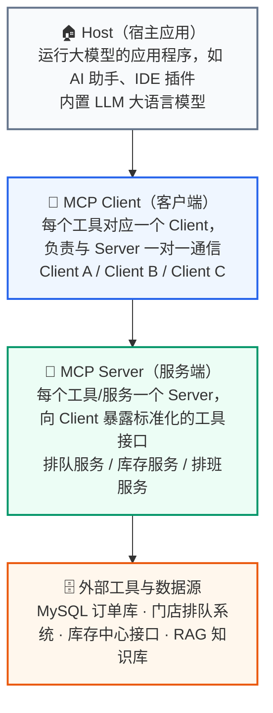

> **图示解读：** 自上而下四层，职责逐层收敛——Host 是**跑着大模型的应用进程**（只有它知道用户意图）；MCP Client 是 Host 内部的对象，**一个 Server 配一个 Client**，负责把模型的意图翻译成协议请求；MCP Server 是**工具的封装层**，对外只暴露标准化接口，对内实现业务逻辑；最底层才是真正干活的数据库与第三方 API。分层的收益是：换数据源不用动模型，换模型也不用动数据源。

MCP 协议有两个核心角色：客户端与服务端。

**MCP 服务端（Tool Provider）：**

- **角色**：工具的提供者。
- **职责**：将一个或多个本地函数（例如 Python 函数）包装起来，通过一个标准的 MCP 接口暴露出去。它监听来自客户端的请求，执行对应的函数，并返回结果。
- **例子**：一个门店排队查询服务、一个数学计算服务、一个数据库访问服务。

**MCP 客户端（Tool Consumer）：**

- **角色**：工具的调用者或消费者。
- **职责**：连接到 MCP 服务端，查询可用的工具列表（自发现），并根据需要调用这些工具。
- **例子**：大模型 Agent、自动化脚本、任何需要远程执行功能的应用程序。
### 2.2 MCP 工具调用流程

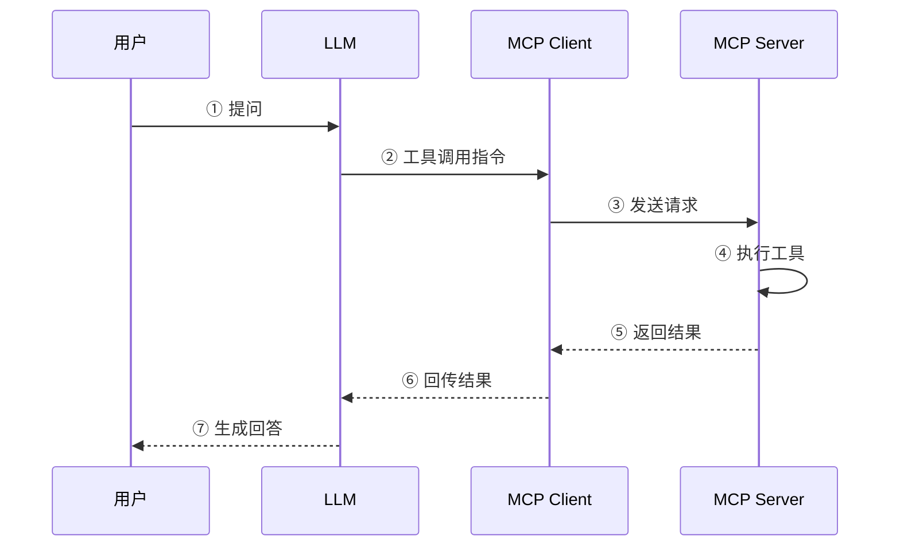

> **图示解读：** 注意第 ④ 步是**自循环**——真正执行工具逻辑的动作发生在 MCP Server 内部，模型侧完全看不到实现细节。整条链路的分工是：LLM 只负责判断"调哪个工具"，MCP Client 负责通信与转发，MCP Server 负责执行。这也是 MCP 与 Function Call 的分界线所在。

> MCP 主机（MCP Hosts）指的是发起请求的 LLM 应用程序。MCP 客户端（MCP Clients）指的是在主机程序内部的一个对象。
>
> 核心要点：**MCP Client 负责与 Server 通信并调用工具；LLM 只负责判断"该调哪个工具"，并不直接执行工具**。

无论使用哪种传输方式（stdio / SSE / Streamable HTTP），Client 与 Server 的交互模式完全一致：

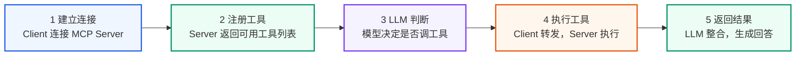

> **图示解读：** 五个步骤里，第 1、2 步只在连接建立时发生一次（Host 为每个 MCP Server 创建一个对应的 Client，Server 回吐工具清单）；第 3、4、5 步则是每轮问答都会走一遍的循环。**关键：MCP Client 对 LLM 是透明的**——LLM 只输出"调哪个工具 + 什么参数"，通信、转发、执行全部由 Client 和 Server 自动完成，开发者不用手写对接代码。

**步骤 1：客户端注册并连接 MCP Server**

- MCP Client 启动后，根据配置文件或命令参数连接多个 MCP Server。
- 每个 Server 都会返回一份工具描述列表（Tool Manifest），包括：

```json
[
  {
    "name": "query_order_db",
    "description": "执行订单库 SQL 查询",
    "input_schema": {},
    "output_schema": {}
  }
]
```

- Client 将这些工具的元信息缓存并上报给 LLM，使大模型"知道"有哪些可用工具。

**步骤 2：LLM 接收用户输入并决定调用工具**

- 用户输入请求（如："帮我查一下 orders 表里昨天的订单量"）。
- LLM 分析语义后，判断需要使用 `query_order_db` 工具。
- LLM 生成 function calling 格式的调用指令：

```json
{
  "name": "query_order_db",
  "arguments": {
    "sql": "SELECT COUNT(*) FROM orders WHERE dt = '2026-09-14';"
  }
}
```

**步骤 3：MCP Client 执行工具调用**

- MCP Client 收到该调用后，匹配到对应的 Server。
- 按协议通过 stdio 或 WebSocket 将请求发送给 MCP Server，例如：

```json
{
  "type": "tool_call",
  "tool": "query_order_db",
  "args": {"sql": "SELECT COUNT(*) FROM orders WHERE dt = '2026-09-14';"}
}
```

**步骤 4：MCP Server 执行工具逻辑**

- MCP Server 内部执行工具逻辑（例如运行 SQL 查询）。
- 生成结果：

```json
{
  "result": [{"count": 1280}]
}
```

- 将结果通过相同的通信通道返回给 MCP Client。

**步骤 5：结果回传给 LLM**

- MCP Client 接收结果，并包装为 ToolMessage 发送回 LLM。
- LLM 读取结果上下文，再生成最终自然语言回答："9 月 14 日共产生 1280 笔订单。"
### 2.3 MCP 的通信传输方式

MCP 传输方式与 MCP 协议本身无关，目前主要有三种通信传输方式：stdio、基于 HTTP 的 SSE 和 Streamable。

**（1）stdio（标准输入/输出）**

- **类型**：一种非常经典和简单的进程间通信（IPC）方式。客户端启动服务端作为一个子进程。
- **工作原理**：客户端通过写入子进程的**标准输入（stdin）**来发送请求，并通过读取子进程的**标准输出（stdout）**来获取响应。这种方式简单高效，无需网络开销。
- **适用场景**：非常适合在**本地环境**中，将一个命令行工具或脚本快速封装成一个 MCP 服务。

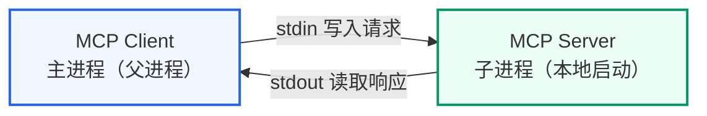

> **图示解读：** stdio 不经过网络，父子进程之间用两根管道对话。**注意方向**：请求写进子进程的 stdin，响应从子进程的 stdout 读出来，所以这是一条双向但"本地"的通道。
>
> 类比：**从自己手边的书架上取书**。书架就摆在工位旁边（Server 作为本地子进程启动），你伸手把书抽出来（stdin 写入请求），书直接落到手里（stdout 读取响应）；不用出门、不用寄快递，所有动作都在本地完成，简单高效。适用场景是本地脚本封装、命令行工具、无需网络开销的快速集成。
>
> ```python
> server_params = StdioServerParameters(command="python", args=["server.py"])
> async with stdio_client(server_params) as (read, write):  # 自动启动子进程
> ```

**（2）SSE（Server-Sent Events）**

- **类型**：SSE 是一种**基于 HTTP 的单向推送协议**，它允许服务器在保持连接开放的情况下，持续向客户端发送事件流。
- **工作原理**：客户端发起一个 HTTP 请求，服务器接收请求并保持连接，然后以 `text/event-stream` 格式将响应数据流式传输给客户端。这在 MCP 中被用来实现请求与响应的通信。
- **适用场景**：适用于**分布式或网络环境**，当服务需要部署在远端，并通过网络供多个客户端访问时。

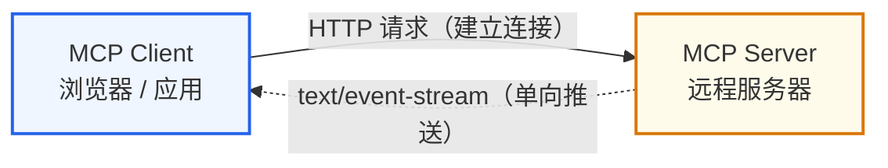

> **图示解读：** 实线是客户端的 HTTP 请求（建立连接），虚线是服务端持续推送的事件流。**这里有个硬限制：SSE 只能服务端 → 客户端单向推送，客户端不能反向发消息**，所以早期的"HTTP + SSE"组合已经被规范标记为弃用。
>
> 类比：**盯着银行大厅的叫号屏 / 订阅微信公众号**。取号之后你能做的只有盯着屏幕（Server 单向推送）："请 A001 号到 3 号窗口""请 A002 号到 5 号窗口"……你只能看，没法跟屏幕对话；公众号也一样，它有新文章就推给你，你却不能顺着这条推送通道回话。适用场景是仅需接收服务器更新的场景，如行情推送、任务进度、日志流。
>
> ```python
> server_url = "http://localhost:8001/sse"
> async with sse_client(url=server_url) as streams:  # 长连接，等待推送
> ```

**（3）Streamable**

- **类型**：Streamable-HTTP 是 MCP 提供的另一种基于 HTTP 的传输方式，它同样用于网络通信。
- **工作原理**：客户端通过 HTTP 请求与服务器通信。与 SSE 的主要区别在于其传输格式和机制不同，比如 Streamable 的传输格式可以为任意格式，而 SSE 为特定格式；Streamable 的通信方向可以为双向，而 SSE 只能是单向。
- **适用场景**：与 SSE 类似，适用于需要**通过网络进行通信的分布式应用**。

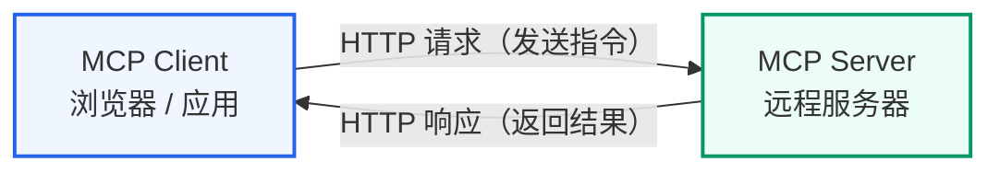

> **图示解读：** 与 SSE 相比，这里的返回通道不再是一条只读的事件流，而是**双向流**——客户端可以持续发指令，服务端可以持续回结果，并且支持会话 ID 在多次请求之间保持状态，避免重复初始化。
>
> 类比：**微信聊天 / 跟馆员一问一答**。你（Client）和馆员（Server）可以来回对话："帮我找本《三体》"→"在 3 楼 I 区，已经取来了"→"那顺便看看有没有《球状闪电》"→"有的，一并给您"；就像微信聊天，双方随时都能发消息，不像公众号推送只能单向接收；与 SSE 的区别是：SSE 像叫号屏（只能看），Streamable 像聊天（可以来回说）。适用场景是需要实时双向交互的复杂任务，如多轮对话、大文件传输、流式处理。
>
> ```python
> server_url = "http://127.0.0.1:8001/mcp"
> async with streamablehttp_client(server_url) as (read, write, _):  # 双向流
> ```

**对比：**

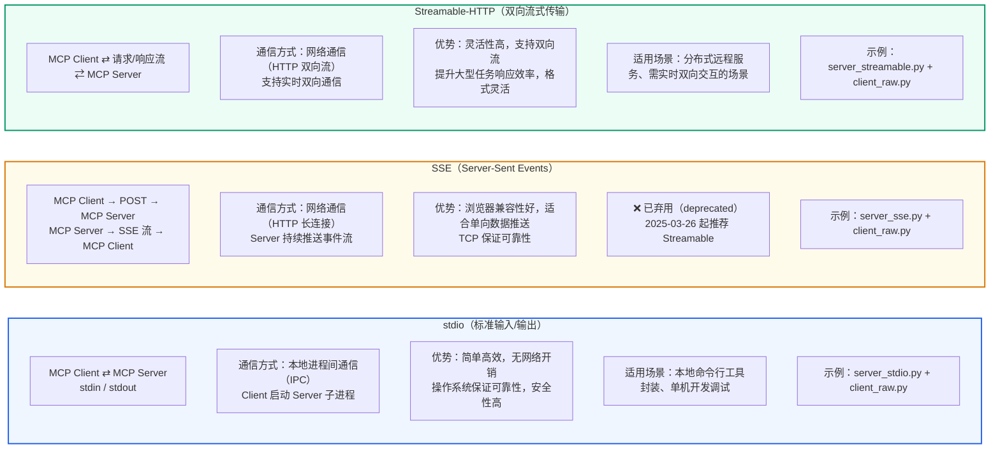

> **图示解读：** 三者的**工具定义代码完全相同**，差别只在连接层。选择策略很简单：本地开发用 stdio，远程部署用 Streamable-HTTP，而 SSE 因为只支持单向推送已经被规范弃用——新项目不建议再选。

| 传输方式 | stdio | SSE（Server-Sent Events） | Streamable-HTTP |
| --- | --- | --- | --- |
| 通信方向 | 双向（请求-响应） | 单向（服务器推送到客户端） | 双向（双向流） |
| 通信模式 | 本地进程间通信（IPC） | 网络通信（长连接流） | 网络通信（双向流） |
| 主要用途 | 封装本地命令行工具 | 仅需接收服务器更新的场景 | 复杂的、需要实时双向流的场景 |
| 是否容易丢失数据 | 由操作系统保证可靠性 | 由 TCP 协议保证可靠性 | 由 TCP 协议保证可靠性 |
| 关键优势 | 简单、高效、安全，无需网络开销 | 适用于简单、单向的数据推送，浏览器兼容性好 | 灵活性高，支持双向流式传输，提升大型任务的响应效率 |

> 注意：此前在早期版本中，MCP 曾使用 "HTTP + SSE" 这种组合（客户端 POST、服务器 SSE 推送）作为远程通信方式。然而，该方式在规范中已被标注为**已弃用（deprecated）**，从 MCP 规范 2025-03-26 起推荐转向 Streamable HTTP。
### 2.4 MCP 与 Function Call 的关系

刚学过 Function Call，又学了 MCP，两者容易混淆。它们不是同一个层面的东西，而是**互补**关系：

| 对比维度 | Function Call | MCP（Model Context Protocol） |
| --- | --- | --- |
| 所属层面 | 大模型的能力（模型层） | 工具暴露与调用的标准协议（工具层） |
| 核心作用 | 让模型判断"该调哪个工具"，并输出调用参数 | 让工具以统一标准被暴露、被发现、被调用 |
| 谁在调用 | LLM 直接生成函数调用指令 | MCP Client 负责与 Server 通信、真正调用工具 |
| 是否执行 | 模型**不执行**，只返回参数 | Client / Server 真正执行工具逻辑 |
| 类比 | 模型的"指令输出能力" | 工具的"标准插座（Type-C）" |

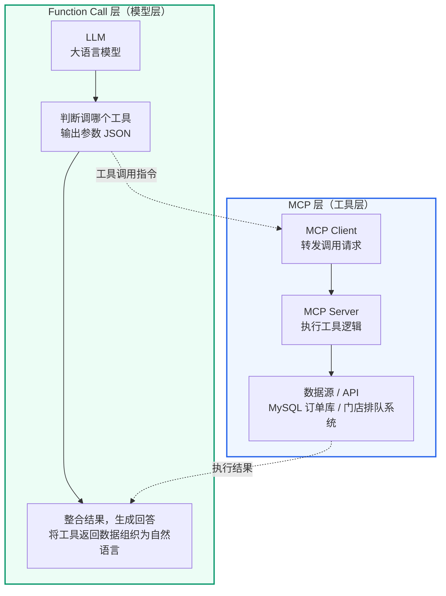

> **图示解读：** 上下两层各管一段：Function Call 层回答"模型怎么表达要调用工具"，产出的是**参数 JSON**；MCP 层回答"工具怎么被统一暴露和执行"，产出的是**真实数据**。虚线把两层缝在一起：模型的调用指令流向 MCP Client，工具的执行结果回到模型侧用于生成回答。**完整链路**：① LLM 通过 Function Call 输出指令 → ② MCP Client 接收 → ③ MCP Server 执行 → ④ 结果返回 LLM → ⑤ LLM 整合生成自然语言回答。

**简单理解：**

- Function Call 回答"模型怎么表达要调用工具"——它是大模型内建的能力，让模型输出结构化的工具调用指令。
- MCP 回答"工具怎么被统一暴露和调用"——它是一套协议，把各类工具（数据库、API、本地函数）标准化成可插拔的 Server。

两者常**配合使用**：MCP Server 暴露的工具，最终会通过 **Function Call** 的方式被 LLM 识别和调用（LangChain 的 `load_mcp_tools` 就是把 MCP 工具转成可被模型调用的函数）。

## 3. mcp 包使用

> 注意：以下代码需要安装 `langchain-mcp-adapters` 包：
>
> ```bash
> pip install langchain-mcp-adapters --index-url https://pypi.org/simple
> ```

### 3.1 stdio 传输方式

stdio（Standard Input/Output，标准输入输出）是最简单的 MCP 通信方式。客户端和服务端运行在**同一台机器**上，客户端通过启动一个子进程来运行服务端脚本，两者通过进程的 stdin/stdout 管道交换 JSON-RPC 消息。

- **适用场景**：本地开发调试、服务端不需要独立部署的场景。
- **核心特点**：客户端启动时自动拉起服务端进程，不需要手动先启动服务端。

#### 3.1.1 服务端

服务端代码的任务很明确：**创建 FastMCP 实例 → 用 `@mcp.tool` 装饰器注册工具 → 启动服务**。

> 代码位置：`agent_learn/mcp_base/stdio/server_stdio.py`

```python
"""
需求：实现基于STDIO的MCP服务器，提供可调用的工具服务
思路步骤：
1. 创建FastMCP实例，配置服务器参数
2. 定义可调用的工具函数（如门店排队查询、库存查询等）
3. 启动STDIO传输协议的服务器
4. 处理服务器异常和中断信号
"""

from fastmcp import FastMCP

# 实例化mcp
mcp = FastMCP("store-hub")

@mcp.tool(
    name="get_queue_length",
    description="查询指定门店当前的排队人数与预计等待时长，返回一段文字说明。",
)
async def get_queue_length(store: str) -> str:
    """
    门店排队查询
    Args:
        store: 门店名称，例如"望京店"
    """
    try:
        print(f"调用查询排队的tool成功！！门店：{store}")
        return f"{store}当前排队 6 人，预计等待 12 分钟"
    except Exception as e:
        print(f"Unexpected error in queue query: {str(e)}")
        raise

@mcp.tool(
    name="query_drink_stock",
    description="查询门店某种饮品或原料的剩余库存"
)
async def query_drink_stock(item: str) -> str:
    """
    查询库存的tools
    Args:
        item: 饮品或原料名称，例如"燕麦奶"
    """
    try:
        print(f"调用查询库存的tools：{item}")
        return f"{item}剩余 18 盒"
    except Exception as e:
        print(f"Unexpected error in stock query: {str(e)}")
        raise

if __name__ == "__main__":
    mcp.run(transport="stdio")
```

**代码解读**：

- `FastMCP("store-hub")` 创建 MCP 服务实例，`"store-hub"` 是服务名称。注意：fastmcp 3.4.7 不再在构造函数中接受 `log_level`、`host`、`port` 参数，这些需改为在 `mcp.run()` 中传入。
- `@mcp.tool(name=..., description=...)` 装饰器将一个异步函数注册为 MCP 工具。`name` 是工具的唯一标识（客户端调用时使用），`description` 告诉大模型这个工具的用途，模型据此决定是否需要调用该工具。
- 第二个工具 `query_drink_stock` 同样用装饰器注册。两个工具都返回字符串，实际项目中可以返回 JSON 等结构化数据。
- `mcp.run(transport="stdio")` 以 stdio 模式启动服务。只需改 `transport` 参数为 `"sse"` 或 `"streamable-http"` 就能切换通信方式，其余代码完全不变。
#### 3.1.2 客户端（直接调用）

客户端（直接调用）是指**不经过大模型**，由代码直接指定调用哪个工具。这种方式适合测试服务端是否正常、或者明确知道要调用哪个工具的场景。

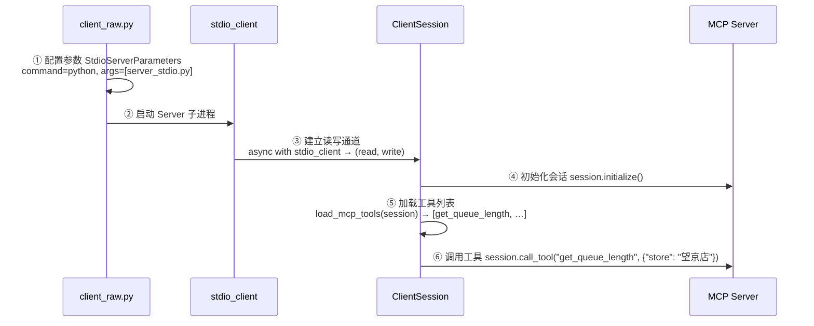

> **图示解读：** 这张图展示的是**旧写法**的分层调用链——`client_raw.py` 只负责配置参数，`stdio_client` 负责拉起子进程并建立 read/write 通道，`ClientSession` 负责初始化会话与加载工具，最后才落到 MCP Server 执行。当前 fastmcp 3.4.7 已把第 ②③④ 步全部收敛进 `Client(transport)` 的一行 `async with` 里，但理解这个分层有助于排查连接类问题。

> 注意：
>
> （1）直接启动客户端即可，不需要启动服务端，因为客户端会自动启动服务端。
>
> （2）如果直接运行报错，可能是编码集的问题，可以尝试使用命令行的方式运行：
>
> ```bash
> set PYTHONIOENCODING=utf-8
> python client_raw.py
> ```

> 代码位置：`agent_learn/mcp_base/stdio/client_raw.py`

```python
"""
需求：实现基于STDIO的MCP原始客户端，连接服务器并调用远程工具
思路步骤：
1. 配置MCP服务器脚本路径
2. 使用 fastmcp.Client + PythonStdioTransport 建立STDIO连接
3. 列出服务器提供的工具列表
4. 调用远程服务器的工具并处理响应
5. 使用异步方式运行客户端程序
"""

import asyncio
from fastmcp import Client
from fastmcp.client.transports import PythonStdioTransport

# 配置mcp服务器脚本路径
server_script = r"server_stdio.py"

# 主要的异步函数run
async def run():
    # 使用 fastmcp.Client + PythonStdioTransport 建立STDIO连接
    # Client 封装了会话创建和初始化，比 mcp 包原生 API 更简洁
    transport = PythonStdioTransport(script_path=server_script)
    async with Client(transport) as client:
        # 列出服务器提供的工具列表
        tools = await client.list_tools()
        print(f"tools-->{tools}")

        # 调用 MCP server 的 get_queue_length 工具
        response = await client.call_tool("get_queue_length", arguments={"store": "望京店"})
        print(f"response-->{response}")

# 启动运行
if __name__ == "__main__":
    asyncio.run(run())
```

**代码解读**：

- 导入 `fastmcp.Client` 和 `PythonStdioTransport`。`Client` 是 fastmcp 3.4.7 提供的高层客户端 API，自动处理连接建立、会话初始化和生命周期管理，比 `mcp` 包原生的 `stdio_client + ClientSession` 写法更简洁。
- `PythonStdioTransport(script_path=server_script)` 配置 stdio 传输参数，指定服务端脚本路径。`Client` 会自动启动服务端子进程并通过 stdin/stdout 通信。
- `async with Client(transport) as client:` 一步完成子进程启动、连接建立、会话初始化——替代了旧写法中 `stdio_client + ClientSession + session.initialize()` 的三层嵌套。
- `client.list_tools()` 列出服务端所有已注册工具，返回 `mcp.types.Tool` 对象列表。
- `client.call_tool("get_queue_length", arguments={"store": "望京店"})` 直接调用服务端注册的 `get_queue_length` 工具，并传入门店名。
- `asyncio.run(run())` 在同步的 `__main__` 中启动异步方法。

运行结果：

```text
tools-->[StructuredTool(name='get_queue_length', description='查询指定门店当前的排队人数与预计等待时长，返回一段文字说明。', args_schema={'properties': {'store': {'title': 'Store', 'type': 'string'}}, 'required': ['store'], 'title': 'get_queue_lengthArguments', 'type': 'object'}, response_format='content_and_artifact', coroutine=<function convert_mcp_tool_to_langchain_tool.<locals>.call_tool at 0x000001E176F59900>), StructuredTool(name='query_drink_stock', description='查询门店某种饮品或原料的剩余库存', args_schema={'properties': {'item': {'title': 'Item', 'type': 'string'}}, 'required': ['item'], 'title': 'query_drink_stockArguments', 'type': 'object'}, response_format='content_and_artifact', coroutine=<function convert_mcp_tool_to_langchain_tool.<locals>.call_tool at 0x000001E176F59A20>)]
response-->meta=None content=[TextContent(type='text', text='望京店当前排队 6 人，预计等待 12 分钟', annotations=None, meta=None)] structuredContent={'result': '望京店当前排队 6 人，预计等待 12 分钟'} isError=False
```
#### 3.1.3 客户端（agent 调用）

> 注意：
>
> （1）直接启动客户端即可，不需要启动服务端，因为客户端会自动启动服务端。
>
> （2）如果直接运行报错，可能是编码集的问题，可以尝试使用命令行的方式运行：
>
> ```bash
> set PYTHONIOENCODING=utf-8
> python client_agent.py
> ```

> 代码位置：`agent_learn/mcp_base/stdio/client_agent.py`

```python
"""
需求：实现基于STDIO的MCP智能代理客户端，集成大语言模型和远程工具
思路步骤：
1. 创建大语言模型实例，配置API参数
2. 配置MCP服务器脚本路径，构建 StdioConnection
3. 使用 langchain-mcp-adapters 的 connection 模式加载工具
4. 构建工具调用代理和执行器
5. 实现交互式聊天循环，处理用户查询
6. 使用异步方式运行客户端程序
"""

import os
import sys
sys.path.append(os.path.join(os.path.dirname(__file__), "../../.."))
import asyncio
from langchain_mcp_adapters.tools import load_mcp_tools
from langchain_mcp_adapters.sessions import StdioConnection
from langchain_openai import ChatOpenAI
from langchain.agents import create_agent
from agent_learn.config import Config

conf = Config()

# 创建模型
llm = ChatOpenAI(base_url=conf.base_url,
                 api_key=conf.api_key,
                 model=conf.model_name,
                 temperature=0.1)

# 配置mcp服务器脚本路径
server_script = r"server_stdio.py"

# 构建 StdioConnection 连接配置
# langchain-mcp-adapters 0.3.2 新增的 connection 模式：
# 无需手动管理 stdio_client / ClientSession，load_mcp_tools 内部自动处理连接生命周期
stdio_connection = StdioConnection(
    transport="stdio",
    command="python",
    args=[server_script],
)

async def run_agent():
    # 使用 connection 模式加载工具
    tools = await load_mcp_tools(session=None, connection=stdio_connection)
    print(f"服务端支持的工具:{tools}")

    # 使用 create_agent 创建 Agent（langchain 1.3.x 新 API）
    agent = create_agent(
        model=llm,
        tools=tools,
        system_prompt="你是一个乐于助人的助手，能够调用工具回答用户问题。",
    )

    # 代理调用
    print("MCP客户端启动，输入'quit'退出")
    while True:
        # 接收用户查询
        query = input("\nQuery: ").strip()
        if query.lower() == "quit":
            break
        # 发送用户查询给代理，并打印
        try:
            result = await agent.ainvoke({"messages": [{"role": "user", "content": query}]})
            print(f"response-->{result['messages'][-1].content}")
        except Exception:
            print("解析有问题")

if __name__ == "__main__":
    asyncio.run(run_agent())
```

**代码解读**：

- 导入 `load_mcp_tools` 和 `StdioConnection`。`StdioConnection` 是 langchain-mcp-adapters 0.3.2 新增的连接配置类，用于描述 stdio 传输参数，替代了旧版手动管理 `stdio_client + ClientSession` 的写法。
- `server_script = r"server_stdio.py"` 指定服务端脚本路径。
- `StdioConnection(transport="stdio", command="python", args=[server_script])` 构建 stdio 连接配置。`command` 和 `args` 定义了如何启动服务端子进程。
- `load_mcp_tools(session=None, connection=stdio_connection)` 是新版核心变化——传入 `session=None` 和 `connection` 对象，`load_mcp_tools` 内部自动创建子进程、建立会话、加载工具，无需手动编写三层嵌套。
- `create_agent` 是 langchain 1.3.x 的新 API，替代了旧版的 `create_tool_calling_agent + AgentExecutor` 组合。它接收模型、工具列表和系统提示，返回一个 `CompiledStateGraph`（LangGraph 编译后的状态图），内部自动处理"调用 LLM → 检查工具调用 → 执行工具 → 循环"的完整流程。
- 交互式聊天循环：`create_agent` 使用 `messages` 列表作为输入，返回结果中 `result['messages'][-1].content` 即为 LLM 的最终回复。用户输入 query → agent 判断是否需要调用工具 → 如需调用则自动调用 MCP 工具 → 将结果返回给用户。输入 `quit` 退出。

运行结果：

```text
MCP客户端启动，输入'quit'退出

Query: 望京店现在排队多久

> Entering new AgentExecutor chain...

Invoking: `get_queue_length` with `{'store': '望京店'}`

望京店当前排队 6 人，预计等待 12 分钟望京店现在排队 6 人，预计等待 12 分钟左右。如果赶时间，建议先在小程序上点单，到店直接取。

> Finished chain.
response-->{'input': '望京店现在排队多久', 'output': '望京店现在排队 6 人，预计等待 12 分钟左右。如果赶时间，建议先在小程序上点单，到店直接取。'}
```
### 3.2 SSE 传输方式

SSE（Server-Sent Events，服务器发送事件）是一种**基于 HTTP 的单向推送**通信方式。与 stdio 不同，SSE 的服务端是一个独立的 HTTP 服务进程，客户端通过 HTTP 请求连接到服务端，服务端通过 SSE 通道将数据推送给客户端。

- **适用场景**：服务端需要独立部署、客户端和服务端可能在不同机器上的场景。
- **核心特点**：需要先手动启动服务端（监听 HTTP 端口），客户端再通过 URL 连接。如需局域网内其他机器访问，可将 `host` 改为具体 IP（如 `192.168.1.100`）。

#### 3.2.1 服务端

SSE 服务端的代码结构与 stdio **几乎完全相同**，唯一的区别在于 `host` 和 `port` 在 `mcp.run()` 中指定，以及启动方式改为 `transport="sse"`：

> 代码位置：`agent_learn/mcp_base/sse/server_sse.py`

```python
from fastmcp import FastMCP

# 在 mcp.run() 中指定 host 和 port（fastmcp 3.4.7 不再在构造函数中接受）
mcp = FastMCP("store-hub")

# …… 工具定义与 stdio 版本完全一致（略）……

def main():
    print("正在启动MCP SSE服务器...")
    print("SSE端点: http://localhost:8001/sse")
    print("按 Ctrl+C 停止服务器")

    try:
        # 运行SSE服务器（fastmcp 3.4.7: host/port 通过 run() 传入）
        mcp.run(transport="sse", host="127.0.0.1", port=8001)
    except KeyboardInterrupt:
        print("\n服务器已停止")
    except Exception as e:
        print(f"服务器启动失败: {e}")

if __name__ == "__main__":
    main()
```

#### 3.2.2 客户端（直接调用）

SSE 客户端的连接方式与 stdio 不同：不再启动子进程，而是通过 HTTP URL 连接到已经运行的服务端。

> 代码位置：`agent_learn/mcp_base/sse/client_raw.py`

```python
import asyncio
from fastmcp import Client

# MCP server URL for SSE connection
server_url = "http://localhost:8001/sse"

async def run():
    # 使用 fastmcp.Client 建立SSE连接
    # Client 会自动识别 http:// 开头的 URL 并选择对应的传输协议（SSE）
    async with Client(server_url) as client:
        # 列出服务器提供的工具列表
        tools = await client.list_tools()
        print(f"tools-->{tools}")

        # 调用 MCP server 的 get_queue_length 工具
        response = await client.call_tool("get_queue_length", arguments={"store": "望京店"})
        print(f"response-->{response}")

# 启动运行
if __name__ == "__main__":
    asyncio.run(run())
```

**代码解读**：

- `server_url = "http://127.0.0.1:8001/sse"` 是 SSE 端点地址，`/sse` 是 FastMCP 默认的 SSE 路径。
- `async with Client(server_url) as client:` 一步完成 SSE 连接建立、会话创建和初始化——替代了旧写法中 `sse_client + ClientSession + session.initialize()` 的三层嵌套。`Client` 会根据 URL 自动识别传输协议。

**与 stdio 客户端的核心区别**：

| | stdio | SSE |
| --- | --- | --- |
| 连接方式 | 子进程 stdin/stdout | HTTP URL |
| 服务端启动 | 客户端自动拉起 | 需手动先启动 |
| 跨机器 | 不支持 | 支持 |

#### 3.2.3 客户端（agent 调用）

SSE 的 agent 调用客户端与 stdio 版本结构相同，只是连接方式从 `StdioConnection` 改为 `SSEConnection`：

```python
from langchain_mcp_adapters.sessions import SSEConnection

# MCP server URL for SSE connection
server_url = "http://127.0.0.1:8001/sse"

# 构建 SSEConnection 连接配置
sse_connection = SSEConnection(
    transport="sse",
    url=server_url,
)

async def run_agent():
    # 使用 connection 模式加载工具
    tools = await load_mcp_tools(session=None, connection=sse_connection)

    # 使用 create_agent 创建 Agent（langchain 1.3.x 新 API）
    agent = create_agent(
        model=llm,
        tools=tools,
        system_prompt="你是一个乐于助人的助手，能够调用工具回答用户问题。",
    )

    # 代理调用
    print("MCP客户端启动，输入'quit'退出")
    while True:
        # 接收用户查询
        query = input("\nQuery: ").strip()
        if query.lower() == "quit":
            break
        # 发送用户查询给代理，并打印
        try:
            result = await agent.ainvoke({"messages": [{"role": "user", "content": query}]})
            print(f"response-->{result['messages'][-1].content}")
        except Exception:
            print("解析有问题")
```

> 注意路径是 `/sse`。`load_mcp_tools(session=None, connection=sse_connection)` 与 stdio 版本用法完全一致——`session=None` 让 `load_mcp_tools` 根据 connection 自动管理连接生命周期。

### 3.3 Streamable 方式

Streamable HTTP 是 MCP 协议**最新推荐的传输方式**（取代了早期的 SSE）。它在 SSE 的基础上做了两项改进：

1. **双向通信**：SSE 是服务端单向推送，Streamable HTTP 支持客户端和服务端双向收发，更高效。
2. **会话管理**：支持会话 ID（session ID），允许客户端在多次请求间保持状态，避免重复初始化。

- **适用场景**：生产环境推荐使用 Streamable HTTP，它是 MCP 规范的标准传输方式。
- **核心特点**：服务端地址路径是 `/mcp`（而非 SSE 的 `/sse`），客户端使用 `fastmcp.Client` 传入 `/mcp` 结尾的 URL 即可自动连接。

#### 3.3.1 服务端

Streamable HTTP 服务端的代码结构与前两种方式一致，区别仅在于 transport 参数：

> 代码位置：`agent_learn/mcp_base/streamable/server_streamable.py`

```python
from fastmcp import FastMCP

# 创建 MCP 实例（fastmcp 3.4.7: host/port 在 mcp.run() 中指定）
mcp = FastMCP("store-hub")

# …… 工具定义与 stdio 版本完全一致（略）……

def main():
    print("正在启动MCP Streamable HTTP服务器...")
    print("Streamable HTTP端点: http://127.0.0.1:8001/mcp")

    try:
        mcp.run(transport="streamable-http", host="127.0.0.1", port=8001)
    except KeyboardInterrupt:
        print("\n服务器已停止")
    except Exception as e:
        print(f"服务器启动失败: {e}")

if __name__ == "__main__":
    main()
```

#### 3.3.2 客户端（直接调用）

> 代码位置：`agent_learn/mcp_base/streamable/client_raw.py`

```python
import asyncio
from fastmcp import Client

# 定义服务器地址（Streamable HTTP 端点）
server_url = "http://127.0.0.1:8001/mcp"

async def main():
    # 使用 fastmcp.Client 建立Streamable HTTP连接
    # Client 会自动识别以 /mcp 结尾的 URL 并选择 Streamable HTTP 传输协议
    async with Client(server_url) as client:
        # 列出服务器提供的工具列表
        tools = await client.list_tools()
        print(f"tools-->{tools}")

        # 调用 MCP server 的 get_queue_length 工具
        response = await client.call_tool("get_queue_length", arguments={"store": "望京店"})
        print(f"response-->{response}")

if __name__ == "__main__":
    asyncio.run(main())
```

#### 3.3.3 客户端（agent 调用）

```python
from langchain_mcp_adapters.sessions import StreamableHttpConnection

# MCP 服务器的 Streamable-HTTP 连接地址
server_url = "http://127.0.0.1:8001/mcp"

# 构建 StreamableHttpConnection 连接配置
streamable_connection = StreamableHttpConnection(
    transport="streamable_http",
    url=server_url,
)

async def run_agent():
    # 使用 connection 模式加载工具
    tools = await load_mcp_tools(session=None, connection=streamable_connection)
    print(f"服务端支持的工具:{tools}")

    # 使用 create_agent 创建 Agent（langchain 1.3.x 新 API）
    agent = create_agent(
        model=llm,
        tools=tools,
        system_prompt="你是一个乐于助人的助手，能够调用工具回答用户问题。",
    )
```

**代码解读**：

- `server_url = "http://127.0.0.1:8001/mcp"` 地址路径为 `/mcp`。
- `StreamableHttpConnection(transport="streamable_http", url=server_url)` 构建 Streamable HTTP 连接配置。注意 `transport` 参数值为 `"streamable_http"`（下划线），而非 `mcp.run()` 中的 `"streamable-http"`（连字符）。
- `load_mcp_tools(session=None, connection=streamable_connection)` 与 SSE / stdio 版本用法完全一致。

**三种传输方式总结**：

| 对比维度 | stdio | SSE | Streamable HTTP |
| --- | --- | --- | --- |
| 通信机制 | 子进程 stdin/stdout | HTTP 单向推送 | HTTP 双向通信 |
| 服务端部署 | 无需独立部署 | 需独立 HTTP 服务 | 需独立 HTTP 服务 |
| 跨机器通信 | 不支持 | 支持 | 支持 |
| 客户端地址 | 脚本路径 | `http://ip:port/sse` | `http://ip:port/mcp` |
| 适用场景 | 本地开发调试 | 需要远程访问 | 生产环境（推荐） |
| 工具定义代码 | 完全相同 | 完全相同 | 完全相同 |

> 核心结论：**三种传输方式只在连接层不同，工具的定义和注册代码完全一致**。切换传输方式只需修改 `transport` 参数和客户端的连接函数/地址。

## 4. 本节小结

- MCP 解决的是**接口标准的缺失**：让工具由最了解它的人自描述，从而"一次编写，到处调用"
- 架构上分四层：**Host → MCP Client → MCP Server → 外部工具与数据源**，Client 与 Server 一对一通信
- 调用流程中 LLM 只负责"调哪个工具"，**MCP Client 负责通信、MCP Server 负责执行**
- 三种传输方式只在连接层不同：**stdio 本地调试、SSE 已弃用、Streamable-HTTP 生产推荐**，工具定义代码完全一致
- MCP 与 Function Call 是**模型层与工具层**的互补关系，实际项目中常配合使用
