> 一句话总结：Agent = 大模型（大脑）+ 工具使用（手脚）+ 规划能力（策略）+ 记忆（经验）。而 Agentic 不是某种实体，而是“像 Agent 的程度”——越 Agentic，越自主、越目标导向、越主动。

## 1. 什么是 Agent

### 1.1 从一个生活场景说起

想象你雇了一位**私人助理**。你给他一个任务："帮我筹备下周六的生日派对，大概 30 个人。"

一位**普通的助手**（相当于基础 LLM）会这样回答："好的，建议您提前两周预订场地，再准备蛋糕和伴手礼，预算按人均 100 元估算。"——这个回答基于他自己的经验，但**没有真的去查档期、没问过报价、也没发出一条邀请**。

一位**优秀的助理**（相当于 Agent）会这样做：

1. **理解目标**：下周六、30 人，需要场地、蛋糕、邀请和预算
2. **主动查询**：调用场地档期系统查那天的空位 → 问蛋糕店 8 寸能不能订、多少钱 → 查当天的天气决定室内还是露台
3. **规划步骤**：先定场地（锁定日期）→ 再订蛋糕（按人数定尺寸）→ 发邀请统计回执 → 汇总预算清单
4. **检查修正**：发现金桂厅当天已被订走 → 改订同商圈的桂花厅，并重算预算
5. **交付结果**：一份完整的派对筹备方案，包含场地、蛋糕、预算和邀约话术

**这就是 Agent 与普通 LLM 的区别**：Agent 不仅能"想"，还能**主动调用工具、自主规划步骤、检查结果并修正**，最终完成一个完整的目标。

用一句话定义：**Agent = 大模型（大脑）+ 工具使用（手脚）+ 规划能力（策略）+ 记忆（经验）**。

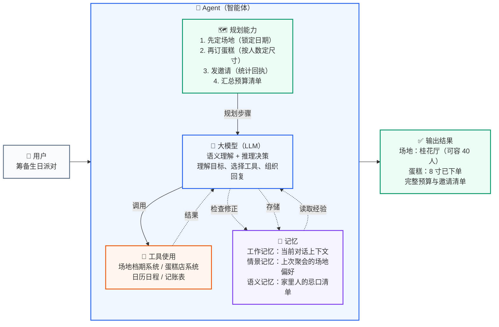

> **图示解读：** 大模型（LLM）位于中心，四个方向各挂一个能力：**规划能力**向下发步骤、**工具使用**提供外部手脚、**记忆**既存又取（存储与读取经验是双向的）、**检查修正**形成回路。**注意 Agent 与普通 LLM 的差别就藏在这些箭头里**——普通 LLM 只有中间那个方块，Agent 多了周围三圈，且能自己驱动它们循环运转。

### 1.2 Agent 与普通 LLM 的对比

| 对比维度 | 普通 LLM（如 ChatGPT 对话） | Agent（智能体） |
| --- | --- | --- |
| **能力边界** | 只能用训练数据中已有的知识回答 | 能调用外部工具获取实时信息、操作外部系统 |
| **任务处理** | 一问一答，被动响应 | 主动拆解复杂任务、规划步骤、逐步执行 |
| **错误处理** | 回答错了也不知道 | 能自我检查、发现问题后主动修正 |
| **多步任务** | 无法自主完成多步骤任务 | 能协调多个工具、多次调用，完成端到端任务 |
| **类比** | 一个博学但不出门的顾问 | 一个能跑腿、能打电话、能帮你把事情办成的助理 |

**一个具体例子**：用户问"帮我看看金桂厅下周六还有没有档期，如果没有就换一家能坐 40 人的"。

- **普通 LLM**：只能回答"我无法查询实时档期"或凭印象编一个（幻觉）。
- **Agent**：调用场地系统查到"金桂厅下周六已订满" → 判断需要换场地 → 调用同商圈备选查询 → 找到"桂花厅可容纳 40 人" → 调用日历工具同步日程 → 返回更新后的方案。
## 2. 什么是 Agentic

Agentic 是一个形容词，它描述的是一个系统所表现出的"**像 Agent 一样的程度**"。

一个系统越是 Agentic，它就越表现出自主性、目标导向性和主动性。它不是一个具体的实体，而是一种行为模式或设计思想。

用一张表来感受"Agentic 程度"的梯度：

| Agentic 程度 | 系统表现 | 生活类比 |
| --- | --- | --- |
| **低 Agentic** | 简单的聊天机器人，只能根据预设规则回答问题 | 自动应答客服（只能按关键词回复固定话术） |
| **中 Agentic** | 能调用工具完成单步任务，但不会自主规划和反思 | 便利店店员（能帮你结账取货，但不会替你算怎么组单更划算） |
| **高 Agentic** | 能自主规划、调用多工具、检查修正、多 Agent 协作 | 资深活动策划（能从零操办一场活动，遇到突发状况主动调整） |

正如 OpenAI 的 AI 主管 Lilian Weng（翁丽莲）在她那篇关于**自主智能体（Autonomous Agents）**的里程碑式博客文章《LLM Powered Autonomous Agents》中所强调的，具备智能体特性（agentic）的 AI，不会傻傻地等待下一步指令，而是会主动进行思考：

- 发现自己犯了错，然后自己去修正。
- 意识到需要外部信息，然后主动去调用工具。
- 面对复杂任务时，自己去拆解成小步骤。

所以，智能体是载体，而它拥有的、让它变得强大的核心能力，正是这篇文章系统阐述的**规划、记忆和工具使用等关键组件**。文章《LLM Powered Autonomous Agents》是智能体系统领域的里程碑之作，其价值在于系统化梳理了智能体的核心概念，提出 ReAct 等模式，奠定了理论框架；通过案例和细节为工程实践提供了指导；推动了从被动响应到主动解决问题的 AI 范式转变；并以通俗语言连接了学术与工业，促进了技术普及，影响了智能体系统的研究与应用。

**Agentic 特性并非凭空出现**，它通过多种具体的工作模式来实现。下面我们将深入探索五种最常见的 Agentic 模式，它们定义了 Agent 在不同场景下的"工作风格"。值得一提的是，这些模式的演化路径与 **ReAct** 思想有着紧密的联系，后者被视为开启了 Agentic 系统设计的大门。

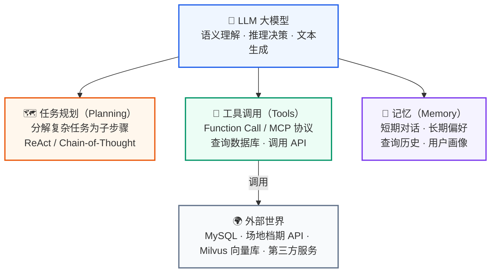

> **图示解读：** 这是 Agent 的概念模型：`Agent = 大模型 + 任务规划 + 工具调用 + 记忆`。LLM 作为中枢向外分出三条支撑线，其中只有**工具调用**会真正触达外部世界（数据库、场地档期 API、向量库、第三方服务），规划与记忆则发生在模型侧。五种模式（工具使用 → ReAct → 反思 → 规划 → 多智能体）就是围绕这三个支点逐步长出来的，复杂度递增。

## 3. Agent 五种模式

### 3.1 工具使用模式（Tool use pattern）

**核心精髓：** 工具使用模式可以看作是 **ReAct 模式的前身或简化版**。它允许 Agent 调用外部工具来弥补自身知识的不足，但通常缺乏 ReAct 模式中那种细致入微的"思考-行动-观察"循环。它的局限在于其推理能力较弱，通常只适用于单步、直接的任务，缺乏动态调整和迭代的能力。

**工作流程（像请教专家）：**

1. **用户问问题**：提出一个问题。
2. **LLM 想想**：小助手判断需要外援。
3. **调用工具**：它找来数据库或 API 查资料。
4. **给出答案**：根据查到的东西，生成回复。
5. **交给你**：答案回到你手里。

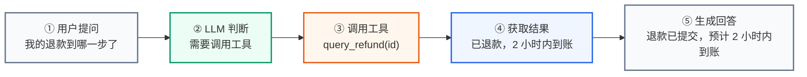

> **图示解读：** 五步是一条**直线**，没有任何回环箭头——这就是工具使用模式的特点：**单步调用，无循环**。LLM 判断需要工具 → 调用一次 → 根据结果回答，不迭代、不修正。适用于简单、直接的任务。

**应用场景示例：**

| 场景 | 用户提问 | Agent 内部过程 |
| --- | --- | --- |
| 电商售后 | "我的退款到哪一步了" | 判断需要查退款单 → 调用 `query_refund(order_id)` → 返回退款进度 |
| 门店助手 | "望京店现在排队多久" | 判断需要排队数据 → 调用 `get_queue_length(store="望京店")` → 返回等候时长 |
| 图书借阅 | "《三体》现在在馆吗" | 判断需要查馆藏 → 调用 `search_book(title="三体")` → 返回在馆册数 |

这些场景的共同点：**单步直接**，用户的问题对应一个明确的工具调用，Agent 不需要多步推理。

### 3.2 ReAct 模式（ReAct Pattern）

几乎所有高级的 Agent 模式都离不开一个核心思想——**ReAct（Reason + Act）**。这是 Agent 实现"思考"与"行动"循环的基础。

**核心精髓：** ReAct（Reasoning and Acting）模式是 Agentic 思想的**奠基性贡献**。它将"思考"（Reasoning）和"行动"（Acting）紧密地结合在一起，形成一个动态的循环。这个模式让 Agent 不再是简单地调用工具，而是像人类一样"边想边做"。ReAct 模式最早由 Yao 等人于 2022 年提出（论文《ReAct: Synergizing Reasoning and Acting in Language Models》），并在 Lilian Weng 的博客中得到系统阐述，成为 Agentic 系统设计的基础。

**工作流程：**

1. **思考**：Agent 接收用户请求，推理任务需求并制定初步行动计划。
2. **行动**：根据思考结果，决定并执行具体行动（如调用工具）。
3. **行动输入**：为选定的工具提供必要参数。
4. **观察**：接收工具执行结果，作为对环境的"观察"。
5. **循环迭代**：将观察结果反馈给自己，再次思考并决定下一步，直到达到目标。

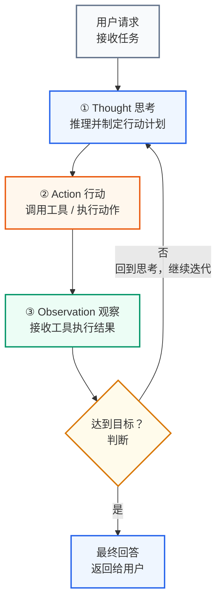

> **图示解读：** 与工具使用模式相比，这里多了一条**紫色的回环**：当判断"未达到目标"时，流程回到 ① 思考继续迭代。这条回环就是 ReAct 的灵魂——**循环迭代：将观察结果反馈给自己，再次思考并决定下一步，直到达到目标**。
**应用场景示例**：

- **找房 Agent**：任务是"帮我找一下公司附近 3 公里内、月租 6000 元以内的两居室"。
  - **Thought**：先按区域和价格条件捞一批房源。
  - **Action**：`search_listings(district="滨江", max_rent=6000, rooms=2)`
  - **Observation**：（返回了 18 条房源）
  - **Thought**：结果太多了，需要过滤掉楼层过低和没有电梯的。
  - **Action**：`filter_listings(results, min_floor=5, need_elevator=True)`
  - **Observation**：（剩下 3 套候选房源）
  - **Thought**：候选已经收敛了，整理成对比表回答用户。

### 3.3 反思模式（Reflection pattern）

为了提高任务完成的质量，Agent 在完成一个步骤或整个任务后，会进行**自我评估和反思**，并根据反思结果进行修正。

**核心精髓：** 反思模式是 **ReAct 模式中"思考"环节的深化**。它强调 Agent 在完成任务后，能够像人类一样进行自我审查和评估。这个过程让 Agent 能够从错误中学习，持续优化自己的表现。

**工作流程：**

1. **用户提出任务**：给小助手提个问题。
2. **生成初稿**：小助手先试着回答，写一个初步答案。
3. **自我评估**：小助手自己审查答案哪里不对（Self-Critique，即自我批评）。
4. **自我修正**：根据评估发现的问题，改进答案。
5. **反复调整**：自我评估与修正循环迭代，直到答案满意。
6. **输出最终回答**：把最终答案交付给用户。

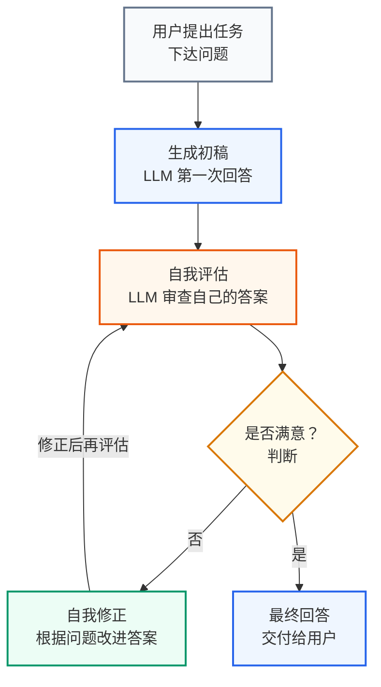

> **图示解读：** 这里出现了一个**双节点回环**：不满意 → 自我修正 → 修正后再评估 → 回到自我评估。也就是说反思循环迭代的是"评估-修正"这一对动作，而生成初稿只做一次。**反思的核心是 LLM 自我评估（Self-Critique）**，闭环在 Agent 内部完成。

> **关于"自我评估"与"用户反馈"**：反思的核心是 **LLM 自我评估**（Self-Critique），评估与修正的循环在 Agent **内部**完成。部分场景会额外引入**用户反馈**作为外部评估依据（用户看答案是否满意、提出修改意见），两者并不矛盾——**自我评估是主循环，用户反馈是可选的辅助手段**。

**应用场景示例**：

- **AI 周报助手**：任务是"根据本周的工作记录写一份周报"。
  - **Action**：Agent 先输出了一份周报，按时间顺序把本周做过的事列了一遍。
  - **Reflection（Self-Critique）**：Agent 开始反思这份周报。"它是流水账，只写了做了什么，没写清结果和价值，也没有下周计划。我应该按'本周成果 / 遇到的问题 / 下周计划'重写。"
  - **Action（Refinement）**：Agent 重写为三段式结构，为每条事项补上量化结果（如"接口平均耗时从 800ms 降到 220ms"），并列出下周计划，作为最终答案。

### 3.4 规划模式（Planning Pattern）

当任务非常复杂，无法通过简单的 ReAct 循环一步到位时，Agent 需要先进行**宏观规划**。

**核心思想**：先将一个大目标分解成一个详细的、有序的计划（Plan），然后再逐一执行计划中的每个步骤（每个步骤可能是一个 ReAct 循环）。

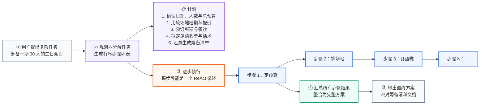

> **图示解读：** 规划模式把流程切成明显的**上下两段**：上半段是"规划器分解任务"，产出一份有序的计划清单；下半段是"逐步执行"，把清单里的每一步交给执行器（每步内部可能又是一个 ReAct 循环）。**核心是先规划、后执行**——规划器负责"做什么"，执行器负责"怎么做"。适用于无法一步到位的复杂任务。

**应用场景示例：**

- **活动策划 Agent**：任务是"帮我筹备一场 30 人的生日派对"。
  - **Planning Phase**：Agent 首先生成一个计划：
    1. 步骤一：确认日期、人数和总预算。
    2. 步骤二：比对 2-3 个场地的档期与报价，锁定其中一个。
    3. 步骤三：按人数预订蛋糕与餐饮，并确认忌口。
    4. 步骤四：拟定邀请名单与邀约话术，统计回执。
    5. 步骤五：汇总所有信息，生成一份筹备清单文档。
  - **Execution Phase**：Agent 开始按顺序执行上述步骤，每一步都可能调用档期查询、比价、日历等工具。
### 3.5 多智能体模式（Multi-agent Pattern）

对于极其复杂的系统性任务，单个 Agent 可能难以胜任。这时，可以设计多个具有不同角色和能力的 Agent，让它们协同工作。

**核心精髓：** 多智能体模式是 Agentic 思想的**终极体现**，它模拟了人类团队协作的工作方式。它不再依赖一个 Agent 单打独斗，而是创建多个具有不同专长的 Agent，让它们各司其职、相互协作，共同完成一个复杂的任务。尽管多智能体模式功能强大，但实现时需要解决 Agent 间的通信效率、任务冲突等问题，这对系统设计提出了更高要求。

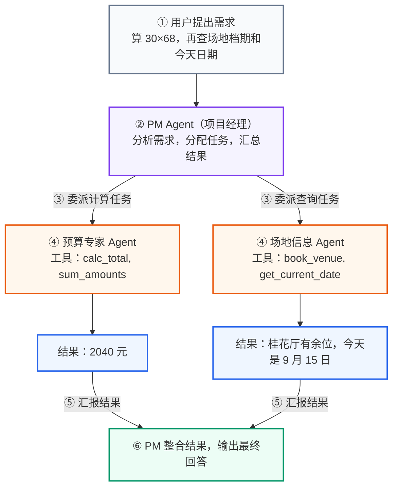

> **图示解读：** 结构上是一个**先分叉、再汇聚**的菱形：PM Agent 作为协调者把需求拆成"算预算"和"查场地"两条支线，交给各自持有一套专属工具的专家 Agent（预算专家只有 `calc_total/sum_amounts`，场地专家只有 `book_venue/get_current_date`），两边跑完后把结果汇报回 PM，由 PM 统一整合成最终回答。**关键点：每个 Agent 有独立的工具集**，这正是多智能体比单 Agent 更擅长复杂任务的原因——职责隔离带来了工具隔离。

**应用场景示例：**

- **内容生产流水线**：把"写一篇公众号推文"拆成一条多智能体流水线，模拟真实编辑部协作。
  - **用户提需求**：给一个题目（比如"写一篇介绍 MCP 的推文"）。
  - **PM Agent**：拆解需求并分配任务（协调整条流水线）。
  - **委托任务**：任务分给选题 Agent 和写作 Agent（选题负责找角度，写作负责成稿）。
  - **执行任务**：写作 Agent 产出初稿，配图 Agent 生成封面图（各司其职）。
  - **结果汇总**：各环节产出统一汇报给 PM Agent（集中收集）。
  - **交给你**：PM Agent 整合定稿，交付给用户（可直接发布的内容）。

### 3.6 Agent 模式的演进关系

上述 5 种模式构成了一个从简单到复杂的演进阶梯。

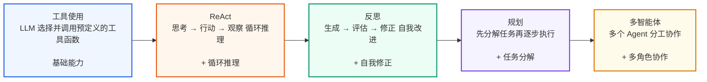

> **图示解读：** 演进逻辑是**每种模式解决前一种模式的局限**：工具使用只能单步 → ReAct 能循环 → 反思能自纠 → 规划能拆解 → 多智能体能分工。每一步都在前一步的基础上叠加一项新能力，而不是替换掉前一步。

**Tool Use（基础）→ ReAct（核心循环）→ Planning（宏观规划）→ Reflection（质量保证）→ Multi-Agent（规模化协作）**

- ReAct 是 Tool Use 的规范化和显式化，让工具使用变得有迹可循。
- Planning 是在执行多个 ReAct 循环之前的高层战略制定。
- Reflection 是对 ReAct 或 Planning 执行结果的检查与优化。
- Multi-Agent 是将多个可能使用上述所有模式的 Agent 组织起来，形成一个系统。

通过上述的 Agent 模式的演进过程，它清晰地指明了"如何一步步构建一个更强大的 Agent"。

> **TIPS：** 一个真正强大的 Agent 系统，并不会只使用其中一种模式。它会根据任务的复杂性，灵活地将这些模式组合起来。例如，一个 Agent 面对一个复杂问题时，可能会先启动**规划模式**来分解任务，然后将子任务交给一个使用 **ReAct 模式**的执行者，而这个执行者在执行过程中又会调用各种**工具**，并在遇到困难时启动**反思模式**来修正自己的策略。
>
> 这种组合和嵌套的能力，正是 Agentic 系统能够处理现实世界中各种复杂任务的关键。
## 4. 代码实战

### 4.1 工具使用模式

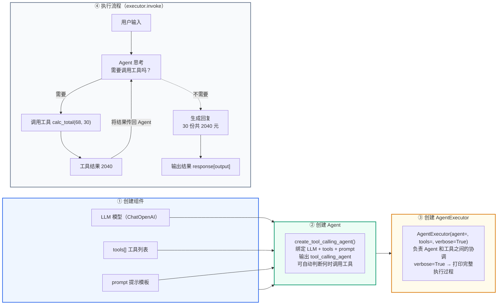

> **图示解读：** 上半部分是**装配线**：组件 → Agent → Executor，三者职责依次收敛，`AgentExecutor` 是最终对外的执行入口；下半部分是**运行时的循环**，`AgentExecutor` 自动处理「思考 → 调用工具 → 获取结果 → 再思考」，`agent_scratchpad` 占位符负责保存 Agent 的思考过程和工具调用历史。多工具场景下，Agent 会自动判断该用哪个工具。

> 代码位置：`agent_learn/agent_types/C01_ToolUsePattern.py`

```python
from langchain_core.prompts import ChatPromptTemplate
from langchain_openai import ChatOpenAI
from langchain_core.tools import tool
from langchain.agents import AgentExecutor, create_tool_calling_agent, create_react_agent
from agent_learn.config import Config

conf = Config()

# 1.创建模型
llm = ChatOpenAI(base_url=conf.base_url,
                 api_key=conf.api_key,
                 model=conf.model_name,
                 temperature=0.1)

# 2.定义工具
@tool
def calc_total(unit_price: int, quantity: int) -> int:
    """用于计算总价：单价乘以数量。"""
    print(f"正在计算总价: {unit_price} * {quantity}")
    return unit_price * quantity

@tool
def book_venue(date: str) -> str:
    """用于查询指定日期的场地档期。"""
    print(f"正在查询场地档期: {date}")
    if "6月20日" in date:
        return "6月20日桂花厅尚有余位，可容纳40人，报价1200元。"
    elif "6月21日" in date:
        return "6月21日桂花厅已订满，金桂厅可容纳20人。"
    else:
        return f"抱歉，暂时查不到'{date}'的场地档期。"

# 将工具列表放入一个变量
tools = [calc_total, book_venue]

# 3.定义一个提示模板，用于控制Agent的思考过程和工具调用
tool_use_prompt = ChatPromptTemplate.from_messages([
    ("system", "你是一个强大的AI助手，可以访问和使用各种工具来回答问题。请根据用户的问题，决定是否需要调用工具。当需要调用工具时，请使用正确的JSON格式。"),
    ("user", "{input}"),
    ("placeholder", "{agent_scratchpad}")  # 保存 Agent 的思考过程和工具调用历史
])

# 4.创建一个 LLM 能够识别和使用的 Agent
tool_calling_agent = create_tool_calling_agent(llm, tools, tool_use_prompt)

# 5.创建 Agent Executor
tool_use_executor = AgentExecutor(
    agent=tool_calling_agent,
    tools=tools,
    verbose=True  # 开启 verbose 模式，可以打印详细的执行过程
)

# 6.通用的执行函数，用于运行agent并打印结果
def run_agent_and_print(agent_executor, query):
    """一个通用函数，用于运行Agent并打印结果。"""
    print(f"--- 运行Agent，查询: {query} ---")
    response = agent_executor.invoke({"input": query})
    print(f"\n--- Agent响应: ---")
    print(response.get("output", "没有找到输出。"))
    print("-" * 30 + "\n")

if __name__ == "__main__":
    run_agent_and_print(tool_use_executor, "6月20日的场地还有位置吗？")
    run_agent_and_print(tool_use_executor, "30乘以68等于多少？ 6月20日的场地什么情况")
```

### 4.2 ReAct 模式

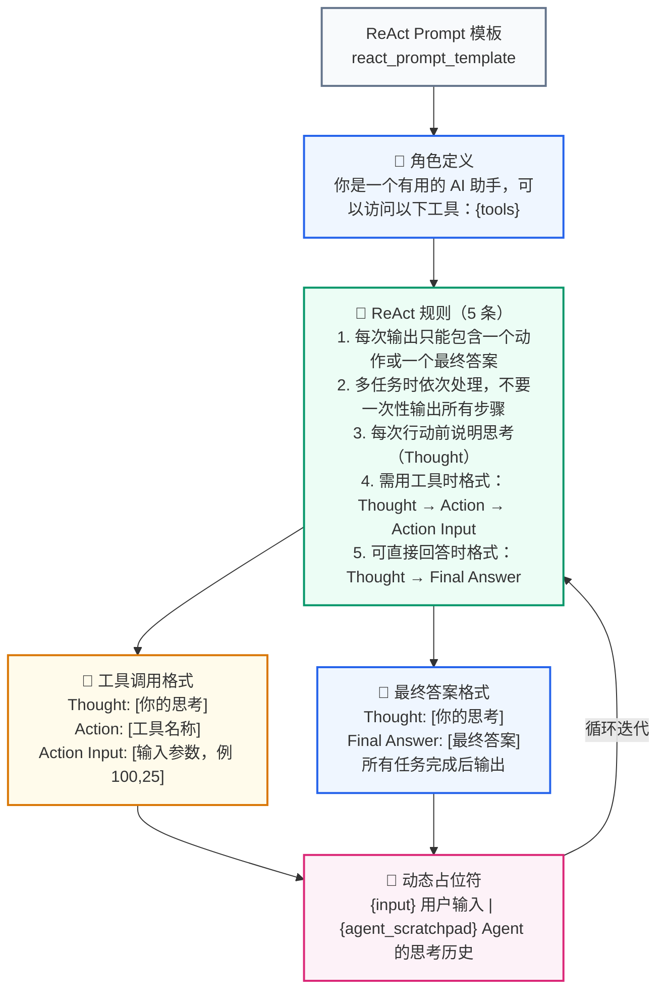

> **图示解读：** 一份 ReAct Prompt 由四块构成：**角色定义**（告诉模型有哪些工具）、**5 条规则**（约束输出格式与节奏）、**两套输出格式**（工具调用 vs 最终答案），以及**动态占位符**（`input` 是用户输入，`agent_scratchpad` 是思考历史）。那条从占位符回到规则的粉色箭头就是循环迭代的入口。**与工具调用模式的关键区别：ReAct 显式要求 Thought-Action-Observation 循环，每一步都有可见的思考过程。**

> 代码位置：`agent_learn/agent_types/C02_ReActPattern.py`

```python
from langchain_openai import ChatOpenAI
from langchain_core.tools import tool
from langchain_core.prompts import ChatPromptTemplate
from langchain.agents import AgentExecutor, create_react_agent
from agent_learn.config import Config

conf = Config()

# 1.创建模型
llm = ChatOpenAI(base_url=conf.base_url,
                 api_key=conf.api_key,
                 model=conf.model_name,
                 temperature=0.1)

# 2.定义工具
# 关键修改：重写 calc_total 工具，使其只接受一个字符串参数，并在内部解析。
@tool
def calc_total(pair_str: str) -> int:
    """用于计算总价：单价乘以数量。

    参数:
        pair_str (str): 包含单价和数量两个整数，用逗号分隔，例如："68,30"。
    返回:
        int: 总价。
    """
    print(f"正在计算总价: {pair_str}")
    try:
        price_str, qty_str = pair_str.split(',')
        unit_price = int(price_str.strip())
        quantity = int(qty_str.strip())
        return unit_price * quantity
    except ValueError:
        return "输入的格式不正确，请确保是两个用逗号分隔的整数，例如：'68,30'"

@tool
def book_venue(date: str) -> str:
    """用于查询指定日期的场地档期。"""
    print(f"正在查询场地档期: {date}")
    if "6月20日" in date:
        return "6月20日桂花厅尚有余位，可容纳40人，报价1200元。"
    elif "6月21日" in date:
        return "6月21日桂花厅已订满，金桂厅可容纳20人。"
    else:
        return f"抱歉，暂时查不到'{date}'的场地档期。"

tools = [calc_total, book_venue]

# 3.自定义 ReAct 风格的 Prompt
react_prompt_template = """你是一个有用的 AI 助手，可以访问以下工具：

{tools}

请根据用户输入一步步推理，并按以下规则操作：
1. 每次输出只能包含一个动作（Action 和 Action Input）或一个最终答案（Final Answer）。
2. 如果用户输入包含多个任务，依次处理每个任务，不要一次性输出所有步骤。
3. 每次行动前，说明你的思考（Thought），并选择合适的工具或直接给出最终答案。
4. 如果需要使用工具，格式必须为：
   Thought: [你的思考]
   Action: [工具名称]
   Action Input: [工具的输入参数，例如对于calc_total工具，使用'68,30'格式]
5. 如果可以直接回答或所有任务都完成，格式为：
   Thought: [你的思考]
   Final Answer: [最终答案]

可用的工具名称有: {tool_names}

用户输入: {input}
{agent_scratchpad}
"""

react_prompt = ChatPromptTemplate.from_template(react_prompt_template)

# 4.创建 ReAct 风格的 Agent
react_agent = create_react_agent(llm, tools, react_prompt)

# 5.创建 Agent Executor
react_executor = AgentExecutor(
    agent=react_agent,
    tools=tools,
    verbose=True,
    handle_parsing_errors=True  # 启用错误处理，自动重试解析错误
)

# 6.运行并测试 Agent
if __name__ == "__main__":
    response_venue = react_executor.invoke({"input": "6月20日的场地还有位置吗？"})
    print(response_venue.get("output", "没有找到输出。"))

    response_price = react_executor.invoke({"input": "68乘以30等于多少？"})
    print(response_price.get("output", "没有找到输出。"))

    response_multi = react_executor.invoke({"input": "68乘以30等于多少？ 6月20日的场地什么情况？"})
    print(response_multi.get("output", "没有找到输出。"))
```
### 4.3 反思模式

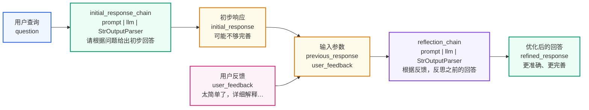

> **图示解读：** 反思模式其实是**两条 LC 链**（`prompt | llm | StrOutputParser`）：第一条 `initial_response_chain` 负责出初稿，第二条 `reflection_chain` 接收"初稿 + 反馈"两个输入后产出优化稿。**注意它没有调用任何外部工具**——对比工具调用模式，这里全靠 LLM 自我评估 + 修正，是典型的两阶段 LLM Chain。

> 代码位置：`agent_learn/agent_types/C03_ReflectionPattern.py`

```python
from langchain_openai import ChatOpenAI
from langchain_core.prompts import ChatPromptTemplate
from langchain_core.output_parsers import StrOutputParser
from agent_learn.config import Config

conf = Config()

# 1.创建模型
llm = ChatOpenAI(base_url=conf.base_url,
                 api_key=conf.api_key,
                 model=conf.model_name,
                 temperature=0.1)

# 3.初始响应 Prompt: 用于生成第一次的回答
initial_response_prompt = ChatPromptTemplate.from_template(
    "请根据以下问题给出你的初步回答: {question}"
)
initial_response_chain = initial_response_prompt | llm | StrOutputParser()

# 4.反思 Prompt: 用于接收用户反馈并优化回答
reflection_prompt = ChatPromptTemplate.from_template(
    """你是一个专业的、善于反思的AI助手。你之前给出了以下回答：
---
{previous_response}
---
现在，你收到了用户对你的回答给出的反馈：
---
{user_feedback}
---
请根据用户的反馈，认真反思你之前的回答，并生成一个更准确、更完善的新回答。
新回答:"""
)
reflection_chain = reflection_prompt | llm | StrOutputParser()

# 5.模拟反射过程
def reflect_and_refine(query: str, feedback: str):
    """模拟一个完整的反射过程，从初始响应到优化后的响应。"""

    print("--- 启动反射模式 ---")
    print(f"用户查询: {query}")

    # LLM 生成初步响应
    print("\n生成初步响应...")
    initial_response = initial_response_chain.invoke({"question": query})
    print(f"LLM 初步响应:\n{initial_response}")

    # 模拟用户反馈
    print(f"\n用户反馈:\n{feedback}")

    # LLM 进行反思，并生成新的回答
    print("\nLLM 正在反思并生成新响应...")
    refined_response = reflection_chain.invoke({
        "previous_response": initial_response,
        "user_feedback": feedback
    })

    print("\n--- LLM 经过反思后的新响应 ---")
    print(refined_response)

    return refined_response

# 6.运行并测试
if __name__ == "__main__":
    # 模拟用户查询
    initial_question = "请用一句话介绍一下什么是 RAG。"
    # 模拟用户反馈，指出初步回答的不足
    user_feedback_text = "太笼统了，请展开说明检索和生成这两步是怎么配合的，最好举一个实际的问答例子。"
    # 运行反射过程
    reflect_and_refine(initial_question, user_feedback_text)
```

### 4.4 规划模式

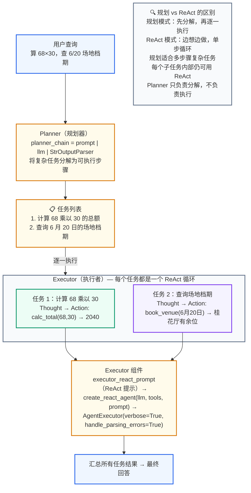

> **图示解读：** 上半段用一条普通的 LC 链（`planner_chain`）产出文本化的任务列表——**规划器只负责分解，不负责执行**；下半段的 Executor 是一个 ReAct Agent + AgentExecutor 组合，把列表里的每一条当成一个独立任务去跑，因此**每个子任务内部仍是一个完整的 ReAct 循环**。`handle_parsing_errors=True` 让执行器在格式解析失败时自动重试。

> 代码位置：`agent_learn/agent_types/C04_PlanningPattern.py`

```python
# …… 模型与工具定义同工具使用模式（calc_total / book_venue）……
tools = [calc_total, book_venue]

# 3.定义规划器 (Planner) 和执行者 (Executor) 的 Prompt
# 3.1 规划器的 Prompt
# 规划器的职责是分析用户任务，并将其分解成一系列简单的、可执行的子任务。
planner_prompt = ChatPromptTemplate.from_template(
    """你是一个任务规划师，你的工作是将用户提出的一个复杂任务分解成一系列清晰、可执行的步骤。
    你的输出应该是一个简单的任务列表，每行一个任务。

    例子:
    用户任务: "请先查 6 月 20 日的场地档期，然后计算 68 乘以 30。"
    任务列表:
    - 查询 6 月 20 日的场地档期
    - 计算 68 乘以 30 的结果

    用户任务: {user_input}
    任务列表:
    """
)
# 规划器链，它只负责生成文本化的任务列表
planner_chain = planner_prompt | llm | StrOutputParser()

# 3.2 执行者的 Prompt
# 执行者的职责是执行单个任务。这里使用 ReAct 模式作为执行者，因为它能根据任务描述选择并调用正确的工具。
executor_react_prompt_template = """你是一个专业的工具执行者，可以访问以下工具：

{tools}

根据你的思考（Thought）决定下一步的行动（Action）。你的行动必须遵循以下格式：
Thought: 我需要思考如何完成任务。
Action: [工具名称]
Action Input: [工具的输入参数，对于calc_total工具，请使用'68,30'这样的格式]

可用的工具名称有: {tool_names}

当你获取了所有必要信息并可以给出最终答案时，请以以下格式结束：
Thought: 我已经有了最终答案。
Final Answer: [最终答案]

请执行以下任务：
{input}
{agent_scratchpad}
"""
executor_prompt = ChatPromptTemplate.from_template(executor_react_prompt_template)

# 4.创建 ReAct Agent 作为执行者
executor_agent = create_react_agent(llm, tools, executor_prompt)
executor_executor = AgentExecutor(
    agent=executor_agent,
    tools=tools,
    verbose=True,
    handle_parsing_errors=True  # 启用错误处理，自动重试解析错误
)

# 5.定义并运行规划模式的工作流
def execute_planning_pattern(query: str):
    print("--- 启动规划模式 ---")

    # 规划器分解任务
    print("\n规划器正在分解任务...")
    plan = planner_chain.invoke({"user_input": query})
    tasks = [task.strip() for task in plan.split('\n') if task.strip()]
    print("规划器生成的任务列表:")
    for i, task in enumerate(tasks):
        print(f"  {i + 1}. {task}")

    # 执行者逐一执行任务
    print("\n执行者正在逐一执行任务...")
    for i, task in enumerate(tasks):
        print(f"\n--- 执行任务 {i + 1}: {task} ---")
        executor_executor.invoke({"input": task})

    print("\n--- 所有任务执行完毕！---")

if __name__ == "__main__":
    test_query = "请先计算 68 乘以 30 的结果，然后告诉我 6 月 20 日的场地档期怎么样？"
    execute_planning_pattern(test_query)
```
### 4.5 多智能体模式

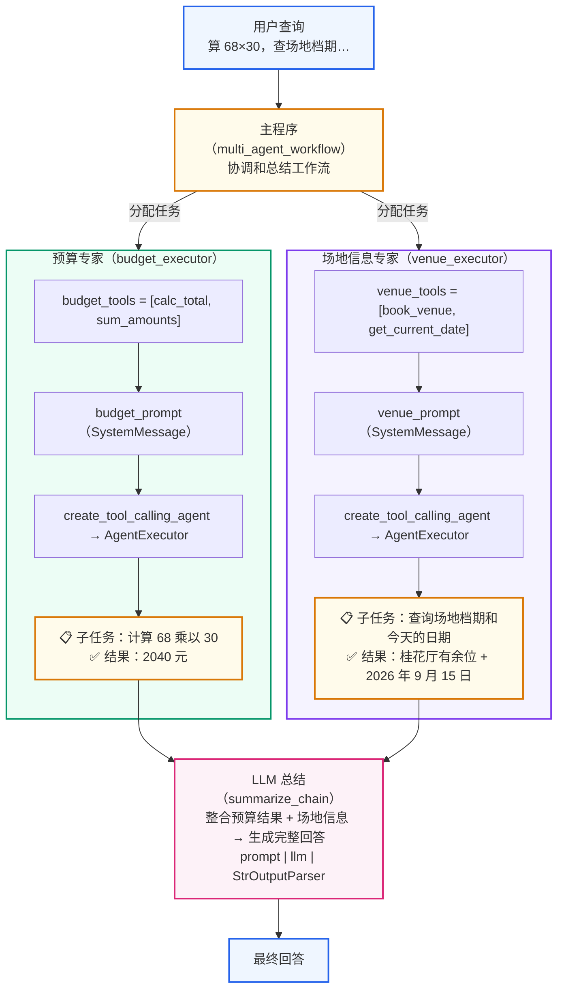

> **图示解读：** 每个专家 Agent 内部都是"**独立的工具集 + 独立的 System Prompt + 独立的 Executor**"三件套，**每个 Agent 有独立工具集**——这是多 Agent 设计的核心前提，工具不混用才能让职责真正隔离。主程序只做三件事：分配任务、收集结果、调用一条 `summarize_chain` 把结果整合成最终回答，不参与具体执行。

> 代码位置：`agent_learn/agent_types/C05_MultiAgent.py`

```python
from langchain_core.prompts import ChatPromptTemplate, MessagesPlaceholder, SystemMessagePromptTemplate, \
    HumanMessagePromptTemplate  # 导入所有必需的 Prompt 类
from langchain_openai import ChatOpenAI
from langchain_core.tools import tool
from langchain.agents import AgentExecutor, create_tool_calling_agent
from langchain_core.output_parsers import StrOutputParser
from agent_learn.config import Config

conf = Config()

# 1.创建模型
# 2.定义工具（2.1 预算工具 calc_total / sum_amounts，2.2 场地信息工具 book_venue / get_current_date）

# 3 创建两个独立的 Agent
# 3.1 创建“预算专家” Agent
budget_tools = [calc_total, sum_amounts]
# 创建完整的 Tool Calling Prompt
# 这包括一个系统消息，一个用户消息占位符，以及一个 Agent 中间思考过程的占位符。
budget_prompt = ChatPromptTemplate.from_messages([
    SystemMessagePromptTemplate.from_template("你是一个强大的预算计算专家，可以访问和使用各种计算工具。"),
    HumanMessagePromptTemplate.from_template("{input}"),
    MessagesPlaceholder(variable_name="agent_scratchpad")
])
budget_agent = create_tool_calling_agent(llm, budget_tools, budget_prompt)
budget_executor = AgentExecutor(agent=budget_agent, tools=budget_tools, verbose=True)

# 3.2 创建“场地信息专家” Agent
venue_tools = [book_venue, get_current_date]
venue_prompt = ChatPromptTemplate.from_messages([
    SystemMessagePromptTemplate.from_template("你是一个强大的场地信息查询专家，可以访问和使用各种查询工具。"),
    HumanMessagePromptTemplate.from_template("{input}"),
    MessagesPlaceholder(variable_name="agent_scratchpad")
])
venue_agent = create_tool_calling_agent(llm, venue_tools, venue_prompt)
venue_executor = AgentExecutor(agent=venue_agent, tools=venue_tools, verbose=True)

# 4.协调和总结工作流
def multi_agent_workflow(query: str, budget_task: str, venue_task: str):
    print("--- 启动多智能体协作流程 ---")
    print(f"\n用户原始请求: {query}")

    # 4.1 让“预算专家”执行任务
    print("\n[主程序] -> 将任务分配给预算专家...")
    budget_result = budget_executor.invoke({"input": budget_task}).get("output")
    print(f"\n[主程序] -> 预算专家返回结果: {budget_result}")

    # 4.2 让“场地信息专家”执行任务
    print("\n[主程序] -> 将任务分配给场地信息专家...")
    venue_result = venue_executor.invoke({"input": venue_task}).get("output")
    print(f"\n[主程序] -> 场地信息专家返回结果: {venue_result}")

    # 4.3 使用 LLM 进行最终结果总结
    print("\n[主程序] -> 使用大模型进行最终总结...")
    summarize_prompt = ChatPromptTemplate.from_messages([
        ("system", "你是一个善于总结和整合信息的助手。请根据以下信息，为用户原始请求生成一个完整的回答。"),
        ("human",
         f"用户请求: {query}\n\n预算计算结果: {budget_result}\n\n场地查询结果: {venue_result}\n\n请整合以上信息，生成一个连贯的最终回答。")
    ])
    summarize_chain = summarize_prompt | llm | StrOutputParser()
    final_answer = summarize_chain.invoke({"query": query})

    print("\n--- 协作流程已完成！---")
    print(f"最终综合回答:\n{final_answer}")
    return final_answer

if __name__ == "__main__":
    # 定义用户原始请求和分配给每个Agent的子任务
    original_query = "请先计算 68 乘以 30 的总额，然后告诉我 6 月 20 日桂花厅的档期和今天的日期。"
    budget_task = "计算 68 乘以 30 的总额"
    venue_task = "查询 6 月 20 日桂花厅的档期和今天的日期"

    # 启动工作流
    multi_agent_workflow(original_query, budget_task, venue_task)
```

## 5. 本节小结

- **Agent = 大模型 + 工具使用 + 规划能力 + 记忆**，与普通 LLM 的差别在于它能主动调用工具、自主规划、检查修正
- **Agentic 是一种程度而非实体**：从低（规则应答）到中（单步工具调用）再到高（自主规划 + 多 Agent 协作）
- 五种模式构成演进阶梯：**工具使用 → ReAct → 反思 → 规划 → 多智能体**，每种模式解决前一种的局限，而不是相互替代
- 实战落地上的对应关系：`create_tool_calling_agent` + `AgentExecutor` 对应工具使用模式，`create_react_agent` 对应 ReAct 模式，两条 LC 链对应反思模式，`planner_chain` + ReAct 执行者对应规划模式，多个 Executor + 总结链对应多智能体模式
- 真实系统**不会只用一种模式**，而是按任务复杂度把它们组合嵌套起来
