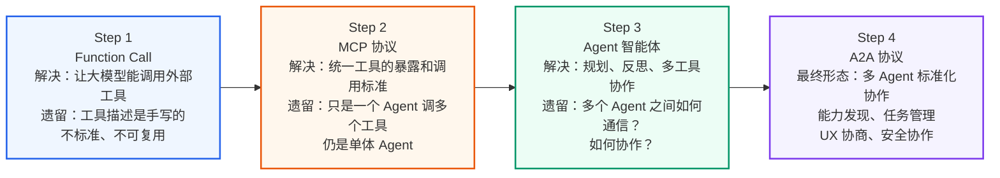
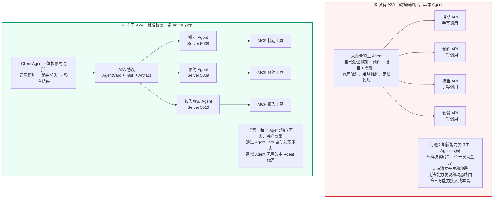
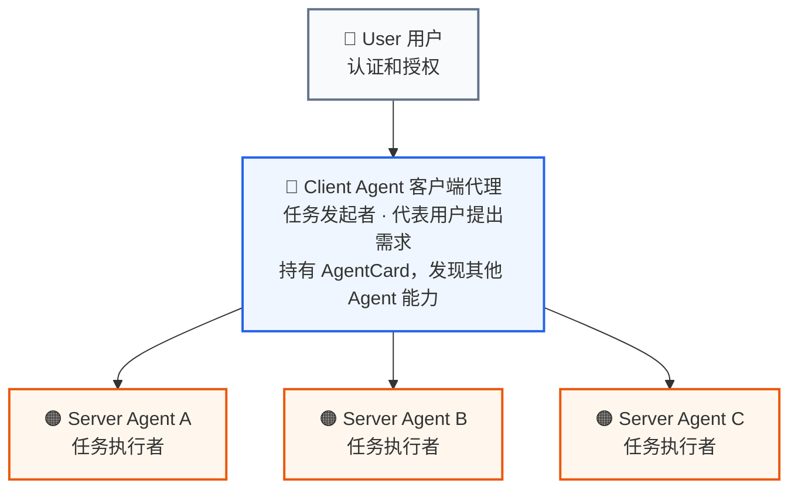
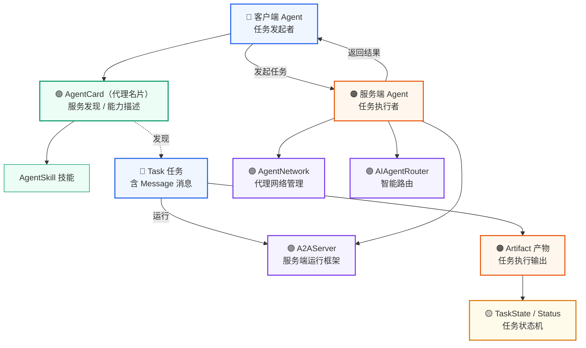
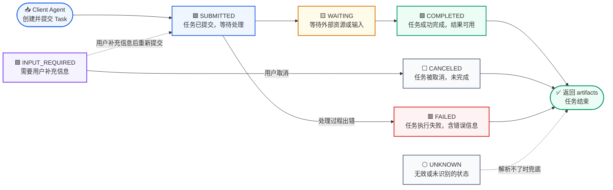
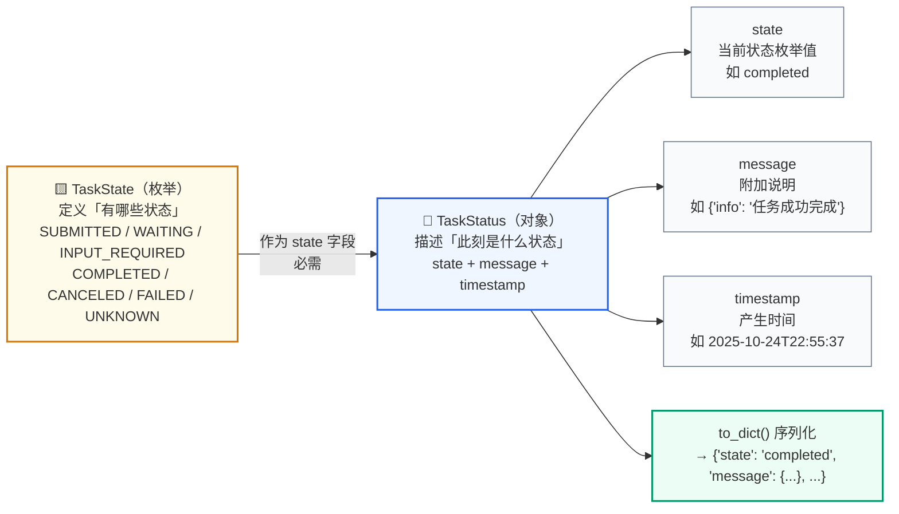
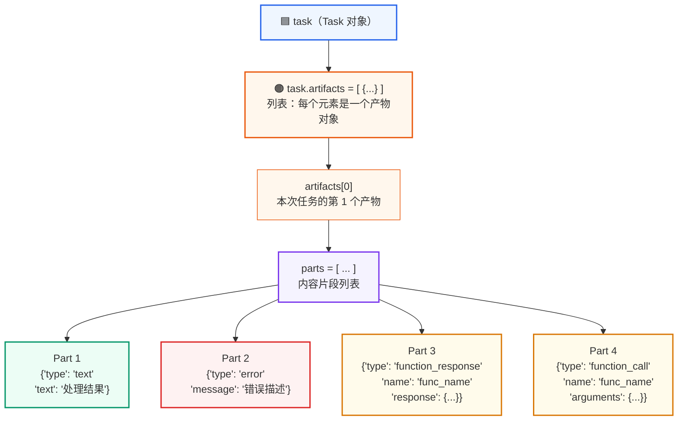
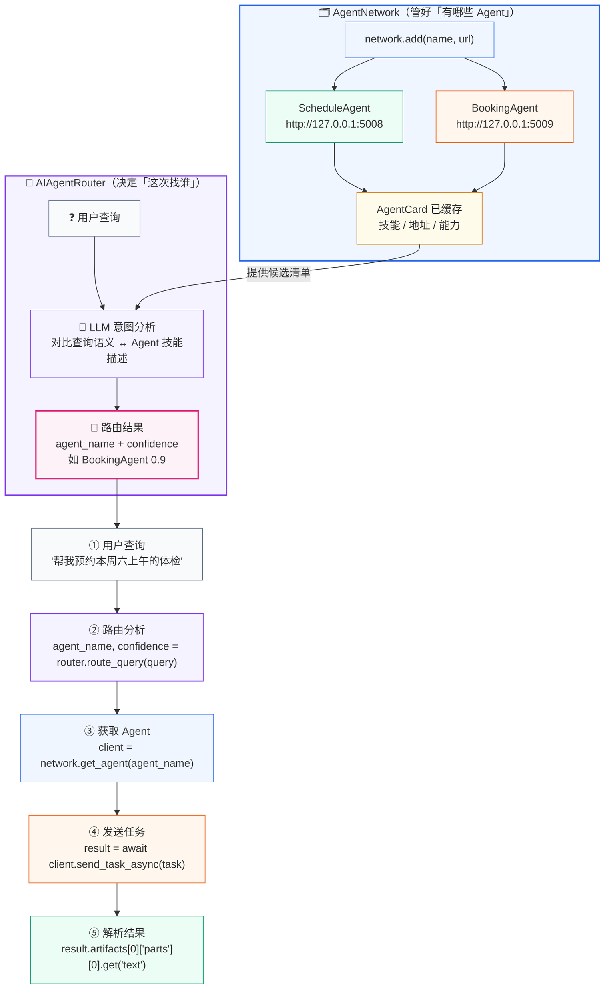
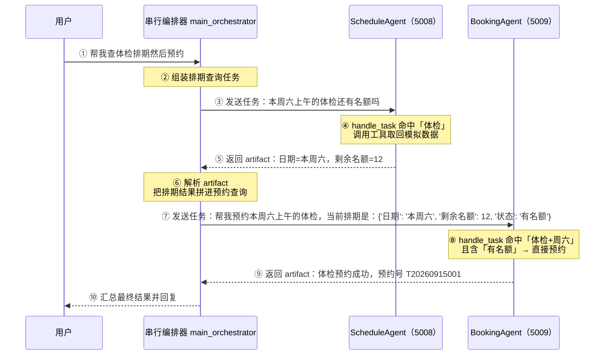
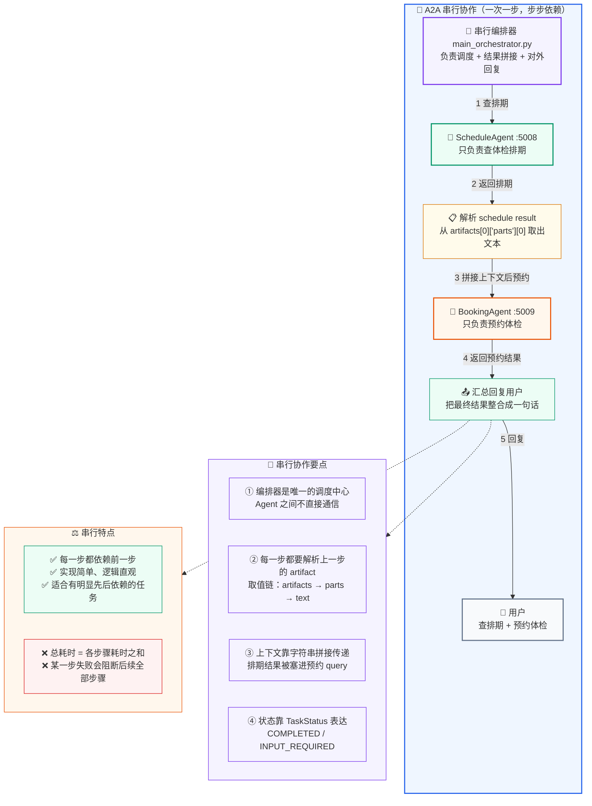

> 一句话总结：Function Call 让模型“学会说”，MCP 统一了“插座”，Agent 装上了“大脑”，而 A2A 解决的是最后一公里——**让多个 Agent 组成团队**。它用 AgentCard 做能力发现、用 Task 做任务管理、用 TaskState 跟踪状态、用 Artifact 承载结果。

## 1. Agent2Agent Protocol

### 1.1 为什么需要 A2A？——从前三节的演进说起

到这里，你已经掌握了三个关键技术：

| 技术 | 解决什么问题 | 还没解决什么 |
| --- | --- | --- |
| **Function Call** | 让大模型能调用外部工具 | 工具描述是手写的，不标准 |
| **MCP 协议** | 统一了工具的暴露和调用标准 | 只是一个 Agent 调用多个工具，仍是"单体 Agent" |
| **Agent 智能体** | 让 Agent 具备规划、反思、多工具协作能力 | 多个 Agent 之间如何通信？如何协作？ |



> **图示解读：** 每一步都在解决上一层遗留的问题，层层递进。用类比记：Function Call 是**学会"说"**（输出调用指令），MCP 是统一**"插座"**（Type-C 接口），Agent 是拥有**"大脑"**（规划 + 反思），A2A 则是**组建"团队"**（多 Agent 协作）。把这四层串起来跑一遍，才构成一套完整的 AI 应用体系：FC + MCP + Agent + A2A。

**核心矛盾**：当我们把系统做得越来越大，一个 Agent 已经无法承担所有职责——就像一个人不可能同时是排期专家、预约专家、报告解读专家、套餐推荐专家。我们需要**多个各有专长的 Agent 协同工作**。但问题是：

- Agent A 怎么知道 Agent B 能做什么？（**能力发现**）
- Agent A 怎么给 Agent B 分配任务、拿到结果？（**任务管理**）
- Agent B 发现信息不足时，怎么向用户追问？（**UX 协商**）
- 整个通信过程如何保证安全？（**安全协作**）

**A2A 协议就是解决这些问题的标准规范**——它让不同 Agent 之间能像"同事"一样协作，而不是靠应用层硬编码调用关系。

### 1.2 一个贯穿全程的体检预约场景

假设你是一个体检预约助手（Client Agent），用户说"帮我看看这周六上午的体检还有没有名额，有的话直接帮我约上"。你既查不到号源，也没权限办理预约——你需要先和 ScheduleAgentServer 协作查排期，再根据排期结果和 BookingAgentServer 协作完成预约。

- **没有 A2A**：你只能在代码里硬编码——先调用排期 API → 拿到结果 → 再调用预约 API。如果以后要加一个报告解读 Agent，你得改代码、改调用链路，所有 Agent 之间的通信都靠应用层胶水代码拼接。
- **有了 A2A**：你只需按协议规则找到合适的 Agent → 发一个 Task → 拿到结果 → 再发给下一个 Agent。新增 Agent 不影响已有代码，每个 Agent 独立开发、独立部署、通过标准协议协作。

A2A 协议就是这套协作的规则手册：它规定了你怎么找到这些 Agent（能力发现）、怎么给它们分配任务（任务管理）、怎么处理它们返回的结果、以及如何在信息不足时向用户追问（UX 协商），全程保证通信安全（安全协作）。



> **图示解读：** 左图的问题在于**所有连接都是手写的、点对点的**——主 Agent 既是调度者又是实现者，加一个能力就要改它的代码。右图在中间插入了一层 **A2A 协议**（AgentCard + Task + Artifact）：Client Agent 只管意图识别与结果整合，具体执行下沉到三个独立部署的 Server Agent，各自再通过 MCP 挂载自己的工具。**这就是"单体 Agent"与"Agent 团队"的分水岭。**

2025 年 4 月 9 日，Google 正式发布了 **Agent2Agent Protocol**（以下简称 "A2A"）。该协议为不同类型的智能体之间搭建了一座高效沟通与协作的桥梁，无论是独立 Agent 与独立 Agent、独立 Agent 与企业 Agent，亦或是企业 Agent 与企业 Agent，都能借助该协议实现通信交互和协作。
### 1.3 A2A 四大核心能力详解

**（1）Secure collaboration（安全协作）**

在整个任务处理过程中，A2A 协议确保所有智能体间的通信和数据交换都是安全的。这包括身份验证、数据加密和访问控制，以防止未经授权的访问或数据泄露。

场景示例：

- "体检预约助手"与"BookingAgentServer"之间的所有通信都通过安全协议进行。
- 即使在处理涉及个人信息（如体检人姓名、手机号、身份证号）的预约任务时，这些数据也得到了协议层面的保护，确保只有授权的智能体才能访问和处理。

**（2）Task and state mgmt（任务与状态管理）**

这表示协议能够有效地管理任务的整个生命周期及其状态变化。例如，一个任务从提交到完成、失败或被取消，协议都能进行跟踪和管理。

场景示例：

- "体检预约助手"发送一个 Task 给"BookingAgentServer"，请求预约本周六上午的入职体检。
- "BookingAgentServer"接收到 Task，并将其状态标记为 SUBMITTED。
- 当它成功模拟预约后，会将 Task 状态更新为 COMPLETED，并返回包含预约号与时间地点的 artifacts。

**（3）UX negotiation（用户体验协商）**

这项功能允许智能体之间就如何更好地为用户提供服务进行协商和调整，以优化最终的用户体验。

工作方式：这项能力允许智能体在协作过程中调整和优化用户体验。例如，一个智能体可能会在发现无法完成任务时，主动请求用户提供更多信息，而不是直接失败。

场景示例：

- 当你发送"帮我约个体检"的请求时，"BookingAgentServer"发现缺少体检日期和体检人信息。
- 它不会直接返回错误，而是通过 A2A 协议向"体检预约助手"发送一个包含 INPUT_REQUIRED 状态的任务更新，并在消息中说明"需要您提供体检日期和体检人姓名"，从而让"体检预约助手"可以反过来向你提问，形成一个流畅的交互，而不是僵硬的错误提示。

**（4）Capability discovery（能力发现）**

这是指 A2A 协议使得智能体能够自动发现其他智能体的能力或功能。智能体通过类似 AgentCard 的"名片"来广播其服务，其他智能体则可以根据这些信息来选择最合适的合作伙伴。

场景示例：

- "体检预约助手"找到了两个智能体：一个叫 "BookingAgentServer" 的智能体，其 AgentCard 描述它拥有"预约体检"的能力。
- 另一个叫 "ScheduleAgentServer" 的智能体，其 AgentCard 描述它拥有"查询体检排期"的能力。

### 1.4 更多场景：A2A 在真实业务中的价值

| 场景 | 没有 A2A 的做法 | 有了 A2A 的做法 |
| --- | --- | --- |
| **企业智能客服** | 一个大而全的 Agent 包揽所有业务，代码臃肿、难以维护 | 按业务拆分：订单 Agent、退款 Agent、物流 Agent，各自独立，通过 A2A 协作 |
| **跨部门协作** | 财务 Agent 要调用 HR Agent 的数据，靠写 HTTP 接口硬编码对接 | 财务 Agent 通过 A2A 协议发现 HR Agent 的能力，发 Task 获取结果，无需关心实现细节 |
| **第三方 Agent 接入** | 每接入一个新能力都要重新写对接代码 | 第三方提供符合 A2A 标准的 Agent，直接加入网络即可使用 |
| **动态扩展** | 新增一个业务模块需要修改主 Agent 代码 | 新增 Agent 发布 AgentCard，主 Agent 自动发现并调用，无需改代码 |

## 2. A2A 架构与核心概念

### 2.1 架构剖析

A2A 核心角色：

- **User**：用户是协议中的关键主体，主要负责进行认证和授权操作，确保交互的安全性和合法性。
- **Client Agent**：客户端 Agent 是任务的发起者，它代表用户提出需求或请求。
- **Server Agent**：服务端 Agent 是任务的执行者，它接收来自客户端 Agent 的请求，并执行相应的操作。



> **图示解读：** 三层结构：User 提供**认证与授权**，Client Agent 代表用户**发起任务**，Server Agent 负责**执行任务**。最需要记住的是右下角那条规则——**一个 Agent 既可以作为 Client 发起任务，也可以作为 Server 执行任务，具有双重角色**：客户端与服务端之间的通信，本质上是基于任务的请求与响应机制，每个请求都对应一个具体任务，服务端 Agent 处理任务后返回结果。

### 2.2 核心概念

Client Agent 和 Server Agent 交互的过程中，会涉及到一些核心概念（Entity）：AgentCard、Task、Artifact 等。



> **图示解读：** 一句话理清整条链路：**客户端通过 AgentCard 发现服务端能力 → 创建 Task 发起任务 → 服务端处理并更新 TaskState → 返回 Artifact 产物**。另外两条要记住的从属关系是：AgentSkill 是 AgentCard 的一部分（技能是名片上的细项）；AgentNetwork 负责管理多个 Agent，AIAgentRouter 负责按意图路由。
#### 2.2.1 AgentSkill

AgentSkill 描述代理的**具体能力或功能模块**，例如处理特定任务的技能。它包括技能名称、描述、示例、输入/输出模式等。在 A2A 协议中，技能是代理卡片（AgentCard）的组成部分，用于**细粒度服务发现**；支持扩展标签和示例，便于代理间匹配调用。

打个比方：AgentCard 是名片，AgentSkill 就是名片上印着的那行"我擅长做什么"。Client Agent 拿到名片后，靠技能条目判断"这件事到底该不该找你"。

**代码示例：**

```python
from python_a2a import AgentSkill

# 定义一个代理技能
checkup_skill = AgentSkill(
    name="book_checkup",
    description="预约体检的技能",
    examples=["预约本周六上午的体检"],
    input_modes=["text/plain"],
    output_modes=["text/plain"]
)

print(checkup_skill)
print(checkup_skill.to_dict())
```

**运行结果：**

```text
AgentSkill(name='book_checkup', description='预约体检的技能', id='321ec43d-043f-4934-9046-56f730b33356', tags=[], examples=['预约本周六上午的体检'], input_modes=['text/plain'], output_modes=['text/plain'])
{'id': '321ec43d-043f-4934-9046-56f730b33356', 'name': 'book_checkup', 'description': '预约体检的技能', 'tags': [], 'examples': ['预约本周六上午的体检'], 'inputModes': ['text/plain'], 'outputModes': ['text/plain']}
```

> **说明：** `id` 由构造函数自动生成的 UUID，不需要手写。另外注意 `to_dict()` 里发生了**键名驼峰化**——`input_modes` 变成 `inputModes`、`output_modes` 变成 `outputModes`。这是为了对齐 A2A 规范的 JSON 字段命名：Python 侧用下划线，跨进程传输时用驼峰。这个细节在手工拼 JSON 调接口时最容易踩坑。

#### 2.2.2 AgentCard

AgentCard 是 A2A 协议中 Agent 代理的**元数据描述卡片**，用于代理发现和服务注册。它包含代理的名称、描述、URL、版本、技能列表、能力（如流式传输支持）和输入/输出模式等信息。AgentCard 允许其他代理或系统查询和调用该代理的服务，是 A2A 生态系统的**入口点**。在源码中，它支持序列化为 JSON 格式，便于网络传输。

AgentCard 是 Server Agent 的**名片**，主要描述 Server Agent 的能力、认证机制等信息。Client Agent 通过获取不同 Server Agent 的 AgentCard，了解它们各自的能力，进而决断具体的任务执行应该调用哪个 Server Agent。

**代码示例：**

```python
from python_a2a import AgentCard, AgentSkill

# 创建一个代理技能
checkup_skill = AgentSkill(
    name="book_checkup",
    description="预约体检的技能",
    examples=["预约本周六上午的体检"],
    input_modes=["text/plain"],
    output_modes=["text/plain"]
)

# 创建代理卡片
agent_card = AgentCard(
    name="BookingAgent",
    description="一个可以预约体检的代理",
    url="http://127.0.0.1:5009",
    version="1.0.0",
    skills=[checkup_skill],
    capabilities={"streaming": True}
)

# 打印代理卡片的字典表示（用于序列化）
print(agent_card)
print(agent_card.to_dict())
```

**输出示例：**

```text
AgentCard(name='BookingAgent', description='一个可以预约体检的代理', url='http://127.0.0.1:5009', version='1.0.0', authentication=None, capabilities={'streaming': True}, default_input_modes=['text/plain'], default_output_modes=['text/plain'], skills=[AgentSkill(name='book_checkup', description='预约体检的技能', id='487e3ee8-1cbd-4567-b083-a9627a486d1c', tags=[], examples=['预约本周六上午的体检'], input_modes=['text/plain'], output_modes=['text/plain'])], provider=None, documentation_url=None)
{'name': 'BookingAgent', 'description': '一个可以预约体检的代理', 'url': 'http://127.0.0.1:5009', 'version': '1.0.0', 'capabilities': {'streaming': True}, 'defaultInputModes': ['text/plain'], 'defaultOutputModes': ['text/plain'], 'skills': [{'id': '487e3ee8-1cbd-4567-b083-a9627a486d1c', 'name': 'book_checkup', 'description': '预约体检的技能', 'tags': [], 'examples': ['预约本周六上午的体检'], 'inputModes': ['text/plain'], 'outputModes': ['text/plain']}]}
```

> **说明：** 几个容易被忽略的默认值——`authentication`、`provider`、`documentation_url` 都是 `None`，说明它们可选；`default_input_modes` / `default_output_modes` 在不填时自动补 `['text/plain']`；而 `capabilities={"streaming": True}` 是在**宣告**"我支持流式返回"，客户端据此决定用不用流式管道来接收进度。也就是说，AgentCard 不只是"介绍自己"，它同时是一份**接口契约**

#### 2.2.3 Task

Task 是一个**具有明确状态的实体**，由 Client Agent 创建并发起，其状态由 Server Agent 负责维护和更新。每个 Task 都旨在实现一个特定的目标或结果。在 Task 的执行过程中，Client Agent 和 Server Agent 通过交换 Message 进行通信，而 Server Agent 执行任务后生成的输出结果被称为 Artifact。

此外，每个 Task 都拥有一个唯一的 `sessionId`。多个 Task 可以共享同一个 `sessionId`，这表明这些 Task 属于同一个会话（Session）的一部分，便于管理和跟踪相关任务的执行流程。

**代码示例：**

```python
from python_a2a import Task, Message, MessageRole, TextContent

# 创建任务
message = Message(content=TextContent(text="查询周六的体检名额"), role=MessageRole.USER)
task = Task(message=message.to_dict())
print(task)
```

**运行结果：**

```text
Task(id='5e63778f-a912-4f07-a757-4b47614d0d1b', session_id='7211f559-d616-4f56-82d2-c74976f86390', status=TaskStatus(state=<TaskState.SUBMITTED: 'submitted'>, message=None, timestamp='2025-10-24T23:20:44.444053'), message={'content': {'text': '查询周六的体检名额', 'type': <ContentType.TEXT: 'text'>}, 'role': 'user', 'message_id': '8a3c1015-0871-4886-b70d-cf1434ad1caf'}, history=[], artifacts=[], metadata={})
```

> **说明：** 注意 `Task` 里出现的三个"容器"：`message` 装本次请求（所以 Server 端能用 `task.message["content"]["text"]` 取出原始问句）、`history` 装多轮对话、`artifacts` 装执行产物——此刻还没执行，所以是空列表。另外构造 `Task` 时只传了 message，但 `id`、`session_id` 已经自动生成，`status` 也默认是 `SUBMITTED`，这就是 Task 的**初始态**。

#### 2.2.4 TaskState

TaskState 是任务状态的枚举类，定义了任务的可能状态，如提交（SUBMITTED）、完成（COMPLETED）、失败（FAILED）等。它是任务生命周期的基础，用于确保状态一致性和可读性。



> **图示解读：** 这张图的关键是**唯一一条虚线回环**——`INPUT_REQUIRED` 回到 `SUBMITTED`。它把线性的状态机变成了可循环的流程：Server Agent 发现信息不够，不是抛错结束，而是把状态挂起并抛出"需要补充信息"，用户补完后任务被**重新提交**，从头再走一遍。这就是上一节"UX 协商"能力在状态机层面的落地。
>
> 另外三个终止态 `COMPLETED` / `CANCELED` / `FAILED` 都直接汇入结束节点，它们之间**不可互相转换**——任务一旦进入终止态，生命周期就结束了。

**TaskState 状态表格：**

| 状态名称 | 值 | 中文描述 |
| --- | --- | --- |
| SUBMITTED | submitted | 任务已提交，等待处理。 |
| WAITING | waiting | 任务正在等待，例如等待外部资源或输入。 |
| INPUT_REQUIRED | input-required | 任务需要额外用户输入以继续执行。 |
| COMPLETED | completed | 任务已成功完成，结果可用。 |
| CANCELED | canceled | 任务被取消，未完成执行。 |
| FAILED | failed | 任务执行失败，可能包含错误信息。 |
| UNKNOWN | unknown | 未知状态，通常用于处理无效或未识别的状态。 |

> **TIPS：**
>
> - **状态名称**：TaskState 枚举的成员名称（例如 `TaskState.SUBMITTED`），用于代码中的类型安全引用。
> - **值**：枚举的字符串值（例如 `"submitted"`），用于序列化（如 JSON）或与外部系统交互。
> - **中文描述**：每个状态的作用和场景，帮助开发者理解其在任务生命周期中的意义。

**代码示例：**

```python
from python_a2a import TaskState  # 只需相关导入

# 检查任务状态
if TaskState.COMPLETED == "completed":
    print("任务完成")

state = TaskState.SUBMITTED
print("转换后的状态值：", state.value)
print(state)
```

**运行结果：**

```text
任务完成
转换后的状态值： submitted
TaskState.SUBMITTED
```

> **注意：** `TaskState.COMPLETED == "completed"` 返回 `True`，是因为该枚举继承自 `str` 类型——**枚举成员和它的字符串值是"相等"的**。这解释了为什么协议里到处混用两者：代码里写 `TaskState.SUBMITTED` 保证类型安全，JSON 里传 `"submitted"` 保证可序列化，两边不会冲突

#### 2.2.5 TaskStatus

TaskStatus 表示 A2A 任务的**当前状态对象**，包括状态枚举（TaskState）、附加消息和时间戳。它用于跟踪任务进度，支持序列化和格式转换，是任务处理的动态表示。

**TaskStatus 依赖 TaskState——每个 TaskStatus 实例必须有一个 TaskState 作为其 `state` 字段。**

以下是 TaskState 和 TaskStatus 结合使用的示例。



> **图示解读：** 这张图要分清的是**枚举与对象的分工**：`TaskState` 是"字典"（规定一共七种可能），`TaskStatus` 是"句子"（说清此刻是其中哪一种，并附带解释和时间）。所以代码里从不单独用 TaskState 表示任务状态，永远包一层 TaskStatus 再挂到 `task.status` 上。
>
> 黄色的 `TaskState` 指向蓝色的 `TaskStatus`，箭头标注"必需"——这就是原文强调的"每个 TaskStatus 实例必须有一个 TaskState 作为其 state 字段"。

**代码示例：**

```python
from python_a2a import TaskStatus, TaskState

status_completed = TaskStatus(
    state=TaskState.COMPLETED,
    message={"info": "任务成功完成"}
)

status_failed = TaskStatus(
    state=TaskState.FAILED,
    message={"error": "无法处理请求"}
)

# 打印字典表示
print("完成状态：", status_completed.to_dict())
print("失败状态：", status_failed.to_dict())
```

**输出日志：**

```text
完成状态： {'state': 'completed', 'timestamp': '2025-10-24T22:55:37.883274', 'message': {'info': '任务成功完成'}}
失败状态： {'state': 'failed', 'timestamp': '2025-10-24T22:55:37.883274', 'message': {'error': '无法处理请求'}}
```

> **说明：** `timestamp` 不需要传，构造时自动打时间戳——所以两个不同语义的状态对象共用同一时刻。另外 `message` 是**自由结构的字典**：成功时放 `{"info": ...}`，失败时放 `{"error": ...}`，协议只规定"有这么个字段"，具体键名由 Agent 自己约定。这给了业务侧很大的灵活性，也意味着**跨 Agent 联调时需要先对齐 message 的约定**。

#### 2.2.6 A2AServer

A2AServer 是 A2A 协议的**核心实现类**，用于构建代理服务器。它继承自 `BaseA2AServer`，支持处理任务（`handle_task`）、处理消息（`handle_message`）和路由设置（`setup_routes`）。它管理任务存储、流式订阅，并支持 Google A2A 兼容模式，提供了 Flask 路由支持、任务处理逻辑和错误处理，确保代理间通信的可靠性。

- **task**：在继承 A2AServer 的情况下，会有一个 task。通常不需要手动创建 Task 对象，因为 A2AServer 的内置机制会自动处理传入的请求并将其解析为 Task 对象，传递给 `handle_task` 方法。
- **handle_task**：用于解析任务输入、处理查询、封装结果并返回 task 任务对象。

**代码示例：**

```python
from python_a2a import A2AServer, run_server, AgentCard, AgentSkill, TaskStatus, TaskState

# 定义代理卡片
booking_card = AgentCard(
    name="BookingAgentServer",
    description="体检预约代理",
    url="http://127.0.0.1:5009/a2a",
    skills=[AgentSkill(name="book_checkup", description="预约体检")]
)

# 自定义 A2AServer 子类
class BookingServer(A2AServer):
    def __init__(self):
        super().__init__(agent_card=booking_card)

    def handle_task(self, task):
        print(f"任务状态：{task.status.state}")
        return task

# 启动服务器
if __name__ == "__main__":
    server = BookingServer()
    print(f"[{server.agent_card.name}] 创建服务成功")
    run_server(server, host="127.0.0.1", port=5009, debug=False)
```

**运行结果：**

服务启动后，除了终端日志，`run_server` 还会自动暴露一个**调试页面**（Web 控制台）用于直观检查 AgentCard：

```text
┌──────────────────────────────────────────────────────────────┐
│  BookingAgentServer                   【调试页面 / 自动生成】│
│  体检预约代理                                                │
├──────────────────────────────────────────────────────────────┤
│  Agent Information                                           │
│    Version:      1.0.0                                       │
│    Protocol:     A2A                                         │
│    Endpoint URL: http://127.0.0.1:5009/                      │
│                                                              │
│  Available Skills                                            │
│    book_checkup                                              │
│    预约体检                                                  │
│                                                              │
│  [ View Agent Card JSON ]            [ Send a Task ]         │
└──────────────────────────────────────────────────────────────┘
```

> **说明：** 这个页面**不需要自己写一行前端代码**，是 `run_server` 依据 `agent_card` 自动渲染出来的——它把 AgentCard 里的 `name`、`description`、`version`、`url`、`skills` 直接铺开成可视化视图。在联调阶段它非常有用：打开浏览器就知道"这个 Agent 对外宣称了什么能力、监听在哪个地址"；`View Agent Card JSON` 还能直接看到即将通过网络发送出去的那份 JSON，是排查"客户端为什么找不到技能"的第一现场。
>
> 另外注意 `url` 这一栏写的是 `http://127.0.0.1:5009/a2a`（卡片声明）而页面上的 Endpoint 显示 `http://127.0.0.1:5009/`（实际根路径）——两者不一致时，以**卡片里的 url 为准**，因为客户端是照着 AgentCard 去连的

#### 2.2.7 artifacts

artifacts 是 A2A 协议中 Task 对象的核心字段之一，用于**存储任务执行后的输出产物（结果）**。该字段为一个列表，每个元素代表一个产物对象，通常以字典形式呈现，并包含 `parts` 键，指向由多个内容片段组成的列表。

作为任务结果的结构化容器，artifacts 支持多种类型的数据（如文本内容、函数调用结果或错误信息），从而保证客户端能够准确解析并有效利用代理生成的输出。



> **图示解读：** 记住**三层嵌套**：`task.artifacts`（列表）→ `artifacts[0]`（一个产物）→ `parts`（片段列表）。代码里那条又长又怪的取值链
>
> ```python
> result.artifacts[0]["parts"][0].get("text")
> ```
>
> 正是照着这个层级一层层剥下来的——**方括号里的 `[0]` 就是"取第一个"**。之所以要套三层，是为了留出扩展空间：一次任务可以产出多个产物，一个产物可以由多个片段组成（比如"一段文字 + 一张图 + 一个错误说明"）。
>
> 四个 part 类型可以理解为**一个统一的"结果信封"**：`text` 是纯文本答复，`error` 是错误描述，`function_response` 是工具返回的数据，`function_call` 是 Agent 发起的工具调用。客户端只要读 `type` 字段就能分派解析逻辑——这也是后面实战代码里那段 `if part_type == "text" / elif == "error" / elif == "function_response"` 的由来。

**常见类型：**

- `text`：纯文本结果，如用户查询的响应。
- `error`：错误信息，包含错误描述。
- `function_response`：函数调用结果，包含函数名和返回数据。`name` 和 `response` 用于函数响应。
- `function_call`：发起的函数调用，包含函数名和参数。

**代码示例（服务端）：**

```python
from python_a2a import A2AServer, run_server, AgentCard, AgentSkill, TaskStatus, TaskState

# 定义代理卡片
booking_card = AgentCard(
    name="BookingAgentServer",
    description="体检预约代理",
    url="http://127.0.0.1:5010",
    skills=[AgentSkill(name="book_checkup", description="预约体检")]
)

# 自定义 A2AServer 子类
class BookingServer(A2AServer):
    def __init__(self):
        super().__init__(agent_card=booking_card)

    def handle_task(self, task):
        print("收到A2A任务的task:=>", task)
        # 默认写法：获取任务内容
        query = (task.message or {}).get("content", {}).get("text", "")

        if "体检" in query and "周六" in query:
            # 这里的结果可以来自于 MCP 模块，这里我们直接模拟结果
            booking_result = "本周六上午 9:00 的体检已经预约成功！预约号 T20260915001，地点：门诊楼 3 层体检中心。"
        else:
            booking_result = "请说明要预约的体检日期和时段。"

        task.artifacts = [{"parts": [{"type": "text", "text": booking_result}]}]
        task.status = TaskStatus(state=TaskState.COMPLETED)
        print(f"[{self.agent_card.name} 日志] 任务处理完毕")
        print(f"[{self.agent_card.name} 日志] 输出结果task: {task}")
        print(f"[{self.agent_card.name} 日志] 输出结果task.artifacts: {task.artifacts}")
        return task

# 启动服务器
if __name__ == "__main__":
    server = BookingServer()
    print(f"[{server.agent_card.name}] 启动成功，服务地址: {server.agent_card.url}")
    run_server(server, host="127.0.0.1", port=5010, debug=True)
```

**代码示例（客户端）：**

```python
from python_a2a import A2AClient

booking_client = A2AClient("http://127.0.0.1:5010")

# 预约体检
booking_query = "帮我预约本周六上午的体检"
print(f"[主控客户端日志] 预约体检 -> '{booking_query}'")
booking_result = booking_client.ask(booking_query)
print(f"[主控客户端日志] 收到体检预约结果: {booking_result}")
```

先启动服务端，然后启动客户端，最终得到的结果如下：

```text
[主控客户端日志]预约体检 -> '帮我预约本周六上午的体检'
[主控客户端日志] 收到体检预约结果: 本周六上午 9:00 的体检已经预约成功！预约号 T20260915001，地点：门诊楼 3 层体检中心。
```

> **说明：** 这里出现了**两种规范写法**，后面会反复用到：
>
> - `task.artifacts = [{"parts": [{"type": "text", "text": ...}]}]` —— 服务端**写结果**，按上面那张图的层级手工拼结构；
> - `query = (task.message or {}).get("content", {}).get("text", "")` —— 服务端**读输入**，用 `.get(..., 默认值)` 一路兜底，防止某个环节缺字段直接抛 `KeyError` 把整个任务打断。
>
> 还有个小坑：`booking_client.ask(...)` 是**同步**接口，而 `send_task_async(...)` 是异步接口。前者适合脚本快速验证，后者适合编排器里并发/串行调度。

#### 2.2.8 AgentNetwork

AgentNetwork 是 A2A 协议中的 **Agent 网络管理类**，用于集中管理和发现 A2A 兼容代理。它维护一个代理列表，支持通过 URL 或客户端实例添加代理，并缓存代理的元数据（如 AgentCard）。

**作用：** 简化多代理协作，提供代理添加、`get_agent`、`list_agents` 和 `discover_agents` 等方法，支持代理发现和移除。适用于构建分布式代理系统，避免手动管理多个客户端。

**核心特性：**

- **添加代理**：通过 `add` 方法，支持 URL（自动创建 A2AClient）或现有客户端。
- **代理元数据**：自动缓存 AgentCard，便于查询代理能力。
- **发现代理**：通过 `discover_agents` 从 URL 列表自动添加有效代理。
- **扩展性**：支持头信息（headers）和异常处理。

**代码示例：**

```python
from python_a2a import AgentNetwork

network = AgentNetwork(name="MyNetwork")
network.add("BookingAgent", "http://127.0.0.1:5010")

print(f"agent network-->{network.agent_cards}")
print('*' * 80)

# 调用
client = network.get_agent("BookingAgent")
print(client.ask("帮我预约本周六上午的体检"))
```

**运行结果：**

```text
INFO:python_a2a.client.network:Added agent 'BookingAgent' from URL: http://127.0.0.1:5010
agent network-->{'BookingAgent': AgentCard(name='BookingAgentServer', description='体检预约代理', url='http://127.0.0.1:5010', version='1.0.0', authentication=None, capabilities={'google_a2a_compatible': True, 'parts_array_format': True, 'pushNotifications': False, 'stateTransitionHistory': False, 'streaming': True}, default_input_modes=['text/plain'], default_output_modes=['text/plain'], skills=[AgentSkill(name='book_checkup', description='预约体检', id='65d84e15-c135-4ffd-9a60-16caf46d88e9', tags=[], examples=[], input_modes=['text/plain'], output_modes=['text/plain'])], provider=None, documentation_url=None)}
********************************************************************************
本周六上午 9:00 的体检已经预约成功！预约号 T20260915001，地点：门诊楼 3 层体检中心。
```

> **说明：** 三个值得注意的点：
>
> 1. `network.add(...)` 并没有只是"记个名字"，它**立刻发起了对目标地址的探测**，把对方的 AgentCard 拉回来缓存在 `network.agent_cards` 里——日志里那行 `Added agent 'BookingAgent' from URL` 就是这次探测。所以**先启动 Server 再启动 Client**，顺序反了会直接报连接失败。
> 2. `agent_cards` 的键是**你在 `add` 时起的本地别名**（`BookingAgent`），值里的 `name` 才是对方自助声明的名字（`BookingAgentServer`）。两者不一致很正常，代码里永远用**别名**去 `get_agent()`。
> 3. 缓存的 AgentCard 声明了 `parts_array_format: True`、`streaming: True`，这就是后面"路由"和"并行调用"能被框架自动处理的前提

#### 2.2.9 AIAgentRouter

**定义：** AIAgentRouter 是**使用 LLM 智能路由查询到合适代理**的类，定义在 `router.py` 中。它分析查询意图和上下文，选择最佳代理。



> **图示解读：** 上半部分的两块各管一件事，**千万不要混**——`AgentNetwork` 回答"网络里有哪几个 Agent、它们分别在哪、会什么"（静态的**清单**）；`AIAgentRouter` 回答"用户这一句该派给谁"（动态的**决策**）。两者之间那条 `提供候选清单` 的箭头就是它们唯一的耦合点：路由器必须知道有哪些候选，才能让 LLM 在候选里挑。
>
> 下半部分那条 ①→⑤ 的直线，是**客户端一次完整路由调用的全部动作**，实战代码基本就是按这五步写的。第 ② 步返回的是一个**元组**（名字 + 置信度），第 ⑤ 步那串又长又绕的取值链，正是 2.7 节讲的三层嵌套结构。另外要记住一条工程约定：**置信度太低就不该硬派**，实战代码里判断的是 `confidence >= 0.5`，低于阈值宁可回一句"没找到合适的代理"。

**作用：** 在多代理网络中，路由用户查询到最匹配的代理，支持语义分析、历史上下文和缓存。响应格式为**代理名称和置信度**，避免手动选择代理。

**核心特性：**

- **LLM 驱动**：使用 LLM 客户端（如 ChatOpenAI）生成路由提示，分析查询匹配代理描述和技能。
- **上下文支持**：包含对话历史（`max_history_tokens` 限制令牌数）。
- **缓存优化**：类似查询使用缓存减少 LLM 调用。
- **回退机制**：LLM 失败时，使用关键词匹配回退路由。
- **系统提示**：自定义提示指导路由决策。

**代码示例：**

```python
from python_a2a import AIAgentRouter, AgentNetwork
from langchain_openai import ChatOpenAI
from agent_learn.config import Config

conf = Config()

# 创建网络
network = AgentNetwork(name="MyNetwork")
network.add("BookingAgent", "http://127.0.0.1:5010")

# 创建模型
llm = ChatOpenAI(base_url=conf.base_url,
                 api_key=conf.api_key,
                 model=conf.model_name,
                 temperature=0.1)

# 创建路由器
router = AIAgentRouter(llm_client=llm, agent_network=network)
agent_name, confidence = router.route_query("预约")
print(agent_name, confidence)
```

**输出结果：**

```text
INFO:python_a2a.client.network:Added agent 'BookingAgent' from URL: http://127.0.0.1:5010
BookingAgent 0.1
```

> **说明：** 结果里的 `0.1` 很值得注意——输入只有"预约"两个字，信息量太小，LLM 给出了一个**很低的置信度**。而后面实战章节里"帮我预约本周六上午的体检"能拿到 `0.9`。同一个路由器、同一个 Agent，差别全在查询的**语义清晰度**上。这也解释了为什么路由之后一定要做阈值判断，而不是拿到名字就无脑调用。
>
> 另外注意构造函数里传的是 `llm_client`——它可以是一个 LangChain 的 ChatOpenAI，也可以是一个 **A2A 客户端**（指向跑在 5555 端口的 LLM 服务器）。这正是 A2A 的优雅之处：**连"负责做路由决策的 LLM"本身，都可以是一个 A2A Agent**

## 3. A2AServer 串行

前面两章把 A2A 的"零件"逐个拆开看完了：AgentSkill 与 AgentCard 负责**能力发现**，Task 与 TaskState 负责**任务管理**，Artifact 负责**结果承载**，AgentNetwork 与 AIAgentRouter 负责**发现与路由**。

从这一章开始把它们**组装起来**。本章实现的是最基础的一种协作形态——**串行协作**：编排器先调用 ScheduleAgent 查体检排期，拿到结果后把排期拼进预约查询，再调用 BookingAgent 完成预约。**上一步的输出是下一步的输入**，这就是"串行"二字的含义。



> **图示解读：** 这张时序图最该注意的是**第 ⑥ 步的"Note over O"**——它不在任何一条箭头上，却是串行协作的**灵魂所在**。如果去掉它，整张图就退化成"编排器分别问了两个 Agent"，两个任务之间毫无关系。正因为编排器在中间做了**解析 + 拼接**，排期结果才变成了预约请求的一部分，任务链条才真正串起来。
>
> 另外注意 ⑤ 和 ⑦ 的方向对比：排期结果（⑤）是**回给编排器**的，而下一次请求（⑦）是编排器**重新发出**的——**两个 Agent 之间没有任何直接通信**。所有跨 Agent 的信息流都必须经过编排器中转，这是串行模式最典型的拓扑特征。
>
> 最后看 ⑧ 那个判断：BookingAgent 收到的查询里**同时包含了体检日期和排期信息**，所以它能据此决定"直接预约"还是"反问用户"。这也说明：**串行的价值不只是省事，而是让下游 Agent 拿到了上游的上下文**。



> **图示解读：** 左边这条链路把"职责"划得非常干净：**编排器只做调度和拼接，ScheduleAgent 只懂排期，BookingAgent 只懂预约**，三者谁都不越界。这正好呼应第一章"一个人不可能同时是排期专家、预约专家、报告解读专家"的论点——串行协作的本质就是**把一个大而全的 Agent 拆成几个小而易维护的 Agent**。
>
> 右边的两张卡片是本章的"考点"：左边四条是**实现要点**（调度中心唯一、artifact 必须解析、上下文靠拼接、状态靠 TaskStatus），右边是**优缺点对照**。尤其要记住 `❌ 总耗时 = 各步骤之和` 和 `❌ 某一步失败会阻断后续` 这两条——它们不是"实现得不好"，而是串行这种拓扑**天生的代价**。也正因为这两个缺点存在，才有了第四章的多意图并行方案。

### 3.1 排期 Agent 服务端

**实现目标**：实现排期代理服务器，监听端口 **5008**，处理体检排期查询，返回模拟数据。

**核心功能**：

- 定义 AgentCard 和 AgentSkill，描述体检排期查询能力。
- 在 `handle_task` 中检查"体检"，模拟 MCP 返回数据，封装 artifacts。
- 打印日志（接收任务、决策、结果）。

**代码位置**：`agent_learn/A2A_base/a2a_serial/schedule_agent.py`

```python
from python_a2a import A2AServer, run_server, AgentCard, AgentSkill, TaskStatus, TaskState

# A2A Agent 的名片
agent_card = AgentCard(
    name="ScheduleAgentServer",
    description="一个体检排期查询的专家 Agent",
    url="http://127.0.0.1:5008",
    skills=[AgentSkill(name="query_schedule", description="查询体检排期", examples=["本周六上午的体检名额"])]
)

class ScheduleAgentServer(A2AServer):
    def __init__(self):
        super().__init__(agent_card=agent_card)

    def handle_task(self, task):
        print("收到A2A任务的task:=>", task)
        query = (task.message or {}).get("content", {}).get("text", "")
        print(f"[{self.agent_card.name} 日志] 收到 A2A 任务: '{query}'")
        # 决策：如果查询包含"体检"，就调用 MCP 工具
        if "体检" in query:
            print(f"[{self.agent_card.name} 日志] 决策：任务需要排期数据，准备调用工具...")
            try:
                # 这里的结果可以来自于 MCP 模块，这里我们直接模拟结果
                schedule_result = {"日期": "本周六", "时段": "上午", "剩余名额": 12, "状态": "有名额"}
                print(f"[{self.agent_card.name} 日志] 从 MCP 工具获得结果: '{schedule_result}'")
                # 将结果保存为任务 artifacts，artifacts 是任务的输出结果
                task.artifacts = [{"parts": [{"type": "text", "text": str(schedule_result)}]}]
            except Exception as e:
                error_msg = f"调用 工具失败: {e}"
                print(f"[{self.agent_card.name} 日志] {error_msg}")
                task.artifacts = [{"parts": [{"type": "text", "text": error_msg}]}]
        else:
            task.artifacts = [{"parts": [{"type": "text", "text": "无法理解的任务"}]}]

        task.status = TaskStatus(state=TaskState.COMPLETED)
        print(f"[{self.agent_card.name} 日志] 任务处理完毕")
        print(f"[{self.agent_card.name} 日志] 输出结果task: {task}")
        print(f"[{self.agent_card.name} 日志] 输出结果task.artifacts: {task.artifacts}")
        return task

if __name__ == "__main__":
    server = ScheduleAgentServer()
    print(f"[{server.agent_card.name}] 已启动，在 {server.agent_card.url}")
    run_server(server, host="127.0.0.1", port=5008)
```

> **说明：** 这段代码是一个**最小的 A2A Server 骨架**，值得记住它的固定套路：`定义 AgentCard → 继承 A2AServer → 重写 handle_task → run_server`。四步之外几乎没有别的代码，**每个专家 Agent 都是同一套模板只换中间的业务逻辑**——这也是 A2A 能快速横向扩展的原因。
>
> 另外注意 `task.artifacts` 里存的是 `str(schedule_result)`（字符串化的字典），而不是字典本身。这样做是为了安全地塞进 `type: "text"` 的信封；代价是下游解析时拿到的是一坨字符串，只能靠字符串拼接传递（第四章会看到，编排器正是把这段字符串直接拼进预约 query 的）

### 3.2 预约 Agent 服务端

**实现目标**：实现预约代理服务器，监听端口 **5009**，处理体检预约请求，返回模拟结果。

**核心功能**：

- 定义 AgentCard 和 AgentSkill，描述体检预约能力。
- 在 `handle_task` 中提取查询，检查关键词，返回 artifacts。
- 打印详细日志（接收任务、结果、任务完毕）。

**代码位置**：`agent_learn/A2A_base/a2a_serial/booking_agent.py`

```python
from python_a2a import A2AServer, run_server, AgentCard, AgentSkill, TaskStatus, TaskState

booking_card = AgentCard(
    name="BookingAgentServer",
    description="一个可以预约体检的专家 Agent。",
    url="http://127.0.0.1:5009",
    version="1.0.0",
    skills=[AgentSkill(name="book_checkup", description="预约体检")]
)

class BookingServer(A2AServer):
    def __init__(self):
        super().__init__(agent_card=booking_card)

    def handle_task(self, task):
        print("收到A2A任务的task:=>", task)
        query = (task.message or {}).get("content", {}).get("text", "")
        print(f"[{self.agent_card.name} 日志] 收到 A2A 任务: '{query}'")

        if "体检" in query and "周六" in query:
            # 这里的结果可以来自于 MCP 模块，这里我们直接模拟结果
            # 排期结果已由编排器拼进 query：若"有名额"则直接预约，否则需要询问用户
            if "有名额" in query:
                booking_result = "本周六上午 9:00 的体检已经预约成功！预约号 T20260915001"
                task.status = TaskStatus(state=TaskState.COMPLETED)
            else:
                booking_result = "本周六上午的名额已满，是否改约周日下午？"
                task.status = TaskStatus(state=TaskState.INPUT_REQUIRED, message={"info": booking_result})
        else:
            booking_result = "请说明要预约的体检日期和时段。"
            task.status = TaskStatus(state=TaskState.INPUT_REQUIRED, message={"info": booking_result})

        print(f"[{self.agent_card.name} 日志] 返回结果: {booking_result}")
        task.artifacts = [{"parts": [{"type": "text", "text": booking_result}]}]
        print(f"[{self.agent_card.name} 日志] 任务处理完毕")
        print(f"[{self.agent_card.name} 日志] 输出结果task: {task}")
        print(f"[{self.agent_card.name} 日志] 输出结果task.artifacts: {task.artifacts}")
        return task

if __name__ == "__main__":
    server = BookingServer()
    print(f"[{server.agent_card.name}] 启动成功，服务地址: {server.agent_card.url}")
    run_server(server, host="127.0.0.1", port=5009)
```

> **说明：** 这段代码是**"UX 协商"能力最直白的落地**，也是 2.2.4 节那张 TaskState 生命周期图的实景演出。它有三条出口：
>
> | 收到的查询 | 状态 | 产出 |
> | --- | --- | --- |
> | 含"体检 + 周六"且含"有名额" | `COMPLETED` | 直接给出预约号 `T20260915001` |
> | 含"体检 + 周六"但名额已满 | `INPUT_REQUIRED` | 反问"本周六上午的名额已满，是否改约周日下午？" |
> | 日期不明确 | `INPUT_REQUIRED` | 反问"请说明要预约的体检日期和时段。" |
>
> **两种情况都用了 `INPUT_REQUIRED`，而不是 `FAILED`**——这是有意的设计：信息不足不是"任务失败"，而是"任务挂起等用户补充"。这正是 TaskState 状态机里那条虚线回环（`INPUT_REQUIRED → SUBMITTED`）的现实意义。
>
> 还要注意它的判断逻辑**依赖上游**：`if "有名额" in query` 能成立，前提是编排器把排期结果拼进了 query。**下游 Agent 的业务判断建立在编排器传递的上下文之上**——这也是串行链路里最容易出问题的地方（拼接格式一改，这里的 `in` 判断就失效了）。
>
> 最后，注意 `INPUT_REQUIRED` 时 `message={"info": booking_result}` 与 `artifacts` 里存的文本是**同一句话**：状态里放一句是给"协议层面"看的（用于协商），artifact 里放一句是给"数据层面"用的（用于展示）。两处都写，是为了不管客户端读哪一边都能拿到完整信息。

### 3.3 串行编排器

**实现目标**：协调多个 Agent 完成"查排期 → 预约体检"的串行任务流。

**核心功能**：

- 初始化 AgentNetwork，注册 ScheduleAgent（5008）和 BookingAgent（5009）。
- 先调用 ScheduleAgent 查询体检排期。解析返回结果，提取排期信息。
- 将排期信息作为上下文输入，调用 BookingAgent 预约体检。

**代码位置**：`agent_learn/A2A_base/a2a_serial/main_orchestrator.py`

```python
import asyncio
from python_a2a import AgentNetwork, A2AClient, Task, Message, MessageRole, TextContent
import json
import uuid
from time import sleep

async def main():
    # 步骤1：初始化 AgentNetwork 并注册专家 Agent
    # 1.1 创建 AgentNetwork 实例，用于管理 Agent 集合
    network = AgentNetwork(name="CheckupOrchestrator")
    # 1.2 添加预约 Agent
    network.add("BookingAgent", "http://127.0.0.1:5009")
    # 1.3 添加排期 Agent
    network.add("ScheduleAgent", "http://127.0.0.1:5008")
    print("[主控日志] AgentNetwork 初始化完成，已添加专家代理：")
    for agent_info in network.list_agents():
        print(json.dumps(agent_info, indent=4, ensure_ascii=False))
    print("-" * 50)

    # 步骤2：执行串行任务流
    # 2.1 任务一：查询体检排期
    schedule_query = "本周六上午的体检还有名额吗"  # 用户请求
    print(f"[主控日志] 串行任务第一步：向 ScheduleAgent 查询排期 -> '{schedule_query}'")
    # 获取 ScheduleAgent 客户端
    schedule_client = network.get_agent("ScheduleAgent")
    # 创建消息和任务
    message_schedule = Message(content=TextContent(text=schedule_query), role=MessageRole.USER)
    task_schedule = Task(id="task-" + str(uuid.uuid4()), message=message_schedule.to_dict())

    # 发送任务并等待结果，这是串行执行的关键
    schedule_result_task = await schedule_client.send_task_async(task_schedule)
    sleep(1)  # 模拟处理延迟

    # 从返回的任务中解析出排期信息
    schedule_info = "未知排期"
    try:
        # 获取 artifacts 中的文本部分
        schedule_parts = schedule_result_task.artifacts[0]["parts"]
        if schedule_parts and schedule_parts[0].get("type") == "text":
            schedule_info = schedule_parts[0].get("text")
            print(f"[主控日志] 收到 ScheduleAgent 的结果: '{schedule_info}'")
    except Exception as e:
        print(f"[主控日志] 解析排期结果出错: {e}")

    # 2.2 任务二：根据排期结果预约体检
    # 这是将一个 Agent 的输出作为另一个 Agent 的输入的关键步骤
    print(f"\n[主控日志] 串行任务第二步：根据排期结果决定预约体检")
    booking_query = f"帮我预约本周六上午的体检，当前排期是：{schedule_info}"
    print(f"[主控日志] 传递给 BookingAgent 的查询为: '{booking_query}'")
    # 获取 BookingAgent 客户端
    booking_client = network.get_agent("BookingAgent")
    # 创建新的任务
    message_booking = Message(content=TextContent(text=booking_query), role=MessageRole.USER)
    task_booking = Task(id="task-" + str(uuid.uuid4()), message=message_booking.to_dict())

    # 发送任务并获取最终结果
    booking_result_task = await booking_client.send_task_async(task_booking)
    sleep(1)  # 模拟处理延迟

    # 打印最终结果
    print(f"\n[主控日志] 收到 BookingAgent 的最终结果：")
    print(json.dumps(booking_result_task.to_dict(), indent=4, ensure_ascii=False))
    print("-" * 50)

    print("[主控日志] 所有串行任务完成！")

if __name__ == "__main__":
    # 请确保 schedule_agent.py 和 booking_agent.py 正在运行...
    asyncio.run(main())
```

**运行结果：**

```text
INFO:python_a2a.client.network:Added agent 'BookingAgent' from URL: http://127.0.0.1:5009
[主控日志] AgentNetwork 初始化完成，已添加专家代理：
{
    "name": "BookingAgent",
    "url": "http://127.0.0.1:5009",
    "description": "一个可以预约体检的专家 Agent。",
    "version": "1.0.0",
    "skills_count": 1
}
{
    "name": "ScheduleAgent",
    "url": "http://127.0.0.1:5008",
    "description": "一个体检排期查询的专家 Agent",
    "version": "1.0.0",
    "skills_count": 1
}
--------------------------------------------------
[主控日志] 串行任务第一步：向 ScheduleAgent 查询排期 -> '本周六上午的体检还有名额吗'
INFO:python_a2a.client.network:Added agent 'ScheduleAgent' from URL: http://127.0.0.1:5008
[主控日志] 收到 ScheduleAgent 的结果: '{'日期': '本周六', '时段': '上午', '剩余名额': 12, '状态': '有名额'}'

[主控日志] 串行任务第二步：根据排期结果决定预约体检
[主控日志] 传递给 BookingAgent 的查询为: '帮我预约本周六上午的体检，当前排期是：{'日期': '本周六', '时段': '上午', '剩余名额': 12, '状态': '有名额'}'

[主控日志] 收到 BookingAgent 的最终结果：
{
    "id": "task-5803b41e-201e-478a-981c-c746e1522d2a",
    "sessionId": "2dfca936-5a0b-487f-836c-78e13b7ece69",
    "status": {
        "state": "completed",
        "timestamp": "2025-10-25T01:15:33.429286"
    },
    "message": {
        "content": {
            "text": "帮我预约本周六上午的体检，当前排期是：{'日期': '本周六', '时段': '上午', '剩余名额': 12, '状态': '有名额'}",
            "type": "text"
        },
        "role": "user",
        "message_id": "50ba4e82-4922-4068-a098-29dd00c025a7"
    },
    "artifacts": [
        {
            "parts": [
                {
                    "text": "本周六上午 9:00 的体检已经预约成功！预约号 T20260915001",
                    "type": "text"
                }
            ]
        }
    ]
}
--------------------------------------------------
[主控日志] 所有串行任务完成！
```

> **说明：** 这段编排器代码里有三处细节，串行的"串"字全在这三点上：
>
> 1. **`await` 就是串行开关**。`await schedule_client.send_task_async(...)` 必须**等**排期返回，后面的代码才会继续——如果这里去掉 `await` 写成并发，预约时会拿到尚未填好的 `schedule_info`。
> 2. **中间那段 `try / except` 是链路的"接缝"**。它从 `artifacts[0]["parts"][0]["text"]` 里抠出排期字符串，赋值给 `schedule_info`。前面讲过这是三层嵌套，**任何一层不存在都会抛异常**，所以必须裹 try 并在外面给一个默认值 `"未知排期"`——否则一次解析失败就会让整个任务流断掉（这就是串行"一步失败阻断后续"的具体形态）。
> 3. **`f"帮我预约本周六上午的体检，当前排期是：{schedule_info}"` 这一行是串行协作的实质**。所谓"A2A 串行"，本质上就是把上一个 Agent 的输出**拼进**下一个 Agent 的输入字符串里。没有共享内存、没有全局变量，只有一条不断加长的文本。
>
> 另外注意输出的 JSON 里 `status.state` 是 `"completed"`、`artifacts[0].parts[0].type` 是 `"text"`——和 2.2.4、2.2.7 两节讲的枚举值和结构**完全对得上**。可以回头看那两节，把这张真实响应和状态表、结构图逐个字段对照一遍
